# B2-1 · 나만의 용돈 기입장 프로그램 만들기 — 구술 평가 대비 학습 문서

> 공책 가계부를 쓰다 보면 세 가지 사고가 난다. 지우개로 고치다 종이가 찢어지고, 같은 번호를 두 번 쓰고, "식비"를 "식ㅂ"로 잘못 적은 줄이 합계에서 빠진다. 이 과제는 그 공책을 **터미널에서 글자로 명령하는 가계부 프로그램**으로 옮기되, 고치다 전원이 나가도 기록이 반쯤 찢어지지 않고, 지운 번호를 다시 쓰지 않고, 틀린 값은 들어오는 문 앞에서 막히게 만드는 일이다. 과제 원문 첫 문장이 그대로 이 과제의 주제다 — "'작은 서비스'란 기능이 많은 게 아니라 예외 상황에서도 데이터가 안전한 것을 말합니다."
>
> 정확히 말하면: 표준 라이브러리만으로 `python -m budget_app <명령>` 형태의 파이썬 CLI 가계부를 만들고, 거래·카테고리·예산을 **JSONL 파일 3개**(+번호 기록 파일 `id_counter`)에 영구 저장하며, 가져오기/내보내기는 **CSV** 로 한다. 그 과정에서 **제너레이터 스트리밍**(파일을 한 줄씩 흘려 읽기), **데코레이터**(로그·시간·오류 처리를 본문 밖으로 빼기), **타입 힌트**(입출력 계약 표기), **모듈·계층 분리**를 스스로 설명할 수 있게 되는 것이 목표다. 이 구현은 43개 모듈을 `domain/ storage/ services/ cli/` 네 계층으로 나눴고, 테스트 147개가 통과한다(2026-09-23 복사본에서 직접 실행).

**읽는 법.**
① 처음이면 §1 부터 끝까지 정독한다(예상 3시간 반 안팎, 그중 §5·§6·§7 이 절반이 넘는다). 처음 읽을 때는 §3 각 칸의 **한 칸 아래** 단락, §6.5, §7.18·§7.19 의 접힌 목록, 부록 A(용어집 — 모르는 낱말이 나올 때 찾아본다)를 건너뛰어도 된다(그러면 3시간 안팎) — 두 번째 읽을 때 채운다. ② 평가 전날이면 §1 · §5 · §6 · §7 만 다시 본다. ③ 평가 30분 전이면 §8 만 본다.
§6 의 접이식 문답은 **질문만 보고 먼저 소리 내어 답해 본 뒤** 펼친다. 펼쳐서 읽기만 하면 평가장에서 입이 열리지 않는다. 휴대폰으로 읽을 때 넓은 표와 그림은 옆으로 밀어 보거나 가로 화면으로 본다.
이 문서의 모든 `파일:줄` 은 저장소 HEAD `3b27383`(2026-09-21) 기준이고, 모든 실행 출력은 저장소 복사본에서 Python 3.14.4 로 실제로 돌린 결과다. 평가장에서는 반드시 **새 빈 폴더**를 `--data-dir` 로 지정해 시연한다(이유는 §5.0 과 §7.1).

## 1. 한눈에 보기

### 1.1 이 과제를 한 문장으로

**비유.** 식당을 떠올리면 쉽다. 손님(사용자)의 주문을 받는 **홀 직원**(`cli/`), 주문을 보고 "이 재료가 있나, 이 메뉴가 되나"를 판단하는 **주방장**(`services/`), 창고에서 재료를 꺼내고 넣는 **창고지기**(`storage/`), 그리고 벽에 붙은 **레시피 규칙표**(`domain/`)가 있다. 홀 직원은 창고에 직접 들어가지 않고, 레시피 규칙표는 창고가 어디 있는지 모른다. 창고 문을 여는 사람은 창고지기 한 명뿐이다.

**정확한 정의.** 사용자가 터미널에 친 명령을 `argparse` 로 해석하고(`cli`), 저장된 상태를 봐야 아는 판단을 하고(`services`), JSONL/CSV 파일을 읽고 쓰고(`storage`), 값 하나만 보고 판단되는 규칙을 검사하는(`domain`) 네 계층 프로그램이다. 의존(누가 누구를 import 하는가)은 **위에서 아래로만** 흐르고, 이 규칙은 문서가 아니라 테스트(`tests/test_architecture.py`)가 검사한다(단 `from ..storage` 같은 상대 import 만 본다 — 한계는 §7.3).

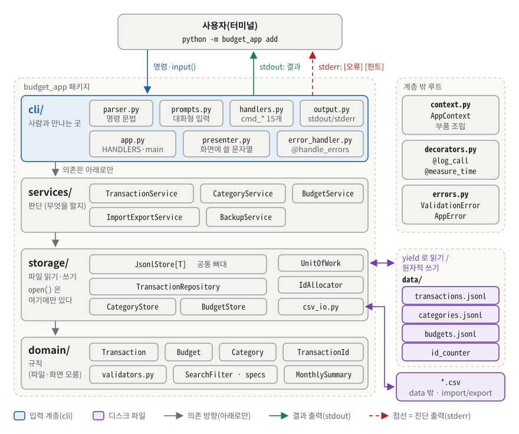
*그림 1. budget_app 의 네 계층 — 명령은 위에서 아래(cli → services → storage → domain)로만 내려가고, 파일을 여는 코드는 storage 에만 있다.*

그림 1 에서 봐야 할 것은 세 가지다.

- **가운데 회색 아래 화살표 세 개.** 네 띠 사이의 화살표는 전부 아래를 향한다. `domain/` 은 파일도 화면도 모르고, `services/` 에는 `open()` 이 한 번도 나오지 않는다. 데이터 파일을 여는 코드는 `storage/` 띠에만 있다(보라색 화살표가 닿는 곳이 거기뿐이다). 유일한 예외는 `cli/app.py` 가 파이프가 끊겼을 때 출력을 버리려고 `/dev/null` 을 여는 한 줄(`budget_app/cli/app.py:57`)인데, 데이터와는 무관하다.
- **오른쪽 "계층 밖 루트" 세 칸.** 여기서 **루트**는 패키지 폴더 `budget_app/` 바로 아래, 네 계층 폴더 어디에도 들어 있지 않은 파일이라는 뜻이다. `context.py`(부품 조립), `decorators.py`(로그·시간 데코레이터), `errors.py`(공용 예외)가 그렇다.
- **오른쪽 아래 보라색 파일들과 맨 위 초록·빨강 출력선.** 영구 저장은 `data/` 의 JSONL 3개 + `id_counter` 1개이고, 그 아래 `*.csv` 는 가져오기/내보내기 때만 쓴다. 사용자에게 돌아가는 결과는 초록 실선(**stdout** — 결과를 내보내는 통로), `[오류]`/`[힌트]` 는 빨간 점선(**stderr** — 오류·안내를 내보내는 통로)으로 따로 나간다(§3.2).

> [!NOTE]
> **한 낱말, 두 뜻.** 이 문서에서 **저장소**는 두 가지를 가리킨다. ① 이 과제의 **git 저장소**(코드 폴더 전체) ② `storage/` 에 있는, 파일을 읽고 쓰는 객체(Repository). ②는 늘 **저장소 클래스**라고 쓴다. **커밋**도 두 뜻이다. ① git 에 변경을 기록하는 **git 커밋** ② 준비해 둔 변경을 파일에 실제로 반영하는 **커밋 단계**(§3.11~§3.12). 앞뒤 문맥에 어느 쪽인지 밝혀 둔다.

### 1.2 평가자는 무엇을 보나

체크리스트(`/home/coder/volume/checklists_md/python_cli_budget_app.md`)는 4영역 16문항이다. 이 문서 §6 이 16문항을 전부 문항 번호와 함께 옮겨 두었다.

| 영역 | 문항 수 | 평가자가 확인하는 것 | 대비하는 곳 |
|---|---|---|---|
| 1. 기능 동작 검증 | 7 | 8개 명령, 재실행 후 유지(파일 3개 이상), category, budget+summary, CSV 스키마(칸 이름과 규칙의 목록), 오류 메시지+힌트, 0 아닌 종료 코드를 **직접 보여 주는가** | §5 시연, [§6.1](#61-기능-동작-검증) |
| 2. 구현 구조 설명 | 3 | 모듈 책임을 "어떻게" 나눴나, 클래스 책임 경계, update/delete 를 "어떻게" 안전하게 | §3.4 · §3.5 · §3.11, §4, [§6.2](#62-구현-구조-설명) |
| 3. 핵심 개념 이해 | 3 | 제너레이터 스트리밍 "어떻게·왜", 데코레이터 분리 "무엇을·왜", 타입 힌트 이점을 "실제 코드로" | §3.6 ~ §3.10, [§6.3](#63-핵심-개념-이해) |
| 4. 확장 사고·트러블슈팅 | 3 | JSONL vs CSV 선택 근거, 10만 건 병목과 개선, 깨진 CSV 행 처리(부분 성공/롤백/리포트) | §3.3 · §3.12 · §3.14, [§6.4](#64-확장-사고--트러블슈팅) |

문항 표기는 한 가지로 통일한다. **C2-3** 은 "체크리스트 2영역의 3번째 문항" 이고, §6 의 **Q6.2-3** 이 그 문항의 문답이다(§6 머리에는 `체크리스트 2-3` 으로 적혀 있다).

**이 학습자가 다른 과제 평가에서 실제로 받은 피드백**은 이 과제에서도 같은 방향으로 나올 가능성이 높다. 그래서 이 문서의 모든 답은 그 성향에 맞춰 짜여 있다.

| 평가자가 한 말(요지) | 이 과제에서 나올 모양 | 대비 |
|---|---|---|
| "주석을 지웠으면 한다", "코드 읽는 속도가 느리다" | "주석 빼고 `stream_sorted` 를 읽어 보세요", "주석이 왜 이렇게 많나요?" | §4.5 에 주석을 뗀 원문 세 조각과 소리 내어 읽는 모범 낭독, §7.9 에 주석 비율(40%) 약점과 답 |
| "CHECK 가 실질적으로 **어떻게** 작동하는지", "인덱싱이 **왜** 인덱싱인지" | "제너레이터가 메모리를 **어떻게** 아끼나요? `os.replace` 는 **왜** 원자적인가요?" | 모든 개념에 **한 칸 아래** 단락(§3), §6.5 심화 문답 |
| "상황에 따라 어떤 것을 쓸지" | "JSONL 과 CSV 중 **언제** 무엇을?", "부분 성공과 롤백 중 **언제**?" | §4.3 설계 결정 표(대안·대가), Q6.4-1, Q6.4-3 |
| "자신감 있게 설명했으면" | — | 모든 답이 **첫 문장에 결론 → 근거 숫자 → 코드 위치** 순서 |
| "대학생이 갓 짠 코드"(코드 품질) | "README 에 ruff 통과라고 썼는데 실제로는요?", "실패했는데 왜 종료 코드가 0 이죠?" | §7 에 약점과 답변 스크립트를 먼저 정리 — 검사의 구멍(§7.2 · §7.3), 조용한 실패(§7.4 ~ §7.6) |

### 1.3 30초 자기소개 스크립트

평가가 시작되면 아래를 그대로 말한다. 다섯 문장, 30초 안팎이다.

> "표준 라이브러리만으로 파일 기반 콘솔 가계부를 만들었습니다. 거래·카테고리·예산은 JSONL 파일 세 개에 저장하고, 가져오기와 내보내기는 CSV 로 합니다. 코드는 cli·services·storage·domain 네 계층으로 나눴고, 의존이 아래로만 흐르는지 테스트가 검사합니다. 목록은 제너레이터로 한 줄씩 읽어 10만 건에서도 메모리가 거의 늘지 않고, 수정·삭제는 임시 파일에 다 쓴 뒤 한 번에 바꿔 끼웁니다. pytest 147개와 10만 건 실측으로 검증했습니다."

이 문단의 계층 검사(§3.5), 제너레이터(§3.6), 임시 파일 교체(§3.11)는 §3 에서 차례로 풀이한다. "더 자세히" 를 청하면 그때 §3 의 숫자(10만 건 18.6MB, 호출 순서 tmp → fsync → replace)를 붙인다.

## 2. 명세 정독 — 무엇을 요구받았나

과제 원문은 PDF 다(분야 AI/SW 기초 · 구분 Python과 Git 심화 · 학습시간 60시간 · 개발 환경 Python 3.10 이상). 산출물은 한 문장이다 — "다음 10가지 기능이 정상 동작하는 애플리케이션 1개를 완성한다."

> [!NOTE]
> **PDF 텍스트 추출 주의.** 추출본에는 `-limit`, `-from`, `-month`, `-data-dir` 처럼 하이픈이 하나 빠진 곳이 있고, 제약 사항에도 "옵션 표기는 - 로 통일"이라고 찍혀 있다. 같은 PDF 의 4-1 이 "옵션 표기는 리눅스 표준인 -- 로 통일해야 합니다. 예: --help , --limit , --from , --to , --month" 라고 명시하므로 **실제 규칙은 `--`** 다. 4-11 의 "import --from \로" 도 `<csv>` 가 유실된 것이다(2-9 에 `import --from <csv>` 로 적혀 있다). 저장소 README 도 같은 판단을 적어 두었다(`README.md:202`, `README.md:282`).

### 2.1 요구사항 지도

ID 는 저장소 README 0.4 절이 붙인 `R#-#` 를 따른다(PDF 원문에는 번호가 없다). 상태: ✅ 충족 · ⚠️ 부분 · ❌ 미충족. **필수 요구는 전부 ✅ 이고, 보너스는 4개 중 3개**다.

| ID | 원문 요지(PDF 그대로) | 쉬운 말 | 왜 이런 요구를? | 내 구현(파일:줄) | 상태 |
|---|---|---|---|---|---|
| R1-1 | `python -m budget_app <command> [options]` 권장 | 패키지 이름으로 실행 | 설치 없이 폴더에서 바로 실행하는 파이썬 표준 방식 | `budget_app/__main__.py:8` | ✅ |
| R1-2 | 모든 명령은 `--help` 옵션으로 사용 방법 출력 | 명령마다 도움말 | 문서 없이도 쓸 수 있는 CLI 관례 | `budget_app/cli/parser.py:79-105` (argparse 자동 생성) | ✅ 최상위 1 + 하위 17종 전부 rc=0 |
| R1-3 | 입력 기본 방식은 "대화형"(add 는 `input()` 순차 입력) | 물어보고 답 받기 | 초보자 친화, 입력 루프·검증 연습 | `budget_app/cli/prompts.py:112-127` | ✅ |
| R1-4 | search/list/summary/export/import/delete 는 옵션 방식 허용, update 는 둘 중 하나로 **문서에 고정** | 조회류는 옵션으로 | 스크립트 자동화 | update=옵션 방식 `budget_app/cli/parser.py:190-200`, 고정 문구 `README.md:656` | ✅ |
| R1-5 | 옵션 표기는 `--` 로 통일 | `--limit` 처럼 | 리눅스 긴 옵션 관례 | 모든 `add_argument("--…")` | ✅ (한 글자 옵션은 argparse 기본 `-h` 뿐) |
| R2-1 | Transaction 최소 필드 `id`(유일) `type`(income/expense) `date`(YYYY-MM-DD) `amount`(양수) `category` `memo`(선택) `tags`(선택) | 거래 한 건의 칸 | 데이터 계약 | `budget_app/domain/entities.py:60-66` | ✅ |
| R2-2 | dataclass 또는 그에 준하는 구조 | 틀이 정해진 클래스 | 필드·타입을 코드로 선언 | `budget_app/domain/entities.py:27` 등 `@dataclass(frozen=True)` | ✅ |
| R2-3 | 최소 2개 이상의 클래스 | 클래스로 나누기 | 책임 분리 연습 | `class` 42개 | ✅ |
| R2-4 | 날짜 형식 오류·음수/0 금액·허용 안 된 type·없는 category → 재입력 또는 오류 메시지 | 틀린 값 막기 | 쓰레기 데이터 차단 | 규칙 `budget_app/domain/validators.py:63-195`, 재입력 `budget_app/cli/prompts.py:60-74` | ✅ |
| R3-1 · R3-2 | JSONL 또는 CSV 중 1개, 저장 파일 3개 이상 `transactions/categories/budgets.<fmt>` | 포맷 하나, 파일 셋 | 포맷 선택 판단, 성격 다른 데이터 분리 | `budget_app/storage/config.py:17-19` | ✅ 빈 폴더에서 3개 생성 실측 |
| R3-3 | 기본 `./data` 권장, 옵션으로 변경 가능 | 폴더 바꾸기 | 테스트·여러 장부 | `budget_app/cli/config.py:13`, `budget_app/cli/parser.py:86-88` | ✅ 명령 앞·뒤 어디서든 |
| R3-4 · R3-5 | 파일이 없으면 자동 생성 / 카테고리 파일이 비면 (안 A) 기본 카테고리 자동 생성 또는 (안 B) add 차단 | 첫 실행 처리 | 콜드 스타트도 정상 상태 | `budget_app/context.py:59-65`, 안 A `budget_app/storage/repositories.py:226-235` (5종 `budget_app/storage/config.py:14`) | ✅ 안 A |
| R4 | add 는 대화형 입력, category 는 등록된 목록에 있어야, 저장 후 id 출력 | 추가하고 번호 받기 | 없는 카테고리를 가리키는 거래를 막고, 이후 update/delete 에 쓸 id 를 알려 주려고 | `budget_app/cli/handlers.py:33-50` | ✅ `[저장 완료] id=TX-000001` |
| R5 | list 는 최신순, `--limit N`(기본값), 파일 전체를 한 번에 로드하지 않고 제너레이터 스트리밍 | 최근 것부터 N 개 | 대용량에서도 메모리 일정 | `budget_app/services/transactions.py:86-108`, 기본 20 `budget_app/cli/config.py:15` | ✅ 10만 건에서 기본 `list` 18.6MB(기준선 18.0MB) |
| R6-1 · R6-2 | `delete --id <id>`, 없는 id 는 "없는 데이터"로 처리하고 메시지 | 지우기 | 실패를 조용히 넘기지 않기 | `budget_app/storage/repositories.py:150-171`, `budget_app/services/transactions.py:79-84` | ✅ 없는 id → rc=4 |
| R6-3 | update 는 (안 A) 옵션 기반 또는 (안 B) 대화형 중 하나로 문서에 고정 | 고치기 | 선택을 문서로 고정 | 안 A `budget_app/cli/parser.py:190-200` | ✅ |
| R6-4 | update/delete 는 "전체 재작성/임시 파일/원자적 교체(권장)" 등 안정성 고려 | 안전하게 고치기 | 덮어쓰는 도중 죽는 사고 대비 | `budget_app/storage/jsonl.py:48-87`, `budget_app/storage/jsonl.py:286-351` | ✅ |
| R7 | 기간 `--from/--to`, `--category`, `--type`, 메모 `--q`, `--tag` / 최신순 / 스트리밍 유지 | 조건 검색 | 조건 조합 연습 | `budget_app/domain/queries.py:58-73` | ✅ 읽기·필터는 스트리밍. 단 최신순 정렬 단계는 일치분을 모은다(§3.6, Q6.3-1 꼬리 질문) |
| R8 | `summary --month YYYY-MM`: 총수입·총지출·잔액·카테고리별 지출 TOP N(`--top`), 데이터 없는 달은 "데이터 없음" | 월별 결산 | 집계 연습, 빈 화면 금지 | `budget_app/services/budgets.py:50-86`, `budget_app/cli/presenter.py:105-120` | ✅ PDF 예시와 숫자까지 같음 |
| R9 | `budget set --month --amount` 저장, summary 에 사용률(%)과 초과 경고, 예산도 영구 저장 | 예산 대비 | 파생값·경계 조건 | `budget_app/storage/repositories.py:300-308`, `budget_app/domain/results.py:42-50` | ✅ `사용률 207.0%` + 경고 |
| R10 | `category add/list/remove`, 사용 중이면 삭제를 막거나 대체 요구 | 분류 관리 | 거래가 없는 카테고리를 가리키지 않게(참조 무결성, §3.13) | `budget_app/services/categories.py:38-89` | ✅ 둘 다 지원 |
| R11 | `import --from <csv>`, `export --out <csv>`, export 는 `--month YYYY-MM` 또는 `--from YYYY-MM-DD --to YYYY-MM-DD` **중 하나 이상** 조건 필수, CSV 최소 스키마(date·type·category·amount 필수, memo·tags 선택, UTF-8, 헤더 포함) | 표로 주고받기 | 상호운용·방어적 기본값 | `budget_app/storage/csv_io.py:73-201`, `budget_app/cli/handlers.py:179-192` | ✅ (+선택 `id` 컬럼). 둘을 함께 주면 모순으로 보고 거부 — 판단(§7.8) |
| R12 | 공통 관심사(예외 처리/로그/시간 측정) 데코레이터 1개 이상 구현·실제 적용 | 포장지 함수 | 여러 기능에 공통인 일을 본문에서 떼어 내기(§3.8) | `budget_app/decorators.py:37-66`, `budget_app/cli/error_handler.py:20-128` | ✅ 3개 |
| R13 | 스택트레이스 대신 원인 + 해결 힌트, 정상 0 / 오류 0 이 아닌 값 | 친절한 실패 | 사용자 UX, 셸 스크립트·CI(코드를 올릴 때마다 테스트를 자동으로 돌리는 서버)와의 약속 | `budget_app/cli/error_handler.py:47-126`, `budget_app/cli/config.py:22-29` | ✅ Traceback 0줄 |
| R14 | 최소 3개 모듈, (권장) CLI/서비스/저장소/모델로 책임 분리 | 파일 나누기 | 유지보수 가능한 구조 | 43개 모듈, `tests/test_architecture.py:66-115` | ✅ |
| R15 | 데이터 3개 이상 파일 영구 저장, README 에 실행 방법·저장 위치/형식·명령 예시·CSV 스키마 | 제출물 문서화 | 다른 사람이 쓸 수 있게 | README 2장 · 3장 · 5장 · 6장 | ✅ |

### 2.2 지켜야 할 제약과 그 이유

| 구분 | 원문(PDF "7. 제약 사항" — 모듈화 행만 다른 절) | 왜 이런 제약을 거나 | 이 저장소 |
|---|---|---|---|
| 라이브러리 | "표준 라이브러리만 사용 가능" / "별도 pip install 이 필요한 외부 라이브러리 사용 금지" | `argparse`·`json`·`csv`·`dataclasses` 같은 기본기를 직접 쓰게 하고, 채점 환경에서 설치 없이 돌게 하려고 | `pyproject.toml` 의 `dependencies = []`. pytest 는 개발 도구일 뿐 실행에 필요 없다 |
| 저장 방식 | "JSONL 또는 CSV 중 1개를 선택해 사용" / "저장 파일은 3개 이상(transactions/categories/budgets)으로 분리" | 포맷 장단점을 비교해 **고르는** 판단을 시키려고, 성격이 다른 데이터를 섞지 않게 하려고 | 저장은 JSONL 하나. CSV 는 가져오기/내보내기 전용 |
| CLI 규칙 | "옵션 표기는 - 로 통일"(추출본. 실제 규칙은 `--`) | 리눅스 긴 옵션 관례 | 전부 `--` |
| 오류 처리 | "스택트레이스 출력 금지(원인 + 해결 힌트 출력)" / "오류 종료 시 exit code는 0이 아니어야 함" | 사용자에게 내부 구현 대신 **다음 행동**을 알려 주고, 셸 스크립트·CI 가 성공과 실패를 숫자로 구별하게 하려고 | `@handle_errors` 한 곳 + 종료 코드 8종 |
| 모듈화 | "한 파일에 몰아넣지 않고 최소 3개 이상 모듈로 분리한다." (7절이 아니라 "4. 기능 요구 사항" 뒤쪽의 "3. 모듈화(구조화)") | 고칠 곳을 좁히려고 | 43개 모듈 |

**스택트레이스(traceback)** 는 오류가 난 함수 호출 경로를 줄줄이 찍은 개발자용 기록이다. 사용자에게는 "무엇이 틀렸고 무엇을 하면 되는지" 가 필요하지 호출 경로가 필요하지 않다.

### 2.3 출력·형식 규칙

PDF 는 결과 예시 앞에 "아래는 정답이 아니라 참고 예시다. 실제 문구와 디자인은 달라도 된다." 라고 적었다. 그래도 이 구현은 대부분을 글자 그대로 맞췄다.

| 화면 | PDF 예시(원문 그대로) | 실제 출력(실측) | 차이 |
|---|---|---|---|
| add | 프롬프트 6개 `날짜(YYYY-MM-DD): ` … `태그(쉼표로 구분, 없으면 엔터): ` / `[저장 완료] id=TX-000012` | 프롬프트 6개 **글자 그대로 같음**(`budget_app/cli/messages.py:21-26`), 첫 줄에 `[안내] 거래 추가 - 대화형 입력입니다.` 추가 | 안내 1줄 |
| list | `TX-000012 \| 2024-01-15 \| expense \| food \| 15000 \| 점심` | 머리글 `id \| date \| type \| category \| amount \| memo` + 구분선 + 열 폭 정렬된 행 | 머리글·구분선·정렬(보너스 B3). 칸 순서 같음 |
| category | `카테고리명: food` / `[저장 완료] category=food` / `- food` | 같음 | 없음 |
| budget | `[저장 완료] 2024-01 예산 500000원` | **완전히 같음** | 없음 |
| summary | `총 수입: 3000000원` … `예산: 500000원 (사용률 43.0%)` `지출 TOP 3` `1) rent 150000원` … | **숫자까지 같음**. `지출 TOP 3` 앞에 빈 줄 1개(`budget_app/cli/messages.py:80`) | 빈 줄 |
| export / import | `[완료] export.csv (12 records)` / `[완료] imported=5, skipped=0` | `[완료] out.csv (5 records)` / `[완료] mode=부분 성공, imported=2, duplicated=0, skipped=5` | import 에 mode·duplicated 추가 |
| 오류 | `[오류] 날짜 형식이 올바르지 않습니다 (YYYY-MM-DD).` / `[힌트] 예: 2024-01-15` | 오류 줄 **글자까지 같음** / `[힌트] 다시 입력해 주세요.` 후 같은 질문 재출력 | 힌트 문구 — PDF 처럼 예시를 주지 않는다(§7.6) |

이 구현이 스스로 고정한 형식(외워 두면 좋다):

- **거래 id**: `TX-{:06d}` → `TX-000001`(`budget_app/domain/config.py:30`). 7자리 이상(`TX-1000000`)도 허용하고 비교는 번호로 한다.
- **날짜·월**: `%Y-%m-%d`, `%Y-%m`(`budget_app/domain/config.py:25-26`). `2024-1-5` 를 넣으면 `2024-01-05` 로 고쳐 저장한다.
- **JSONL 한 줄**(실제 파일): `{"id": "TX-000001", "type": "expense", "date": "2024-01-15", "amount": 15000, "category": "food", "memo": "점심", "tags": ["meal"]}` — `json.dumps(..., ensure_ascii=False)` 라서 한글이 `\uXXXX` 로 바뀌지 않는다(`budget_app/storage/jsonl.py:229-230`).
- **CSV 헤더**: `id,date,type,category,amount,memo,tags`(`--no-id` 면 `id` 없음), UTF-8(파일 맨 앞 표식 BOM 없음 — §3.3), 줄 끝 `\r\n`.
- **표 한 줄 템플릿**: `"{id} | {date:<10} | {type:<7} | {category:<12} | {amount:>12} | {memo}"`(`budget_app/cli/messages.py:50`).
- **오류 두 줄**: `[오류] 원인` / `[힌트] 해결책` → 둘 다 stderr.

### 2.4 보너스 과제

| 보너스 | 원문 | 상태 | 어디서 |
|---|---|---|---|
| 1. 백업 | "backup 실행 시 타임스탬프가 포함된 백업 파일을 생성한다." | ✅ `[백업 완료] backup_20260923_101255` (jsonl 3개 + `id_counter`) | `budget_app/storage/backup.py:17-47` |
| 2. 반복 내역 | "월급/월세처럼 반복되는 내역을 등록하고, 특정 월에 자동 생성한다." | ❌ 미구현 | §7.20 에 설계안 |
| 3. 표 정렬 | "외부 라이브러리 없이 문자열 정렬로 가독성을 개선한다." | ✅ 열 폭 템플릿 + 머리글·구분선 | `budget_app/cli/messages.py:50`, `budget_app/cli/presenter.py:38-57` |
| 4. 저장 원자성 | "update/delete 시 임시 파일에 쓰고 rename으로 교체하는 방식을 적용한다." | ✅ 임시 파일 + fsync + `os.replace` | `budget_app/storage/jsonl.py:48-87`, 다중 파일 `budget_app/storage/unit_of_work.py:73-181` |

## 3. 배경 개념 — 처음부터 차근차근

개념은 쉬운 것에서 어려운 것 순서로 14칸이다. 앞 칸에서 정의한 말만 뒤 칸에서 쓴다. 각 칸은 **비유 → 정확한 정의 → 숫자로 따라가기 → 이 과제의 코드 → 한 칸 아래 → 흔한 오해** 순서다.

| 칸 | 개념 | 체크리스트와의 연결 |
|---|---|---|
| 3.1 ~ 3.3 | 명령행 · 종료 코드와 스트림 · 파일 저장 포맷 | 1절 전체, C4-1 |
| 3.4 ~ 3.5 | dataclass 와 검증 · 계층 분리 | C2-1, C2-2 |
| 3.6 ~ 3.10 | 제너레이터 · 힙 · 데코레이터 · 예외 분류 · 타입 힌트 | C3-1, C3-2, C3-3, C1-6, C1-7 |
| 3.11 ~ 3.14 | 원자적 교체 · 준비/커밋 · 무결성 · 확장성 | C2-3, C4-3, C1-3, C4-2 |

### 3.1 명령행 프로그램과 argparse — "명령어 + 옵션"을 해석하는 법

**비유로 먼저.** 식당 주문표를 생각한다. `add`, `list` 는 메뉴 이름이고, `--limit 3` 은 "곱빼기" 같은 선택 사항이다. 주문표 양식에 없는 메뉴를 적으면 점원이 주방에 넘기기 전에 바로 돌려준다. 비유의 한계: 사람 점원은 대충 알아듣지만 `argparse` 는 **선언된 문법만** 기계적으로 받는다.

**정확히 말하면.** **CLI**(Command-Line Interface, 명령줄 인터페이스)는 마우스 대신 글자로 명령을 입력해 쓰는 프로그램 방식이다. **서브커맨드**는 한 프로그램 안의 세부 명령 이름(`add`, `list`)이고, **옵션**은 명령 뒤에 붙는 선택 설정(`--limit 3`)이다. 글자를 문법에 맞춰 뜯어 읽는 일을 **파싱**(parsing), 그 일을 하는 부품을 **파서**(parser)라 한다. 파이썬 표준 모듈 **argparse** 는 `ArgumentParser` 에 `add_subparsers()` 로 하위 명령을 달고 하위 명령마다 옵션을 선언하면, 글자 해석·형식 검사·`--help` 문구·사용법(usage) 출력을 전부 자동으로 만들어 준다. `python -m budget_app` 은 `budget_app` 폴더(패키지)의 `__main__.py` 를 실행하라는 뜻이다.

**구체적인 숫자로.** 명령 개수가 곳곳에서 8·10·11·15·18 로 다르게 나오는데, 세는 대상이 다를 뿐이다.

| 숫자 | 무엇을 셌나 |
|---|---|
| 10 | PDF 의 "10가지 기능". 그중 9가지가 명령(가져오기/내보내기를 하나로 셈)이고 10번째는 "파일 3개 이상 + README" 라는 추가 조건이다 |
| 8 | 체크리스트 1-1 이 묻는 명령(add · list · search · summary · export · import · update · delete) |
| 11 | 실제 최상위 명령 — 위 8개 + `budget` · `category` · `backup`(usage 출력의 `{add,…,backup}`) |
| 15 | 끝 명령 — `budget` 을 set/get/list, `category` 를 add/list/remove 로 펼친 수. 이것이 `HANDLERS` 의 키 개수다 |
| 18 | 파서 — 끝 명령 15 + 묶음 파서 2(`budget`, `category`) + 최상위 1 |

파서 18개 모두 `--help` 가 종료 코드 0 으로 끝난다(직접 반복 실행해 확인). `budget set` 처럼 두 단어짜리 명령은 `budget` 파서 안에 또 한 번 `add_subparsers` 를 단 것이다(`budget_app/cli/parser.py:150`).

**이 과제에서는.** 파서는 함수를 직접 들고 있지 않고 **문자열 키**만 남긴다. 그 키를 함수로 바꾸는 것은 `app.py` 의 대응표다.

```python
# budget_app/cli/parser.py:114-121 — list 의 문법
p = sub.add_parser("list", help="최신순 거래 목록")
_add_shared_options(p)                                   # --data-dir, --debug
p.add_argument("--limit", type=positive_int, default=config.DEFAULT_LIST_LIMIT, ...)  # 1 이상, 기본 20
p.set_defaults(handler="list")                           # 함수가 아니라 문자열 키

# budget_app/cli/app.py:28-29, 83 (요지) — 키 → 함수
HANDLERS: dict[str, Handler] = {
    "add": handlers.cmd_add,  ...  15개  ...
return HANDLERS[args.handler](ctx, args)                 # if/elif 사다리 없이 한 줄
```

명령 하나를 맡아 처리하는 함수(예: `cmd_add`)를 **핸들러**라 부른다. `HANDLERS` 는 15개 키를 가진 **레지스트리**(이름 → 핸들러 대응표)다(`budget_app/cli/app.py:28-44`). 명령을 추가하는 절차는 셋 — `parser` 에 문법, `handlers` 에 함수, `HANDLERS` 에 한 줄 — 이고, 등록을 빠뜨리면 `tests/test_architecture.py:109-115` 가 잡는다.

**한 칸 아래.** `--data-dir` 과 `--debug` 는 명령 **앞에도 뒤에도** 쓸 수 있다(`budget_app --data-dir X list` 와 `budget_app list --data-dir X`). 비결은 기본값을 최상위 파서에만 두고 하위 파서들은 `default=argparse.SUPPRESS`("받으면 덮어쓰고, 안 받으면 아무것도 안 함")로 둔 것이다(`budget_app/cli/parser.py:58-76`). 하위 파서에도 기본값을 주면, 앞에서 읽은 값을 하위 파서가 기본값으로 **되돌려 버린다**. 또 argparse 는 잘못된 인자를 만나면 usage 를 찍고 스스로 `sys.exit(2)` 한다 — `list --limit 0` 이 `argument --limit: 1 이상이어야 합니다: 0` 과 종료 코드 2 로 끝나는 이유다(`budget_app/cli/parser.py:38-55`).

> [!WARNING]
> **흔한 오해.** "`--help` 는 직접 만들어야 한다" → argparse 가 인자 선언으로 자동 생성한다. / "`-h` 가 있으니 `--` 통일 위반이다" → `-h` 는 argparse 가 기본으로 주는 단축형이고 `--help` 도 함께 된다. 이 저장소가 직접 선언한 옵션은 전부 `--` 로 시작한다.

### 3.2 종료 코드와 표준 스트림 — 프로그램이 셸에 남기는 두 가지 신호

**비유로 먼저.** 택배 기사는 문 앞에 두 가지를 남긴다. 물건(결과)과 쪽지(안내)다. 그리고 회사 시스템에는 배송 상태 코드(완료, 주소 불명, 수취 거부 …)를 찍는다. 프로그램도 같다. 결과는 **stdout**, 안내·오류는 **stderr**, 그리고 끝날 때 **종료 코드** 숫자 하나를 남긴다. 비유의 한계: 물건과 쪽지는 같은 문 앞(터미널 화면)에 도착해서 **화면에서는 구별되지 않는다.** 둘은 리다이렉트할 때만 갈린다.

**정확히 말하면.** **프로세스**는 실행 중인 프로그램 하나다. 이 가계부는 명령을 칠 때마다 새 프로세스로 켜졌다가 일을 마치면 꺼진다. **종료 코드**(exit code)는 프로세스가 끝나며 남기는 0~255 정수다. 셸에서 `echo $?` 로 바로 앞 명령의 코드를 볼 수 있고, 0 이 성공이라는 것이 관례다. **stdout**(표준 출력, 파일 디스크립터 1)과 **stderr**(표준 오류, 파일 디스크립터 2)는 프로그램이 글자를 내보내는 두 통로다. **리다이렉트**(`>`, `2>`)는 화면 대신 파일로 돌리는 셸 기능이고, **파이프**(`|`)는 한 프로그램의 stdout 을 다음 프로그램의 입력으로 잇는다.

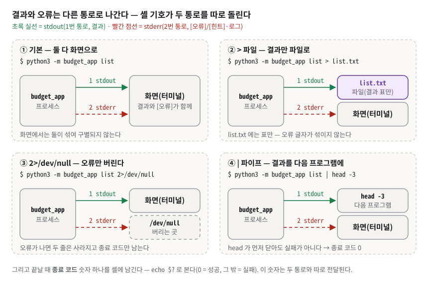
*그림 2. 결과와 오류는 다른 통로로 나간다 — `>` 는 1번 통로(stdout)만, `2>` 는 2번 통로(stderr)만 돌리고, `|` 는 stdout 만 다음 프로그램에 넘긴다.*

그림 2 의 네 칸은 같은 프로그램에 셸 기호만 바꿔 붙인 것이다. ① 기본은 두 통로가 모두 화면에 닿아 구별되지 않는다. ② `> list.txt` 는 초록 1번 통로만 파일로 돌리고, 빨간 2번 통로는 여전히 화면에 나온다. ③ `2>/dev/null` 은 빨간 통로만 버린다(`/dev/null` 은 쓰면 사라지는 특수 파일이다). ④ 파이프 `|` 는 초록 통로만 다음 프로그램(`head -3`)의 입력으로 잇는다. 맨 아래 줄처럼 종료 코드는 두 통로와 따로 셸에 남는다.

**구체적인 숫자로.** 이 프로그램의 종료 코드는 8종이다(`budget_app/cli/config.py:22-29`).

| 코드 | 이름 | 언제 | 실측 예 |
|---|---|---|---|
| 0 | `EXIT_OK` | 정상. 예산 초과 **경고**, "데이터 없음" 같은 빈 결과도 0 | `summary --month 2030-05` → `2030-05: 데이터 없음` |
| 1 | `EXIT_ERROR` | 분류 밖의 예상 못 한 버그 | 테스트로만 재현(`tests/test_phase3_cli.py:160`) |
| 2 | `EXIT_VALIDATION` | 값 하나가 규칙을 어김(`ValidationError`), argparse 인자 오류 | `summary --month 2024-13`, `list --limit 0` |
| 3 | `EXIT_IO` | 파일·폴더 없음, 디렉터리 착오, 권한, 기타 입출력 | `import --from nope.csv` |
| 4 | `EXIT_APP` | 힌트를 들고 다니는 `AppError` — "이 요청은 처리할 수 없다" 전반. 저장 상태 위반(없는 id, 사용 중 카테고리), 옵션 조합 오류(update 필드 없음, export 기간 누락·충돌), CSV 헤더·파싱 오류, 대화형 입력 중단(EOF)·재입력 10회 초과 | `delete --id TX-999999`, `import --from nohdr.csv` |
| 5 | `EXIT_NO_CATEGORY` | 카테고리가 **하나도 없는** 상태에서 add | 2차 방어선(보통은 기본 5종이 심어져 도달하지 않음) |
| 6 | `EXIT_ENCODING` | UTF-8 이 아닌 파일 | UTF-16 으로 저장한 CSV 가져오기 |
| 130 | `EXIT_INTERRUPT` | Ctrl+C | 128 + SIGINT(2) |

코드 4 는 이름(`EXIT_APP`)보다 범위가 넓다. "값이 틀리면 2, 상황이 틀리면 4" 로만 외우면 "헤더 없는 CSV 가 왜 4 인가요?" 에 막힌다. 정확한 규칙은 "값 하나의 형식 오류는 2, 그 밖에 사용자에게 해결 힌트를 줘야 하는 실패는 4" 다(약점으로서의 설명은 §7.7).

실측 세 가지(§5 의 시연 순서대로 따라 한 뒤의 `demo` 폴더). `list --data-dir demo > list.txt` 를 하면 `list.txt` 는 11줄(머리글 + 구분선 + 9행)이고 오류 글자는 섞이지 않는다. `import --from nope.csv --data-dir demo 2>/dev/null; echo rc=$?` 는 화면에 아무것도 없이 `rc=3` 만 찍힌다(오류 두 줄이 stderr 로 나가서 버려졌다). `delete --id TX-999999 --data-dir demo && echo 성공 || echo "실패(rc=$?)"` 는 `실패(rc=4)` 를 찍는다 — 셸이 종료 코드로 분기한 것이다.

시연에 쓰는 셸 기호를 모아 둔다. 평가자가 "이 명령이 뭘 보여 주는 거죠?" 라고 물으면 이 표대로 답한다.

| 기호 | 뜻 | 쓰는 곳 |
|---|---|---|
| `명령 > 파일` | stdout 만 파일로 보낸다 | §5.7 `list > list.txt` |
| `2>/dev/null` | stderr 만 버린다 | §5.7 |
| `2>&1 >/dev/null` | 왼쪽부터 처리한다. 먼저 stderr 를 "지금 stdout 이 가리키는 곳(화면)" 으로 보내고, 그다음 stdout 을 버린다 → 로그·오류만 화면에 남는다 | §3.8, §5.8 |
| `2>&1 \| tail -3` | stderr 를 stdout 에 합쳐 파이프로 넘긴다 | §5.6 |
| `A && B \|\| C` | A 가 0 으로 끝나면 B, 아니면 C 를 실행한다 | §5.7 |
| `echo $?` | 바로 앞 명령의 종료 코드 | 곳곳 |
| `echo ${PIPESTATUS[0]}` | 파이프 맨 **앞** 명령의 종료 코드(`$?` 는 맨 끝 명령의 것, bash 전용) | §5.7 |
| `printf '가\n나\n' \| 명령` | 줄바꿈(`\n`)으로 이은 글자를 대화형 입력으로 넣는다 | §5.1 |
| `yes 'bad' \| head -20` | `bad` 를 20줄 만들어 입력으로 넣는다 | §5.6 |
| `od -c 파일` / `od -An -tx1` | 파일의 바이트를 한 글자씩 / 16진수로 보여 준다(BOM·한글 바이트 확인) | §3.3, §5.5 |
| `wc -l 파일` | 줄 수를 센다 | §5.7 |

**이 과제에서는.** 종료 코드는 `__main__.py` 한 줄이 셸로 넘긴다. 채널 결정은 `output.py` 한 모듈만 한다.

```python
# budget_app/__main__.py:8
    sys.exit(main())                 # main() 이 돌려준 정수가 곧 프로세스 종료 코드

# budget_app/cli/output.py:42-44, 53-66 (요지)
def out(message: str = "") -> None:
    print(message)                   # 결과 → stdout
def err(message: str = "") -> None:
    sys.stdout.flush()               # 결과를 먼저 비우고
    print(message, file=sys.stderr)  # 진단 → stderr
```

**한 칸 아래.** stdout 은 터미널이 아닐 때(파일·파이프로 갈 때) **블록 버퍼링**, 즉 모아 두었다가 한꺼번에 내보내고, stderr 는 줄 단위로 곧바로 내보낸다(파이썬 3.9 부터 stderr 는 **줄 버퍼링**이다 — 실측 `sys.stderr.line_buffering` 이 `True`, 리다이렉트한 stdout 은 `False`). 그래서 `cmd 2>&1 | less` 처럼 두 통로를 다시 합치면 진단이 결과보다 먼저 튀어나올 수 있다. `err()` 가 쓰기 전에 `sys.stdout.flush()` 를 먼저 하는 이유다(`budget_app/cli/output.py:53-66`). 또 `list | head -3` 에서 `head` 가 3줄만 받고 파이프를 닫으면, 이쪽의 다음 쓰기가 `BrokenPipeError` 가 된다. 사용자가 "그만" 이라고 한 것이지 오류가 아니므로 `main` 이 잡아 stdout 을 `/dev/null` 로 돌리고 0 을 돌려준다(`budget_app/cli/app.py:52-60`, `budget_app/cli/app.py:93-96`). 실측 `list | head -3; echo ${PIPESTATUS[0]}` → 0. 130 은 "시그널로 죽은 프로세스는 128 + 시그널 번호" 라는 셸 관례에서 왔고 Ctrl+C 가 보내는 **SIGINT** 는 2번이다.

> [!WARNING]
> **흔한 오해.** "경고도 문제니까 1 을 돌려준다" → 예산 초과 경고는 계산이 성공한 **답**이라 0 이다. / "`print` 는 어차피 화면에 나오니 오류도 `print`" → 오류가 stdout 으로 가면 `list > out.txt` 의 결과 파일에 오류 문자열이 섞인다. / "종료 코드는 0 과 1 이면 충분" → 파일이 없는 것(3)과 값이 틀린 것(2)은 대응이 다르다. 셸 스크립트가 숫자로 갈라 대응할 수 있게 나눴다.

### 3.3 파일 영구 저장 · JSONL · CSV · UTF-8 — 프로그램이 꺼져도 남는 기록

**비유로 먼저.** **JSONL** 은 한 장에 한 건씩 적은 **영수증 묶음**이다. 한 장이 찢겨도 나머지는 멀쩡하고, 새 영수증은 맨 뒤에 한 장 끼우면 끝이다. **CSV** 는 **엑셀 표**다. 누구나 열어 볼 수 있지만, 칸 안에 쉼표를 쓰려면 "그 칸을 따옴표로 감싼다" 는 약속이 필요하다. 비유의 한계: 영수증 묶음에서 "1월 것만" 을 빨리 찾을 방법은 없다. 처음부터 넘겨야 한다(색인이 없다 — §3.14).

**정확히 말하면.** 새 낱말이 여럿이라 하나씩 적는다.

- **영구 저장**(persistence): 프로그램이 꺼져도 남도록 파일에 저장하는 것.
- **레코드**(record): 데이터 한 건. 여기서는 거래 하나, 카테고리 하나, 예산 하나.
- **JSON**: `{"키": 값}` 모양의 데이터 표기.
- **JSONL**(JSON Lines): **한 줄에 레코드 하나**(완결된 JSON 객체 하나)를 쌓은 파일. JSON 배열 파일(`[ {...}, {...} ]`)과 달리 줄마다 독립이라 뒤에 이어 쓰기와 한 줄씩 읽기가 된다.
- **CSV**(Comma-Separated Values): 쉼표로 칸을 나눈 표 파일. 쉼표·따옴표·줄바꿈이 든 칸은 `"` 로 감싸고, 칸 안의 `"` 는 `""` 로 쓴다(표준 규칙 RFC 4180).
- **인코딩**: 글자를 바이트로 바꾸는 규칙. **UTF-8** 은 전 세계 글자를 1~4바이트로 저장하는 인코딩이고, 한글 한 글자는 3바이트다.
- **BOM**(Byte Order Mark): 파일 맨 앞에 붙는 3바이트 표식 `EF BB BF`. 엑셀이 "UTF-8 CSV" 로 저장할 때 붙인다.

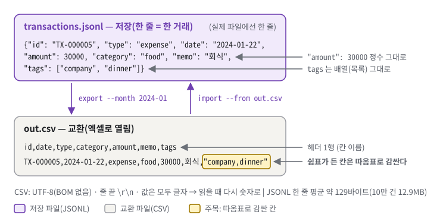
*그림 3. 같은 거래를 JSONL 과 CSV 로 쓴 모습 — JSONL 은 정수와 배열을 그대로 담고, CSV 는 쉼표가 든 태그 칸을 따옴표로 감싼다.*

그림 3 의 위 상자(보라색)가 저장 파일, 아래 상자가 교환 파일이다. 위 상자에서 `"amount": 30000` 은 따옴표 없는 **정수**이고 `"tags": ["company", "dinner"]` 는 **배열**이다. 아래 상자의 노란 칸 `"company,dinner"` 는 태그 두 개를 쉼표로 이어 한 칸에 넣었기 때문에 따옴표로 감싸졌다. CSV 에서는 `30000` 도 결국 글자라서, 읽을 때 다시 숫자로 바꿔야 한다.

**구체적인 숫자로.** 빈 폴더 `f2` 에 거래 5건(§5.1 과 같은 입력)을 넣고 1월을 내보낸 실제 결과다.

```text
$ grep TX-000005 f2/transactions.jsonl                  # 저장 파일의 5번째 줄
{"id": "TX-000005", "type": "expense", "date": "2024-01-22", "amount": 30000, "category": "food", "memo": "회식", "tags": ["company", "dinner"]}
$ grep TX-000005 f2out.csv                              # export --out f2out.csv --month 2024-01 결과
TX-000005,2024-01-22,expense,food,30000,회식,"company,dinner"
$ printf '점심' | od -An -tx1                            # 한글 2글자 = 6바이트
 ec a0 90 ec 8b ac
```

거래 5건의 JSONL 파일은 674바이트였다. 10만 건 합성 파일은 12,944,056바이트(약 12.9MB), 한 줄 평균 약 129바이트다. CSV 의 첫 바이트를 `od -c` 로 보면 `i d , d a t e …` 로 시작하고(BOM 없음) 헤더 줄 끝이 `\r \n` 이다.

**이 과제에서는.** 저장 포맷은 JSONL 하나이고 파일은 세 개 + 번호 기록 하나다.

```python
# budget_app/storage/config.py:17-27
TX_FILE_NAME = "transactions.jsonl"
CATEGORY_FILE_NAME = "categories.jsonl"
BUDGET_FILE_NAME = "budgets.jsonl"
ID_COUNTER_FILE_NAME = "id_counter"          # JSONL 이 아니라 숫자 한 줄(§3.13)
FILE_ENCODING = "utf-8"
FILE_ERRORS = "surrogateescape"              # 깨진 바이트도 잃지 않고 읽고 다시 쓴다
LINE_TERMINATOR = "\n"
TMP_SUFFIX = ".tmp"
```

CSV 는 `budget_app/storage/csv_io.py` 한 파일이 맡는다. 쓰기는 `encoding="utf-8"` + `csv.DictWriter` + `writeheader()`(`budget_app/storage/csv_io.py:170-172`), 읽기는 `encoding="utf-8-sig"`(`budget_app/storage/config.py:40`)로 BOM 이 있으면 떼어 낸다. 스키마 상수는 `CSV_FIELDS = ("id","date","type","category","amount","memo","tags")`, 필수 `("date","type","category","amount")` 다(`budget_app/storage/config.py:42-44`). `id` 는 PDF 스키마에 없는 **선택** 컬럼으로, 내보낸 파일을 다시 가져올 때 같은 거래가 두 번 들어가지 않게 하는 열쇠다(`budget_app/storage/csv_io.py:10-21` docstring — 함수·파일 맨 위에 적는 설명 문자열).

**한 칸 아래.** 세 가지 세부가 있다. ① 저장 파일은 `errors="surrogateescape"` 로 연다. UTF-8 이 아닌 바이트가 섞여 있어도 예외 대신 **대리 문자**(U+DC80~U+DCFF)로 읽어 들여, 다시 쓸 때 원래 바이트로 되돌린다(무손실 왕복). 그런 줄은 조회 경로에서 손상 줄로 격리된다(`budget_app/storage/jsonl.py:184-203`). ② CSV 는 `open(..., newline="")` 로 연다(`budget_app/storage/csv_io.py:89`). 따옴표 안의 줄바꿈을 파이썬이 먼저 바꿔 버리지 않고 csv 모듈이 직접 해석하게 하려는 것이다. ③ 쓰기는 BOM 없는 UTF-8, 읽기는 `utf-8-sig` 로 BOM 을 흡수한다 — "내 파일은 표준대로 깨끗하게, 남(엑셀)이 준 파일은 관대하게" 다. BOM 이 남아 있으면 첫 칸 이름이 `\ufeffdate`(눈에 보이지 않는 BOM 글자 + `date`)가 되어 "필수 컬럼 없음" 으로 거절된다(**회귀 테스트** — 한 번 고친 버그가 다시 생기지 않는지 지키는 테스트 — `tests/test_phase2_storage.py:98`).

> [!WARNING]
> **흔한 오해.** "CSV 는 `split(',')` 로 읽으면 된다" → `"company,dinner"`, `"점심, 회식"` 같은 인용 칸에서 깨진다. `csv` 모듈을 써야 한다. / "JSONL 은 JSON 배열 파일이다" → 배열이 아니라 줄마다 독립 객체라서 이어 쓰기·줄 단위 읽기가 된다. / "UTF-8 에서 한글은 2바이트" → 3바이트다(2바이트는 EUC-KR/CP949).

### 3.4 dataclass · 불변 객체 · 생성자 검증 — "잘못된 거래는 존재할 수 없다"

**비유로 먼저.** 은행 창구의 **입금 전표 검수대**를 떠올린다. 검수대를 통과해야만 전표가 장부에 들어가고, 한 번 도장 찍힌 전표는 고칠 수 없어서 수정하려면 **새 전표**를 쓴다. 비유의 한계: 검수대는 "이 전표의 칸이 형식에 맞나" 만 본다. "그 카테고리가 장부에 등록돼 있나" 처럼 **장부를 펼쳐 봐야 아는 것**은 창구 직원(서비스)의 몫이다.

**정확히 말하면.** 새 낱말을 한 줄에 하나씩 적는다.

- **클래스 / 객체**: 데이터의 틀 / 그 틀로 만든 실제 하나.
- **`@dataclass`**: 필드만 선언하면 `__init__`(생성자 — 객체를 만들 때 불리는 함수)·`__repr__`(출력 모양)·`__eq__`(같은지 비교)를 자동으로 만들어 주는 장식.
- **`frozen=True`(불변)**: 만든 뒤 필드에 값을 다시 넣으려 하면 `FrozenInstanceError` 가 난다.
- **`__post_init__`**: dataclass 가 만들어진 직후 자동으로 불리는 자리. 이 코드는 여기서 **검증**(규칙에 맞는지 확인)과 **정규화**(같은 뜻을 한 가지 표기로 통일)를 한다.
- **불변식**(invariant): 언제나 참이어야 하는 규칙(예: 금액은 양수).
- **엔티티 / 값 객체**(Value Object): 저장되는 도메인 객체(거래·예산·카테고리) / 값과 그 값의 규칙을 한 타입으로 묶은 것(`TransactionId`).

**구체적인 숫자로.** 복사본에서 직접 확인한 결과다.

```text
>>> t = Transaction(id="TX-1", type="Expense ", date="2024-1-5", amount="15000", category=" food ", memo=None, tags="a,,b,a")
>>> print(t)
Transaction(id=TransactionId(value='TX-000001'), type='expense', date='2024-01-05', amount=15000, category='food', memo='', tags=('a', 'b'))
>>> t.amount = -1
FrozenInstanceError: cannot assign to field 'amount'
>>> '2024-1-5' <= '2024-01-31'
False
```

첫 줄에서 7칸이 전부 정규화됐다. id 는 6자리로, 타입은 소문자로, 날짜는 0 채움으로, 금액은 정수로, 카테고리는 공백 제거로, 메모 `None` 은 빈 문자열로, 태그는 빈 항목·중복을 뺀 튜플로 바뀌었다. 셋째 줄이 날짜 정규화가 필요한 이유다. 이 프로그램은 날짜를 **문자열로 비교**하는데(`2024-01-05` 형식이면 사전순 = 시간순), `2024-1-5` 를 그대로 두면 1월 5일 거래가 "1월 31일 이하" 조건에서 빠진다.

**이 과제에서는.** 생성자가 규칙을 강제하는 **유일한 지점**이다.

```python
# budget_app/domain/entities.py:27-28, 68-80
@dataclass(frozen=True)
class Transaction:
    def __post_init__(self) -> None:
        _set = object.__setattr__                    # frozen 이라 대입 대신 이 우회로
        _set(self, "id", TransactionId.parse(self.id))
        _set(self, "type", validators.parse_type(self.type))
        _set(self, "date", validators.parse_date(self.date))
        _set(self, "amount", validators.parse_amount(self.amount))
        _set(self, "category", validators.parse_category(self.category))
        _set(self, "memo", validators.parse_memo(self.memo))
        _set(self, "tags", tuple(validators.parse_tags(self.tags)))
```

서비스가 만들든, CSV 에서 읽든, JSONL 에서 읽든(`from_dict`), 수정하든(`with_patch`) 이 생성자를 지나야 객체가 존재한다. 수정은 제자리에서 바꾸지 않고 `Transaction(**{**self.to_dict(), **patch.changed_fields()})` 로 **새 객체**를 만들어 검증을 다시 통과시킨다(`budget_app/domain/entities.py:113-124`). 규칙 자체는 `budget_app/domain/validators.py` 의 함수 하나씩이다(`parse_amount` `:63`, `parse_date` `:103`, `parse_tags` `:151`). 예산도 같다 — `Budget.__post_init__` 이 `parse_amount` 로 양수만 받으므로 0원 예산은 만들어질 수 없다(`budget_app/domain/entities.py:164-166`).

**한 칸 아래.** 먼저 발췌의 `object.__setattr__` 이다. `frozen=True` 는 클래스의 대입(`__setattr__`)을 "항상 `FrozenInstanceError`" 로 바꿔 끼운다. `object.__setattr__` 은 바꿔 끼운 것을 거치지 않고 파이썬 기본 대입을 직접 부르는 길이라, 생성 직후 `__post_init__` 안에서 값을 정규화할 때만 쓴다. 이 코드에서 그 호출은 생성 직후 자리(`budget_app/domain/entities.py:73`, `budget_app/domain/entities.py:165-166`, `budget_app/domain/entities.py:183`, `budget_app/domain/tx_id.py:89`)에만 있다. 파이썬이 이 우회를 막아 주지는 않으므로 "생성자 밖에서는 쓰지 않는다" 는 관례로 지키는 것이고, 그래서 만들어진 뒤에는 아무도 값을 바꾸지 않는다.

`parse_amount` 는 `int()` 에 바로 맡기지 않고 **정규식**(글자 모양 규칙) `^[+-]?[0-9]+$` — 맨 앞에 부호가 한 개 있어도 되고, 그 뒤는 0~9 숫자만 한 개 이상 — 를 먼저 본다(`budget_app/domain/validators.py:37`, `budget_app/domain/validators.py:87-93`). 파이썬 `int()` 는 너무 관대해서 `int('1_000')` 이 1000, 아랍 숫자 `int('١٢٣')` 이 123 이 된다(둘 다 실측). `\d` 대신 `[0-9]` 를 쓴 것도 `\d` 가 유니코드 숫자 전부를 포함하기 때문이다. `tags` 를 리스트가 아니라 **튜플**로 두는 이유는 `frozen` 이 "필드에 다른 값을 다시 넣는 것" 만 막고 리스트 **안을** 바꾸는 `tx.tags.append(...)` 는 못 막기 때문이다(회귀 테스트 `tests/test_phase5_patterns.py:46`). 필드가 전부 해시 가능하면 frozen dataclass 는 `__hash__` 도 만들어 주어 set·dict 키로 쓸 수 있다. `TransactionId` 는 `TX-1` 과 `TX-000001` 을 같은 값으로 만들고(`budget_app/domain/tx_id.py:83-89`), 크기 비교는 **번호로** 한다(`budget_app/domain/tx_id.py:91-95`) — 문자열 비교라면 `'TX-1000000' < 'TX-999999'` 가 참이 되어 100만 번째 거래부터 순서가 뒤집힌다(실측: 문자열 비교 True, `TransactionId` 비교 False).

> [!WARNING]
> **흔한 오해.** "`frozen` 이면 안의 리스트도 못 바꾼다" → 필드 재대입만 막는다. 그래서 튜플이다. / "`strptime` 을 통과하면 정규형이다" → `2024-1-5` 도 통과한다. 그래서 `strftime` 으로 다시 찍는다(`budget_app/domain/validators.py:117-122`). / "검증은 입력받는 CLI 에서 하면 된다" → CSV 가져오기처럼 CLI 입력을 거치지 않는 경로에서 구멍이 난다. 모든 경로가 지나는 생성자에 둬야 한다.

### 3.5 모듈 · 계층 · 의존 방향 — 누가 누구를 알아도 되는가

**비유로 먼저.** §1.1 의 식당 비유 그대로다. 홀 직원(cli)은 주방장(services)에게만 주문을 넘기고, 주방장은 창고지기(storage)에게만 재료를 달라고 하고, 레시피 규칙(domain)은 누구도 부르지 않는다. 비유의 한계: 실제 식당에서는 급한 직원이 창고에 몰래 들어갈 수 있지만, 이 저장소에서는 그러면 **테스트가 빨간불**을 켠다.

**정확히 말하면.** **모듈**은 `.py` 파일 하나, **패키지**는 모듈을 담은 폴더다. **의존**은 A 가 B 를 import 해 쓰는 관계다. **계층형 아키텍처**는 역할별로 층을 나누고 "위 계층은 아래를 써도 되지만 아래는 위를 모른다" 는 규칙을 두는 구조다. 이 저장소의 방향은 `cli → services → storage → domain → errors` 다(`budget_app/errors.py:13`). **합성 루트**(Composition Root)는 부품(저장소 클래스·서비스)을 한꺼번에 조립하는 단 한 곳이고(여기서 "루트" 는 "뿌리 = 출발점" 이라는 뜻), 여기서는 `AppContext` 다(`budget_app/context.py:33-65`).

**구체적인 숫자로.** 모듈 43개 = `domain/` 10 · `storage/` 9 · `services/` 8 · `cli/` 10 · 루트 6(`__init__`, `__main__`, `config`, `errors`, `decorators`, `context`). 클래스 42개. 계층 규칙 테스트는 모듈마다 하나씩 도는 것을 포함해 47개다. 복사본의 `budget_app/domain/periods.py` 에 `from ..storage import config` 한 줄을 넣고 돌리자 2개가 실패했다.

```text
E   AssertionError: domain/periods.py (domain) 가 위 계층 storage 를 import 한다
FAILED tests/test_architecture.py::test_no_upward_imports[domain/periods.py]
FAILED tests/test_architecture.py::test_domain_imports_nothing_above_itself
```

**이 과제에서는.** 네 계층의 기준은 **"무엇을 아는가"** 다.

| 계층 | 아는 것 | 모르는 것 | 대표 |
|---|---|---|---|
| `domain/` | 값 하나만 보고 판단되는 규칙(날짜 형식, 금액 양수), 검색 조건 | 파일, 화면 | `Transaction`, `validators`, `SearchFilter` |
| `storage/` | 파일 형식(JSONL·CSV), 원자적 쓰기, ID 발급 | 업무 판단, 화면 | `JsonlStore`, `TransactionRepository`, `csv_io` |
| `services/` | **저장된 상태를 봐야** 아는 판단(카테고리 등록됐나, 사용 중인가) | 파일 여는 법(`open()` 0개), 화면 문구 | `TransactionService`, `ImportExportService` |
| `cli/` | 사람: 인자 문법, 대화형 입력, 화면 문자열, 오류 → 종료 코드 | 파일 | `parser`, `handlers`, `presenter`, `error_handler` |

규칙은 테스트가 검사한다(상대 import 한정 — 아래 "한 칸 아래"). 핵심 검사는 이것이다.

```python
# tests/test_architecture.py:26, 66-75
LAYERS: dict[str, int] = {"domain": 0, "storage": 1, "services": 2, "cli": 3}

def test_no_upward_imports(path: Path):
    here = _layer_of(path)
    ...
    for imported in _imported_layers(path) - {"<root>"}:
        assert LAYERS[imported] <= LAYERS[here]      # 자기보다 위(숫자 큰) 계층 import 금지
```

이 외에 `cli` 가 `storage` 를 직접 import 하지 않는지(`tests/test_architecture.py:78-88`), `AppContext` 가 저장소 클래스를 공개하지 않는지(`tests/test_architecture.py:99-106`)도 검사한다. `AppContext` 는 저장소 클래스 객체를 `self._txs`, `self._cats`, `self._budgets` 처럼 밑줄로 숨기고 서비스만 공개한다(`budget_app/context.py:49-57`).

**한 칸 아래.** 테스트는 import 문을 문자열 검색이 아니라 **AST**(Abstract Syntax Tree, 추상 구문 트리 — 코드를 문법 구조로 분해한 것)로 뽑는다. 문자열 검색은 주석이나 docstring 에 적힌 모듈 이름까지 세어 거짓 양성이 나기 때문이다(`tests/test_architecture.py:1-14`). `from ..storage.repositories import X` 는 `ImportFrom(level=2, module="storage.repositories")` 로 파싱되므로 첫 조각 `storage` 가 계층 이름이다. 검사 대상 파일은 손으로 적은 목록이 아니라 `rglob("*.py")` 로 파일시스템을 훑어 모으므로(`tests/test_architecture.py:32-33`), 새 모듈을 만들면 저절로 검사에 붙는다.

단 **이 검사는 상대 import 만 본다.** `tests/test_architecture.py:52` 가 `ImportFrom` 이면서 `level`(앞의 점 개수)이 1 이상인 것만 남기고 나머지는 건너뛰기 때문이다. 복사본에서 같은 `periods.py` 에 절대 import `from budget_app.storage import config` 를 넣으면 **47개가 전부 통과**했고, `cli/handlers.py` 에 `import budget_app.storage.repositories` 를 넣어도 47개 통과였다. 지금 패키지 안에 절대 import 는 0건이라 위반은 없지만, 검사는 "이 패키지는 상대 import 만 쓴다" 는 관례에 기대고 있다. 게다가 CI 가 없어 이 테스트는 사람이 손으로 돌릴 때만 동작한다(`README.md:567`). 답변 스크립트와 고칠 방법은 §7.3.

> [!WARNING]
> **흔한 오해.** "파일을 많이 쪼갤수록 좋은 구조다" → 기준은 개수가 아니라 **의존 방향**이다. 43개라도 방향이 뒤엉키면 한 곳을 고칠 때 전부 흔들린다. / "규칙은 README 에 적어 두면 된다" → 문서에만 적힌 규칙은 다음 git 커밋에서 조용히 깨진다. 이 코드는 규칙을 테스트로 옮겼다(`budget_app/errors.py:15-17`). / "테스트가 있으니 규칙은 완벽히 지켜진다" → 테스트가 **무엇을 못 보는지**까지 말할 수 있어야 한다. 이 검사는 절대 import 를 못 본다(§7.3).

### 3.6 이터레이터와 제너레이터 — "필요할 때 한 개씩"

**비유로 먼저.** 회전초밥 레일을 떠올린다. 주방(파일)은 접시를 한 개씩 레일에 올리고, 손님(화면)은 지나가는 접시를 한 개씩 집는다. 1,000접시를 한꺼번에 식탁에 쌓지 않으므로 식탁(메모리)이 좁아도 된다. 비유의 한계: 레일은 되감을 수 없다(제너레이터는 **한 번만** 돈다). 그리고 "가장 최근 접시 3개" 를 고르려면 결국 모든 접시를 한 번은 봐야 한다 — 식탁은 좁아도 되지만 **시간**은 줄지 않는다.

**정확히 말하면.** 새 낱말을 하나씩 적는다.

- **이터레이터**(iterator): `next()` 를 부를 때마다 값을 하나씩 내주는 객체. `for` 문은 내부적으로 `next()` 를 반복해 부른다. 파이썬의 파일 객체도 이터레이터라서 `for line in f:` 는 파일을 **한 줄씩** 읽는다.
- **제너레이터 함수 / 제너레이터 객체**: 함수 안에 `yield` 가 있으면 제너레이터 함수가 된다. 호출해도 본문이 실행되지 않고 제너레이터 객체만 돌려준다. `next()` 가 불릴 때마다 다음 `yield` 까지 실행하고, 값을 내준 뒤 지역 변수와 실행 위치를 그대로 둔 채 멈춘다.
- **제너레이터 식**: `(x for x in … if …)` 모양. 제너레이터 함수와 같은 성질을 가진다.
- **지연 평가**(lazy evaluation): 이렇게 필요해질 때까지 계산을 미루는 것.
- **스트리밍**: 전체를 모으지 않고 한 건씩 흘려 처리하는 것.

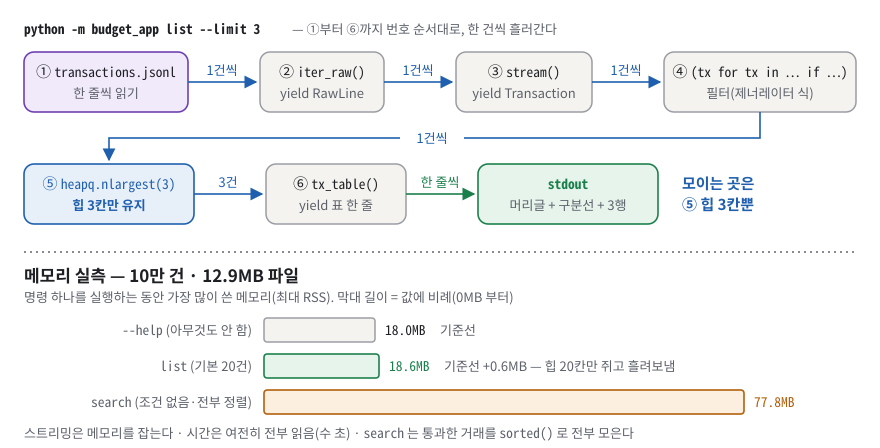
*그림 4. list 는 파일을 한 줄씩 흘려보내며 상위 3건만 쥔다 — 10만 건 파일에서도 메모리는 기준선(18.0MB)과 거의 같고, 전부 모아 정렬하는 search 만 77.8MB 까지 오른다.*

그림 4 의 위 행은 `list --limit 3` 한 번이 거치는 여섯 단계다. ①~④ 사이의 화살표 라벨이 전부 "1건씩" 이라는 것이 핵심이다. 어느 단계도 목록을 만들지 않고 한 건을 받아 한 건을 넘긴다. 무언가를 **쥐고 있는** 곳은 파란 ⑤ `heapq.nlargest(3)` 뿐이고, 거기서도 3칸만 쥔다(§3.7). 아래 행의 막대 셋은 그 결과다. 아무것도 하지 않는 `--help` 가 18.0MB(파이썬이 켜지는 데 드는 기본 메모리)인데, 10만 건을 전부 훑으며 힙 20칸을 쥐는 초록 막대 기본 `list` 도 18.6MB 다. 주황 막대 `search` 만 77.8MB 로 튀는데, 조건 없는 검색은 결과 **전부**를 정렬해야 해서 모으기 때문이다.

**구체적인 숫자로.** 복사본에서 거래 저장소 클래스 객체(`TransactionRepository`)의 `stream()` 을 불러 상태를 찍었다.

```text
>>> g = repo.stream()
>>> print(type(g).__name__, inspect.getgeneratorstate(g))
generator GEN_CREATED                  ← 아직 파일도 열지 않았다
>>> x = next(g)
>>> print(x.id, x.date, inspect.getgeneratorstate(g))
TX-000001 2024-01-15 GEN_SUSPENDED     ← 첫 줄만 읽고 멈춰 있다
```

10만 건(12.9MB) 파일에서 명령별 **피크 메모리**(프로세스가 가장 많이 쓴 순간의 물리 메모리, RSS)를 명령마다 별도 프로세스로 쟀다. `--help` 18.0MB, `list --limit 1` 18.5MB, `list`(기본 20건) 18.6MB, `summary --month 2024-01` 18.2MB, 조건 없는 `search` 77.8MB 였다(다시 재도 ±0.5MB 안이었다).

**이 과제에서는.** 파이프라인은 네 파일에 걸쳐 있다.

```python
# budget_app/storage/jsonl.py:177-182 — ① 파일을 한 줄씩
with open(self.path, encoding=config.FILE_ENCODING, errors=config.FILE_ERRORS) as f:
    for lineno, raw in enumerate(f, start=1):
        ...
        yield self._parse_line(lineno, line)          # RawLine(원문 + 해석 결과)

# budget_app/storage/jsonl.py:221-223 — ② 유효한 거래만
for raw in self.iter_raw():
    if raw.is_valid:
        yield raw.entity

# budget_app/services/transactions.py:104-108 — ③ 필터 → ④ 상위 N 또는 전체 정렬
filtered = (tx for tx in self.txs.stream() if flt is None or flt.matches(tx))
if limit is not None:
    yield from heapq.nlargest(limit, filtered, key=_sort_key)   # list: 힙 N 칸
    return
yield from sorted(filtered, key=_sort_key, reverse=True)       # search: 전부 모아 정렬
```

마지막 단계는 `presenter.tx_table()` 이 표를 한 줄씩 `yield` 하고(`budget_app/cli/presenter.py:71-97`) `output.out_lines()` 가 받은 줄을 바로 찍는다(`budget_app/cli/output.py:47-50`). `list` 가 `limit` 을 **서비스까지** 내려보내는 것이 핵심이다(`budget_app/cli/handlers.py:53-59`). 화면 단계에서만 자르면 이미 만들어진 목록을 자르는 것이라 아무것도 아끼지 못한다.

**한 칸 아래.** 제너레이터 파이프라인은 **당기는(pull) 구조**다. 맨 끝 `for line in tx_table(...)` 이 한 줄을 요청하면 그 요청이 거꾸로 올라가 `heapq` → 필터 → `stream()` → `iter_raw()` → 파일 순으로 한 줄씩 끌어온다. `iter_raw()` 안의 `with open(...)` 은 제너레이터가 끝까지 소비되거나 닫힐 때 파일을 닫는다. 그리고 **체인 중간에 `list()` 나 `sorted()` 가 끼면 그 지점에서 전부 모인다.** `search` 가 그렇다(`budget_app/services/transactions.py:108`). 한도가 없는 검색에서 "최신순" 을 만들려면 파일이 날짜순이 아니므로 결과 전부를 봐야 하기 때문이다. 이것은 README 10장이 먼저 밝혀 둔 한계다(`README.md:1006-1012`). 예전 구현은 `list` 도 필터 통과분 전체를 리스트로 모은 뒤 화면에서 `break` 했다. 20만 건 `list --limit 1` 의 피크 메모리를 외부 검수는 131.4MB 로, 작성자는 146MB 로 쟀다(코드 주석 `budget_app/services/transactions.py:94` 와 README 9장 `README.md:925` 는 146MB — 평가자가 코드를 열면 이 숫자를 본다). 지금의 `heapq.nlargest` 가 그 수정이다(`budget_app/services/transactions.py:89-103` docstring).

> [!WARNING]
> **흔한 오해.** "제너레이터를 쓰면 무조건 메모리가 적다" → 중간에 한 번이라도 모으면 끝이다. **"`yield` 를 썼다" 와 "스트리밍했다" 는 다르다.** / "화면에서 `break` 하면 아낀다" → 이미 만들어진 리스트를 자를 뿐이다. / "스트리밍이니 빠르다" → 메모리만 일정하다. 10만 건을 훑는 시간(이 환경에서 수 초)은 그대로다(§3.14).

### 3.7 정렬 대신 힙 — "상위 N 개만 손에 쥐기"

**비유로 먼저.** 오디션 심사위원이 **의자 3개**만 놓고 심사한다. 새 참가자가 오면 의자에 앉은 사람 중 **가장 약한 사람**과 비교해, 새 사람이 더 잘하면 그 사람을 내보내고 앉힌다. 참가자가 10만 명이 와도 의자는 3개다. 비유의 한계: 심사는 결국 10만 명을 **다 봐야** 끝난다. 의자(메모리)는 아끼지만 시간은 아끼지 못한다.

**정확히 말하면.** 먼저 낱말 셋.

- **트리**는 맨 위 하나(**루트**, 뿌리)에서 아래로 가지가 뻗는 계층 그림이고, **이진 트리**는 한 칸의 가지(자식)가 둘까지인 트리다. **완전 이진 트리**는 위층부터, 같은 층은 왼쪽부터 빈틈없이 채운 이진 트리다.
- **O(…) 표기**(빅오)는 데이터 수가 커질 때 시간이나 메모리가 얼마나 늘어나는지를 나타낸다. O(N) 은 N 에 비례해 늘고, O(1) 은 N 과 무관하게 일정하다. 시간에 쓰면 **시간 복잡도**, 메모리에 쓰면 **공간 복잡도**다.
- **log₂ n** 은 "n 을 몇 번 반으로 나누면 1 이 되나" 다. n = 3 이면 약 1.6, n = 100,000 이면 약 17 이다.

**힙**(heap)은 "부모가 자식보다 작거나 같다" 는 규칙만 지키는 완전 이진 트리이고, 파이썬 `heapq` 는 이것을 리스트(배열)에 저장한다. 그래서 맨 앞(루트)이 항상 최솟값이다. `heapq.nlargest(n, 흐름, key)` 는 크기 n 의 **최소 힙**을 유지한다. 루트는 "지금까지 뽑힌 n 개 중 가장 작은 것" 이 되고, 새 원소가 루트보다 크면 루트만 갈아 끼운다(`heapreplace`). 새 원소가 M 개일 때 시간은 O(M log n), 메모리는 O(n) 이다. 전부 정렬하는 `sorted` 는 시간 O(M log M), 메모리 O(M) 이다. 숫자로 어림하면 10만 건(M)에서 상위 3건(n)을 고를 때 `nlargest` 는 많아야 10만 × 1.6 ≈ 16만 번 수준의 비교, `sorted` 는 10만 × 17 ≈ 170만 번 수준이다.

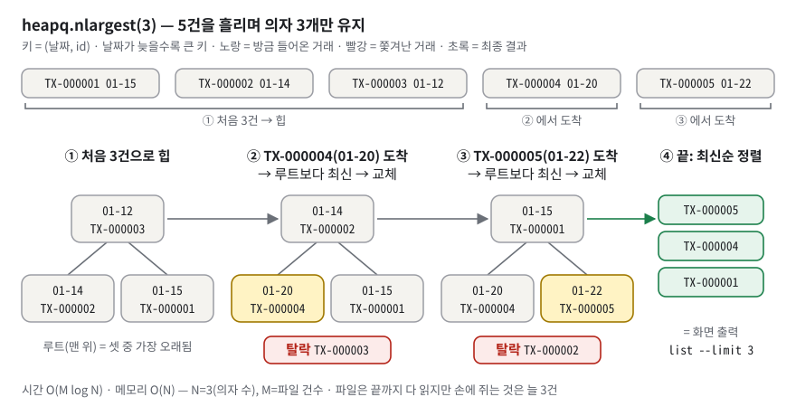
*그림 5. 힙은 지금까지 뽑힌 3건 중 가장 오래된 것을 맨 위(루트)에 둔다 — 더 최신 거래가 오면 루트만 갈아 끼우므로 5건이든 10만 건이든 손에 쥐는 것은 3건이다.*

**구체적인 숫자로.** 그림 5 를 손으로 따라간다. 정렬 키는 `(날짜, id)` 이고 파일 순서는 입력 순서다 — `TX-000001(01-15)`, `TX-000002(01-14)`, `TX-000003(01-12)`, `TX-000004(01-20)`, `TX-000005(01-22)`.

1. 처음 3건으로 힙을 만든다. 루트는 셋 중 가장 오래된 `01-12 TX-000003`.
2. `TX-000004(01-20)` 도착. 루트(01-12)보다 최신이므로 교체한다. `TX-000003` 이 빨간 상자로 **탈락**하고 새 루트는 `01-14 TX-000002`.
3. `TX-000005(01-22)` 도착. 루트(01-14)보다 최신 → 교체. `TX-000002` 탈락, 새 루트 `01-15 TX-000001`.
4. 남은 3건을 최신순으로 정렬하면 `TX-000005, TX-000004, TX-000001` — §5.1 의 `list --limit 3` 출력과 같다.

이 순서는 CPython(우리가 쓰는 표준 파이썬 실행기)의 `heapq` 로 실제 계산한 힙 배열 `[03,02,01] → [02,04,01] → [01,04,05]` 와 일치한다(그림의 노란 칸이 방금 들어온 거래다).

**이 과제에서는.** 두 줄이 전부다.

```python
# budget_app/services/transactions.py:22-24
def _sort_key(tx: Transaction) -> tuple[str, TransactionId]:
    return (tx.date, tx.id)           # 날짜가 같으면 발급 번호로 가른다

# budget_app/services/transactions.py:106
yield from heapq.nlargest(limit, filtered, key=_sort_key)
```

같은 날짜가 둘이면 튜플 비교가 두 번째 칸 `TransactionId` 로 내려가고, `TransactionId.__lt__` 가 번호로 비교한다(`budget_app/domain/tx_id.py:91-95`). 그래서 2024-01-15 거래 두 건이면 나중에 발급된 쪽이 위에 온다. 반면 `summary` 의 지출 TOP N 은 카테고리 수만큼(많아야 수십 개)만 정렬하면 되므로 그냥 `sorted(...)[:top_n]` 이다(`budget_app/services/budgets.py:76-78`). 크기가 작으면 단순한 쪽이 낫다.

**한 칸 아래.** 트리를 리스트에 담는 규칙은 인덱스 계산 하나다. 인덱스 i 칸의 자식은 2i+1 과 2i+2, 부모는 (i−1)//2 다. 마지막 힙 배열 `[01, 04, 05]` 에서 0번(루트, `TX-000001` 01-15)의 자식이 1번(`TX-000004` 01-20)과 2번(`TX-000005` 01-22)이다. 그래서 포인터 없이 리스트 하나로 트리가 된다. `heapreplace` 는 루트를 새 값으로 바꾼 뒤, 두 자식 중 더 작은 쪽과 자리를 바꾸며 내려간다(**sift-down**). 예를 들어 `[02, 04, 01]` 에 `TX-000005` 가 오면 루트를 05 로 바꿔 `[05, 04, 01]` 이 되고, 두 자식 04(01-20)·01(01-15) 중 더 작은 01 과 자리를 바꿔 `[01, 04, 05]` 가 된다. 트리 높이(log₂ n)만큼만 내려가므로 한 번에 O(log n) 이다(CPython 은 빈자리를 잎까지 먼저 내린 뒤 제자리로 올리는 변형을 쓰지만 결과와 O(log n) 은 같다).

CPython 의 `heapq.nlargest` 소스(이 환경 Python 3.14.4 에서 `inspect.getsource` 로 확인)는 세 갈래다. ① `n == 1` 이면 힙 없이 `max()` 를 쓴다(`list --limit 1` 이 이 경로). ② 입력의 `len()` 을 알 수 있고 `n >= 길이` 면 `sorted(...)[:n]` 을 쓴다. ③ 그 밖에는 처음 n 개를 `(key, 순번, 원소)` 튜플로 힙에 넣고, 이후 원소의 key 가 루트보다 클 때만 `heapreplace` 한다. 제너레이터는 `len()` 이 없으므로 ③ 경로로 간다. 순번을 끼우는 것은 key 가 같을 때 원소 자체를 비교하지 않게 하려는 장치다. 이 저장소는 id 가 유일해 key 가 겹치지 않는다. 만약 `TransactionId` 에 비교 연산이 없었다면, 날짜가 같은 두 거래에서 튜플 비교가 id 까지 내려가는 순간 `TypeError` 가 난다(`budget_app/domain/tx_id.py:69-78` docstring).

> [!WARNING]
> **흔한 오해.** "힙이면 정렬된 배열이다" → 부모 ≤ 자식만 보장하고 형제끼리는 순서가 없다. 그래서 마지막에 한 번 정렬한다. / "`nlargest` 는 파일을 덜 읽는다" → 다 읽는다. 덜 **쥘** 뿐이다.

### 3.8 데코레이터 · 클로저 · functools.wraps — "함수에 포장지 씌우기"

**비유로 먼저.** 선물 포장이다. 내용물(원래 함수)은 그대로 두고, 포장지(wrapper)가 "언제 받았는지 기록"(로그), "포장을 뜯는 데 걸린 시간"(시간 측정), "깨졌으면 사과 쪽지"(오류 처리)를 덧붙인다. `functools.wraps` 는 포장지 겉에 원래 이름표를 옮겨 붙이는 일이다. 비유의 한계: 포장지는 내용물의 **앞뒤**에서만 일한다. 내용물 **중간**의 동작은 바꾸지 못한다.

**정확히 말하면.** **데코레이터**는 함수를 받아 새 함수를 돌려주는 함수다. `@log_call` 을 `def add` 위에 쓰는 것은 `add = log_call(add)` 와 똑같다. 이처럼 함수를 받거나 돌려주는 함수를 **고차 함수**라 하고, 안쪽의 `wrapper` 가 바깥 변수 `func` 를 기억해 두었다가 나중에 쓰는 것을 **클로저**라 한다. 로그·시간·예외 처리처럼 "무엇을 계산하는가" 와 무관하게 여러 기능에 공통으로 걸치는 일을 **횡단 관심사**(cross-cutting concern)라 부른다. **로그 레벨**은 기록의 중요도(DEBUG < INFO < WARNING < ERROR)다.

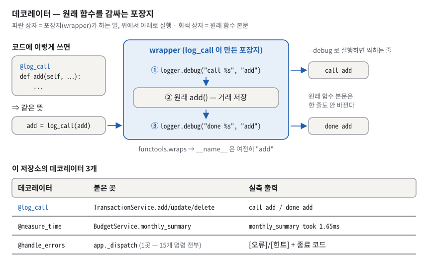
*그림 6. @log_call 은 원래 함수를 바꾸지 않고 앞뒤에 로그 두 줄을 덧붙인다 — 이 저장소는 로그·시간·오류 처리 세 가지를 이렇게 본문 밖으로 뺐다.*

그림 6 의 가운데 파란 상자가 포장지다. 안쪽 회색 상자(원래 `add()` — 거래 저장)는 한 글자도 바뀌지 않았고, 그 위아래에 ①`call add` ③`done add` 로그가 붙었다. 아래 표의 세 번째 줄 `@handle_errors` 는 **한 곳**(`app._dispatch`)에만 붙었는데 15개 명령 전부를 덮는다는 점을 기억한다.

**구체적인 숫자로.** `--debug` 를 붙이면 DEBUG 로그가 stderr 로 나온다(실측, 시각은 `<시각>` 으로 가림).

```text
$ printf '2024-01-27\nexpense\netc\n100\n\n\n' | python3 -m budget_app --debug add --data-dir demo 2>&1 >/dev/null
[DEBUG] <시각> budget_app:42 call add
[DEBUG] <시각> budget_app:44 done add
$ python3 -m budget_app summary --month 2024-01 --debug --data-dir demo 2>&1 >/dev/null
[DEBUG] 2026-09-23 10:12:55,476 budget_app:64 monthly_summary took 1.65ms
```

`42`, `44`, `64` 는 `budget_app/decorators.py` 안에서 `logger.debug` 를 부른 줄 번호다. 시간은 실행마다 조금씩 다르다. 감싼 뒤에도 `TransactionService.add.__name__` 은 `'add'` 이고 `__wrapped__` 속성이 원본을 가리킨다(실측).

**이 과제에서는.** 데코레이터는 셋이고 붙은 곳은 다섯 줄이다.

```python
# budget_app/decorators.py:37-47
def log_call(func: Callable[..., Any]) -> Callable[..., Any]:
    @functools.wraps(func)                      # 이름표(__name__ 등) 옮겨 붙이기
    def wrapper(*args, **kwargs):               # 어떤 인자든 그대로 받아
        logger.debug(LOG_CALL, func.__name__)   # 앞: "call add"
        result = func(*args, **kwargs)          # 원래 함수 실행 (func 는 클로저가 기억)
        logger.debug(LOG_DONE, func.__name__)   # 뒤: "done add"
        return result
    return wrapper
```

| 데코레이터 | 하는 일 | 정의 | 붙은 곳 |
|---|---|---|---|
| `@log_call` | 호출 전후 DEBUG 로그 | `budget_app/decorators.py:37-47` | `TransactionService.add/update/delete`(`budget_app/services/transactions.py:34`, `budget_app/services/transactions.py:59`, `budget_app/services/transactions.py:79`) |
| `@measure_time` | `time.perf_counter()` 로 실행 시간 DEBUG 로그 | `budget_app/decorators.py:50-66` | `BudgetService.monthly_summary`(`budget_app/services/budgets.py:50`) |
| `@handle_errors` | 예외 → `[오류]`/`[힌트]` + 종료 코드(§3.9) | `budget_app/cli/error_handler.py:20-128` | `app._dispatch` 한 곳(`budget_app/cli/app.py:63`) |

`@handle_errors` 만 `decorators.py` 가 아니라 `cli/error_handler.py` 에 있다. 예외를 화면 문구와 종료 코드로 바꾸는 일은 CLI 의 표현 정책이라서, `decorators.py` 에 두면 서비스가 `@log_call` 하나를 쓰려다 화면 출력 모듈까지 끌고 들어오는 역류(`services → decorators → output`)가 생긴다(`budget_app/decorators.py:3-15`).

**한 칸 아래.** 데코레이터는 **정의 시점**, 즉 모듈이 import 될 때 한 번 실행되어 이름 `add` 를 `wrapper` 로 바꿔 끼운다. 호출할 때마다 실행되는 것은 wrapper 쪽이다. `measure_time` 은 `try: return func(...)` / `finally: 시간 기록` 모양이라 예외로 빠져나갈 때도 시간이 찍힌다(`budget_app/decorators.py:59-64`) — "느려서 멈췄다" 와 "즉시 터졌다" 를 구별하려는 것이다. `functools.wraps` 는 `__name__`·`__doc__`·`__module__`·`__qualname__` 을 복사하고 `__wrapped__` 로 원본을 가리킨다. 이것을 빼면 로그가 전부 `call wrapper` 가 된다. 로그 템플릿이 `"call %s"` 처럼 %-스타일인 이유는 `logging` 에 인자를 따로 넘기면 레벨이 꺼져 있을 때 문자열 조립 자체를 하지 않기 때문이다(`budget_app/decorators.py:28-32`). f-string 은 호출 전에 이미 조립된다.

> [!WARNING]
> **흔한 오해.** "데코레이터는 함수를 부를 때마다 실행된다" → 감싸는 일은 import 때 한 번, 호출마다 도는 것은 wrapper 다. / "`@measure_time` 을 제너레이터 함수에 붙이면 순회 시간도 잰다" → 아니다. 제너레이터 함수는 호출하면 본문을 실행하지 않고 객체만 돌려주므로, wrapper 는 **객체를 만드는 순간**만 잰다. 0.1초씩 세 번 쉬는 제너레이터에 이 데코레이터를 붙이자 로그는 `gen took 0.00ms` 인데 실제 소비에는 0.3초가 걸렸다(복사본 실측, Q6.3-2). / "안전하려면 `@handle_errors` 를 모든 핸들러에 붙여야 한다" → 반대다. 예전에는 핸들러마다 붙였는데, 그 **바깥**에서 일어나는 `AppContext` 조립과 `prepare()` 가 방패 밖이라 `--data-dir` 오타 하나로 트레이스백이 났다. 데이터 폴더를 만지는 모든 경로를 `_dispatch` 한 함수로 모으고 한 번만 씌운 것이 수정이다(`budget_app/cli/app.py:65-79` docstring).

### 3.9 예외 계층과 오류 분류 — 예외가 "[오류]/[힌트] + 숫자"가 되기까지

**비유로 먼저.** 응급실의 **분류(트리아지)** 다. 들어온 환자(예외)를 증상별 칸으로 나눠 해당 과로 보낸다 — "사고가 아니라 귀가 요청", "환자가 스스로 고칠 수 있는 문제", "건물 설비 문제", "원인 불명". 원인 불명 환자도 돌려보내지 않고 "정밀검사(`--debug`)를 받으세요" 라고 안내한다. 비유의 한계: 트리아지는 **먼저 맞는 칸이 이긴다.** 칸 순서가 틀리면 모든 환자가 한 칸으로 몰린다.

**정확히 말하면.** **예외**(exception)는 실행 중 생긴 오류 신호 객체이고, 파이썬 예외는 클래스 **상속 계층**을 이룬다(`OSError` 아래에 `FileNotFoundError`, `PermissionError`, `BrokenPipeError` …). `try/except` 는 **위에서부터 처음 일치하는 절**을 실행한다. 부모 클래스를 적은 절은 자식 예외도 잡는다. 이 저장소가 직접 만든 예외는 둘이다(`budget_app/errors.py:33-51`).

- `ValidationError(ValueError)` — **값**이 규칙을 어겼다(날짜 형식, 금액 부호). 값 하나만 보고 안다. → 종료 코드 2
- `AppError(Exception)` — 값 하나의 형식 문제가 아닌 "처리할 수 없는 요청". 대표는 저장된 상태를 봐야 아는 위반("없는 id", "사용 중인 카테고리")이고, 옵션 조합 오류·CSV 헤더 오류·입력 중단도 여기에 든다(§3.2 표). 해결책 `hint` 를 들고 다닌다(단 선택 인자라 빠질 수 있다 — §7.6). → 종료 코드 4

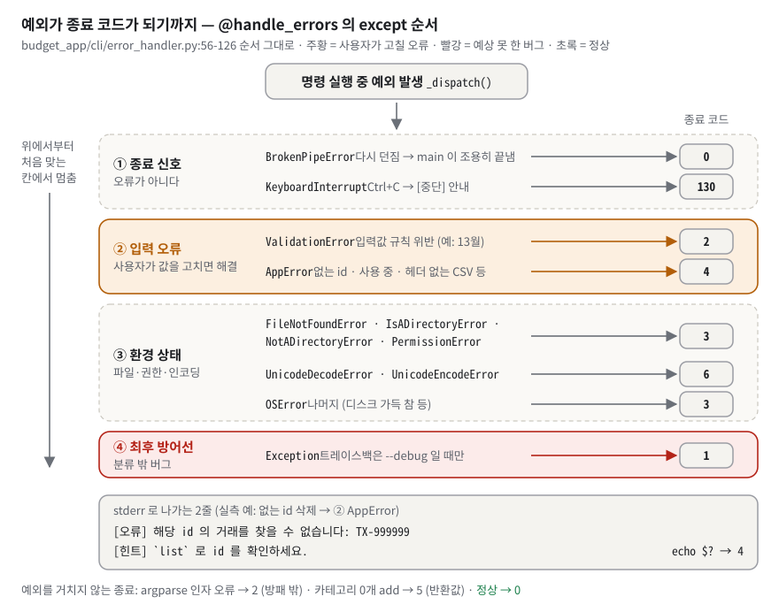
*그림 7. 예외는 위에서부터 처음 맞는 칸으로 떨어진다 — 칸마다 [오류]/[힌트] 문구와 종료 코드가 정해져 있어, 어떤 실패도 스택트레이스 대신 원인과 해결책으로 끝난다.*

그림 7 을 위에서부터 읽는다. ① 종료 신호: `BrokenPipeError` 는 다시 던져 `main` 이 조용히 0 으로 끝내고, `KeyboardInterrupt` 는 130. ② 주황 칸 입력 오류: `ValidationError` 2, `AppError` 4. ③ 환경 상태: 파일 없음·디렉터리 착오·권한 3, 인코딩 6, 나머지 `OSError` 3. ④ 빨간 칸 최후 방어선: 분류 밖의 모든 버그 1, 트레이스백은 `--debug` 일 때만. 맨 아래 줄은 예외를 거치지 않고 끝나는 경우다 — argparse 인자 오류는 방패 **밖**에서 argparse 가 직접 2 로 끝내고, 카테고리 0개 add 는 방패 **안**에서 핸들러가 예외 없이 5 를 그냥 돌려준다.

**구체적인 숫자로.** 실측한 7가지다.

| 상황 | 종료 코드 | 명령 | 핵심 줄(stderr) |
| --- | --- | --- | --- |
| 없는 id | 4 | `delete --id TX-999999` | `[오류] 해당 id 의 거래를 찾을 수 없습니다: TX-999999` |
| 틀린 월 | 2 | `summary --month 2024-13` | `[오류] 월 형식이 올바르지 않습니다 (YYYY-MM).` |
| 0건 요청 | 2 (argparse) | `list --limit 0` | (첫 줄 `usage: …` 다음) `budget_app list: error: argument --limit: 1 이상이어야 합니다: 0` |
| 없는 파일 | 3 | `import --from nope.csv` | `[오류] 파일을 찾을 수 없습니다: nope.csv` |
| 폴더 자리에 파일 | 3 | `list --data-dir notadir.txt` | `[오류] 디렉터리가 아닙니다: notadir.txt` |
| UTF-16 CSV | 6 | `import --from u16.csv` | `[오류] 파일 인코딩을 읽을 수 없습니다 (UTF-8 이 아닙니다).` |
| 입력 도중 끝남 | 4 | `printf '2024-01-15\n' \| … add` | `[오류] 입력이 중단되었습니다 (EOF).` |

어느 경우에도 `Traceback` 은 0줄이었다.

**이 과제에서는.** except 절의 순서가 곧 정책이다.

```python
# budget_app/cli/error_handler.py:56-126 (요지 — 부류별 첫 절만)
except BrokenPipeError:            raise                          # (1) 종료 신호
except KeyboardInterrupt:          ...; return config.EXIT_INTERRUPT     # 130
except ValidationError as exc:     ...; return config.EXIT_VALIDATION    # (2) 2
except AppError as exc:            ...; return config.EXIT_APP           #     4
except FileNotFoundError as exc:   ...; return config.EXIT_IO            # (3) 3
except UnicodeDecodeError:         ...; return config.EXIT_ENCODING      #     6
except OSError as exc:             ...; return config.EXIT_IO            #     3 (나머지)
except Exception as exc:                                                 # (4) 최후 방어선
    output.err(messages.MSG_ERR_UNEXPECTED.format(error=exc))
    output.err(messages.HINT_UNEXPECTED)
    logger.error(messages.LOG_UNHANDLED, exc_info=output.debug_enabled())   # 트레이스백은 --debug 때만
    return config.EXIT_ERROR                                             #     1
```

대화형 입력에서는 `ValidationError` 가 여기까지 오지 않는다. `ask_until` 이 잡아서 `[오류] …` / `[힌트] 다시 입력해 주세요.` 를 찍고 **같은 질문을 다시 한다**(최대 10회, `budget_app/cli/prompts.py:60-74`). 입력이 끝나 버리면(**EOF**, End Of File — 더 읽을 입력이 없다는 신호) `InputAborted`(`AppError` 의 자식)로 즉시 멈춘다(`budget_app/cli/prompts.py:28-57`) — 그러지 않으면 빈 문자열을 계속 받아 무한히 되묻는다.

**한 칸 아래.** 순서에 상속 제약이 둘 있다. `BrokenPipeError`·`FileNotFoundError`·`PermissionError` 는 `OSError` 의 자식이라 반드시 `OSError` 보다 위에 있어야 각자의 문구가 나간다(`budget_app/cli/error_handler.py:37-42`). 그리고 `KeyboardInterrupt` 는 `Exception` 이 아니라 `BaseException` 의 자식이라 (4) 의 `except Exception` 에 잡히지 않는다. 그래서 따로 적었다. 또 하나의 원칙은 **"오류는 원인을 아는 자리에서 만든다"** 다. `--data-dir` 에 파일 경로를 주면, 그대로 두면 한참 아래 `mkdir` 이 "파일이 이미 있어 만들 수 없다" 는 엉뚱한 말을 한다. 그래서 `AppContext` 가 먼저 `NotADirectoryError` 를 던져 (3) 칸에서 "디렉터리가 아닙니다" 가 나가게 했다(`budget_app/context.py:67-80`). 최후 방어선의 `logger.error(..., exc_info=...)` 도 두 번 고친 결과다 — 예전 `logger.exception` 은 `--debug` 없이도 트레이스백을 찍었다(`budget_app/cli/error_handler.py:117-121` 주석, 테스트 `tests/test_phase3_cli.py:160` 과 `tests/test_phase3_cli.py:182` 가 짝으로 고정).

> [!WARNING]
> **흔한 오해.** "`except Exception` 하나면 다 된다" → 원인별 힌트와 종료 코드를 잃고, Ctrl+C(`KeyboardInterrupt`)는 잡지도 못한다. / "트레이스백을 숨기면 디버깅을 못 한다" → 숨기는 것은 화면이고, `--debug` 또는 환경변수 `BUDGET_APP_DEBUG=1` 이면 stderr 로그에 남는다.

### 3.10 타입 힌트 — 코드에 적는 "입출력 계약서"

**비유로 먼저.** 택배 **송장**의 "내용물: 서류, 파손주의" 칸이다. 택배 기사는 송장을 보고 다루지만 상자를 열어 확인하지는 않는다. 송장과 내용물이 달라도 배송은 된다. 비유의 한계: 파이썬 실행기는 송장을 **아예 읽지 않는다.** 읽는 것은 사람, 편집기(IDE), 그리고 mypy 같은 검사 도구다.

**정확히 말하면.** **타입 힌트**는 `def f(x: int) -> str` 처럼 인자와 반환값의 종류를 적는 표기다(PEP 484 — PEP 는 파이썬 개선 제안 문서이고, 484번이 타입 힌트다). `X | None` 은 "X 이거나 없음" 을 뜻한다(이것을 실행 중인 식으로 평가하려면 Python 3.10 이상이 필요하다. 다만 이 코드는 바로 뒤의 `from __future__ import annotations` 로 힌트를 문자열로만 저장한다). `from __future__ import annotations` 를 파일 맨 위에 쓰면 힌트를 **문자열로 저장만** 하고 실행 중에 평가하지 않는다. `Generic[T]` 와 `TypeVar` 는 "여러 타입에 재사용하되 타입을 매개변수로 받는" **제네릭** 클래스를 만든다. **정적 검사**는 프로그램을 실행하지 않고 코드만 읽어 타입 모순을 찾는 것이고, mypy 가 대표 도구다.

**구체적인 숫자로.** AST 로 세어 보니 함수 242개 중 220개가 인자·반환을 모두 표기했다. 빠진 22개는 argparse 설정 함수 `_add_*` 11개, `__init__` 7개, 데코레이터 안쪽 `wrapper` 3개, `UnitOfWork.stage`(여러 파일을 한꺼번에 바꾸는 클래스의 메서드, §3.12) 1개다. 28개 모듈이 `from __future__ import annotations` 를 쓴다. 실제 저장된 모양은 이렇다.

```text
>>> print(inspect.signature(TransactionService.stream_sorted))
(self, flt: 'SearchFilter | None' = None, *, limit: 'int | None' = None) -> 'Iterator[Transaction]'
>>> TransactionPatch(amout=5)
TypeError: TransactionPatch.__init__() got an unexpected keyword argument 'amout'. Did you mean 'amount'?
```

첫 줄의 따옴표가 "문자열로 저장만 했다" 는 증거다.

**이 과제에서는.** 실제 코드 예 세 개로 이점을 보여 준다.

1. **계약이 시그니처에 보인다.** **시그니처**는 함수 이름·인자·반환 타입을 적은 첫 줄이다. `stream_sorted(self, flt: SearchFilter | None = None, *, limit: int | None = None) -> Iterator[Transaction]`(`budget_app/services/transactions.py:86-88`). 반환이 리스트가 아니라 `Iterator` 라는 것만 보고 "스트리밍이다, `len()` 을 못 쓴다, 한 번만 돌 수 있다" 를 안다. `flt: … | None` 은 "조건이 없을 수 있다" 를 알려 주고, 그 분기가 바로 `flt is None or flt.matches(tx)`(`budget_app/services/transactions.py:104`) 다. `*` 뒤의 `limit` 은 키워드로만 넘길 수 있다.
2. **dict 대신 선언된 필드.** 수정 요청은 예전에 `changes: dict` 였고 키를 `amout` 처럼 잘못 쓰면 **조용히 무시**됐다. 지금은 필드가 선언된 `TransactionPatch`(`budget_app/domain/entities.py:127-154`)라서 위처럼 즉시 `TypeError` 가 난다. `None` 인 필드는 "변경 없음" 을 뜻한다.
3. **선언과 실제 값의 어긋남을 찾아 고침.** `TransactionPatch.tags` 는 `list[str] | None` 인데 argparse 는 `"a,b"` **문자열**을 준다. 뒤에서 `Transaction` 생성자가 우연히 고쳐 주고 있었을 뿐 선언과 값이 달랐다. 지금은 핸들러가 경계에서 `validators.parse_tags` 로 리스트를 만들어 넣는다(`budget_app/cli/handlers.py:133-151`, 회귀 테스트 `tests/test_phase3_cli.py:133`).

제네릭은 저장소 공통 클래스 `JsonlStore(Generic[T])`(`budget_app/storage/jsonl.py:131`)에 쓰였다. `TransactionRepository(JsonlStore[Transaction])` 처럼 구체 타입을 넣으면 `stream()` 의 반환이 `Iterator[Transaction]` 으로 읽힌다.

**한 칸 아래.** 힌트는 `함수.__annotations__` 에 저장될 뿐 실행 경로에 끼어들지 않는다. 값 검사는 `validators` 가 따로 한다 — 그래서 이 저장소는 **힌트(계약 표기) + 생성자 검증(계약 강제)** 두 겹이다. `TransactionPatch(amout=5)` 의 `TypeError` 도 힌트가 검사해서가 아니다. dataclass 가 힌트를 **필드 선언**으로 읽어 `__init__` 을 만들었고, 그 `__init__` 이 `amout` 이라는 인자를 모르기 때문이다. 이 프로젝트는 mypy 를 설정·실행하지 않았다. 따로 설치한 mypy 2.3.1(기본 설정)로 돌려 보니 `Found 11 errors in 7 files` 였다. 대부분 "생성자가 정규화하므로 실제로 받는 값이 선언보다 넓다"(예: `tags: tuple[str, ...]` 필드에 리스트를 넘김)와 "제네릭 `T` 에 제약이 없어 `to_dict/from_dict` 를 모른다" 는 종류다. 실행 버그는 아니지만 **선언이 실제보다 좁다**는 사실을 보여 준다(§7.16).

데코레이터와 만나는 곳에도 구멍이 있다. `log_call`·`measure_time` 이 `Callable[..., Any] -> Callable[..., Any]` 로 적혀 있어서(`budget_app/decorators.py:37`, `budget_app/decorators.py:50`), 이것을 씌운 메서드는 정적 검사기 눈에 타입이 사라진다. mypy 의 `reveal_type(TransactionService.add)` 는 `def (*Any, **Any) -> Any` 였다(실측, `BudgetService.monthly_summary` 도 같다). 데코레이터가 없는 `stream_sorted` 는 선언한 시그니처가 그대로 보였다. 실행 중에는 `functools.wraps` 가 남긴 `__wrapped__` 덕분에 `inspect.signature(TransactionService.add)` 가 원래 모양을 보여 준다.

> [!WARNING]
> **흔한 오해.** "`amount: int` 라고 쓰면 문자열을 넣을 때 오류가 난다" → 실행 중에는 아무 일도 없다. 오류를 내는 것은 `parse_amount` 다. / "타입 힌트를 달았으니 타입 검사를 통과한 코드다" → 검사기를 돌려야 안다. 이 저장소는 돌리지 않았고, 돌리면 11건이 나온다.

### 3.11 원자적 파일 교체 — 임시 파일 + fsync + os.replace

**비유로 먼저.** 게시판의 공지를 고친다고 하자. 붙어 있는 종이를 지우개로 지우고 다시 쓰면, 쓰는 도중 누가 보면 반쪽짜리 공지를 읽게 된다. 대신 **새 종이에 완성본을 다 쓴 뒤**, 핀 하나를 뽑아 옛 종이와 새 종이를 **한 번에** 바꿔 꽂는다. 보는 사람은 옛 공지 아니면 새 공지만 본다. 비유의 한계: 컴퓨터가 꺼지는 바로 그 순간에는 "핀을 바꿔 꽂았다" 는 기록조차 디스크에 안 남았을 수 있다(아래 "한 칸 아래" 의 디렉터리 fsync).

**정확히 말하면.** 새 낱말을 한 줄에 하나씩 적는다.

- **원자성**(atomicity): "전부 되거나 전혀 안 되거나, 중간 상태는 없다" 는 성질.
- **디렉터리 항목 / inode**: 파일 **이름**은 폴더 안의 "이름 → 실체 번호" 대응표 한 줄(디렉터리 항목)이고, 그 실체 번호를 inode 라 부른다.
- **`os.replace(src, dst)`**: 운영체제의 `rename` 호출. 같은 파일시스템 안에서 `dst` 라는 이름이 가리키는 대상을 `src` 의 실체로 한 번에 바꾼다(`dst` 가 이미 있어도 덮어쓴다).
- **페이지 캐시**: `write()` 한 내용은 곧바로 디스크에 가지 않고, 운영체제가 잠시 모아 두는 이 메모리에 머문다.
- **`flush()` / `os.fsync()`**: 파이썬 버퍼 → 운영체제로 넘기기 / 운영체제 캐시 → 디스크 장치까지 내려보내라는 요청.

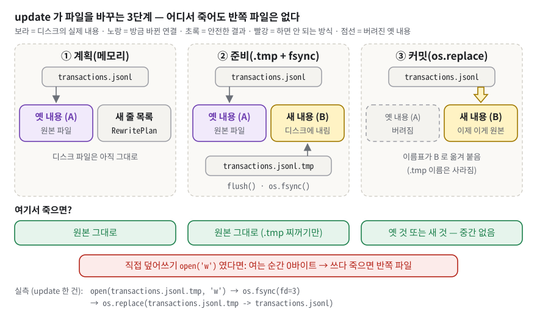
*그림 8. 새 내용을 임시 파일에 다 쓰고 디스크에 내린 뒤 이름표만 한 번에 옮긴다 — 어느 단계에서 멈춰도 파일은 옛 내용이거나 새 내용이다.*

그림 8 에서 이름 상자 `transactions.jsonl` 이 가리키는 화살표를 따라간다. ① 계획 단계에서 이름은 여전히 옛 내용(A)을 가리키고, 새 줄 목록은 메모리에만 있다. ② 준비 단계에서 `transactions.jsonl.tmp` 라는 **다른 이름**에 새 내용(B)을 다 쓰고 `fsync` 한다. 원본 이름은 여전히 A 다. ③ 커밋 단계의 노란 화살표 하나 — `os.replace` — 로 이름이 B 를 가리키게 되고, A 는 회색 점선(버려짐)이 된다. 아래 행의 초록 상자 셋이 "어느 단계에서 죽어도 반쪽 파일은 없다" 는 결론이고, 맨 아래 빨간 상자는 하면 안 되는 방식이다. `open(..., 'w')` 는 **여는 순간 파일을 0바이트로 자르므로**, 쓰다 죽으면 반쪽 또는 빈 파일이 남는다.

**구체적인 숫자로.** 파이썬 수준에서 `open`, `os.fsync`, `os.replace` 를 감싸 호출 순서를 기록했다(이 환경에 strace 가 없어서 쓴 방법). 아래는 **읽기용 `open(..., 'r')` 은 생략하고 쓰기 관련 호출만 추린 것**이다. 실제 기록에는 그 앞에 읽기용 open 이 여러 번 더 찍힌다(update 는 `transactions.jsonl` 'r' 두 번, add 는 카테고리·거래·`id_counter` 읽기 여러 번). 같은 방법으로 재현하면 줄이 더 나오는 것이 정상이다.

```text
update --id TX-000004 --amount 160000
  open(transactions.jsonl.tmp, 'w')
  os.fsync(fd=3)
  os.replace(transactions.jsonl.tmp -> transactions.jsonl)

add (한 건)
  open(id_counter.tmp, 'w')                 ← 발급한 최대 번호를 적은 파일(워터마크, §3.13)을 먼저 원자적으로 올리고
  os.fsync(fd=3)
  os.replace(id_counter.tmp -> id_counter)
  open(transactions.jsonl, 'rb')            ← 마지막 1바이트가 줄바꿈인지 검사(아래 '추가(append)' 단락)
  open(transactions.jsonl, 'a')             ← 거래는 파일 끝에 한 줄 이어 쓰기
  os.fsync(fd=3)
```

**이 과제에서는.** 준비와 커밋이 함수 둘로 나뉘어 있다.

```python
# budget_app/storage/jsonl.py:59-77 (요지)
tmp = path.with_suffix(path.suffix + config.TMP_SUFFIX)   # 같은 폴더의 transactions.jsonl.tmp
with open(tmp, "w", ...) as f:
    for line in lines:
        f.write(line + config.LINE_TERMINATOR)
    f.flush()                                             # 파이썬 버퍼 → OS
    os.fsync(f.fileno())                                  # OS 캐시 → 디스크
return tmp
...
def commit_staged(tmp: Path, target: Path) -> None:
    os.replace(tmp, target)                               # 이름표를 한 번에 교체
```

`update/delete` 의 전체 흐름은 세 단계다. ① **계획**: `plan_rewrite` 가 `iter_raw()` 로 모든 줄을 원문과 함께 읽고, 변환 함수(삭제면 `None`, 수정이면 새 객체)를 적용해 새 줄 목록을 **메모리에서만** 만든다(`budget_app/storage/jsonl.py:286-333`). 해석하지 못한 손상 줄은 **원문 그대로** 목록에 넣는다(`budget_app/storage/jsonl.py:311-315`). ② **준비**: `stage_lines` 가 `.tmp` 에 쓰고 fsync(`budget_app/storage/jsonl.py:48-72`). ③ **커밋**: `commit_staged` 가 `os.replace`(`budget_app/storage/jsonl.py:75-77`). 계획 결과 바뀐 것이 없으면(없는 id 삭제 등) 파일을 **아예 건드리지 않는다**(`budget_app/storage/jsonl.py:347-349`, 테스트 `tests/test_phase5_patterns.py:133`). 또 `delete` 는 "있나?" 를 따로 묻지 않고 재작성하면서 `found` 로 알아내 파일을 **한 번만** 읽는다(`budget_app/storage/repositories.py:150-171`, 테스트 `tests/test_phase5_patterns.py:112`). CSV 내보내기도 같은 규칙(임시 파일 + fsync + `os.replace`)이다(`budget_app/storage/csv_io.py:167-186`).

추가(append)는 재작성하지 않는다. 대신 두 위험을 막는다(`budget_app/storage/jsonl.py:242-284`). 마지막 줄에 줄바꿈이 없는 파일에 그냥 이어 쓰면 새 JSON 이 그 줄 뒤에 붙어 두 레코드가 함께 망가지므로, 마지막 1바이트를 `rb` 모드로 읽어(`seek(-1, SEEK_END)`) 줄바꿈이 아니면 먼저 `\n` 을 쓴다. 그리고 이어 쓰기도 `flush` + `fsync` 한다.

**한 칸 아래.** `rename` 이 원자적인 이유는 그것이 **디렉터리 항목 한 줄을 바꾸는 연산**이기 때문이다. 다른 프로세스는 이름을 열 때 옛 inode 아니면 새 inode 를 얻고, 그 중간은 없다. 옛 inode 는 그것을 열고 있는 프로그램이 모두 닫으면 해제된다. 단 `rename` 은 **같은 파일시스템 안에서만** 된다(다르면 `EXDEV` 오류). 그래서 임시 파일을 `/tmp` 가 아니라 **원본과 같은 폴더**에 만든다(`budget_app/storage/jsonl.py:60`). 이 코드가 하지 않는 것도 있다. 파일 내용은 fsync 하지만 **폴더(디렉터리) 자체는 fsync 하지 않는다.** 그래서 전원이 끊긴 직후 "이름을 바꿨다" 는 사실이 파일시스템에 따라 되돌아갈 수 있고, 그 영속성은 ext4 저널 같은 파일시스템에 맡긴다(§7.17).

> [!WARNING]
> **흔한 오해.** "`open('w')` 로 바로 덮어써도 금방 끝나니 안전하다" → `'w'` 는 여는 순간 파일을 0바이트로 자른다. / "`os.replace` 만 하면 내용도 안전하다" → fsync 없이 전원이 끊기면 새 이름이 아직 디스크에 없는(빈) 내용을 가리킬 수 있다(`budget_app/storage/jsonl.py:55-57`). / "`os.rename` 과 `os.replace` 는 같다" → 리눅스에선 같지만 Windows 의 `os.rename` 은 대상이 있으면 실패한다. 어디서나 덮어쓰는 쪽이 `os.replace` 다.

### 3.12 준비와 커밋 · 부분 성공과 롤백 — import 의 정책

**비유로 먼저.** 이사할 때 **짐을 전부 트럭에 먼저 싣고**(준비), 다 실렸을 때만 출발한다(커밋). 짐 하나가 안 들어가면 선택지가 둘이다. "아예 출발하지 않는다"(전수 롤백, `--atomic`) 또는 "그 짐만 두고 출발하고, 두고 온 짐 목록을 남긴다"(부분 성공, 기본). 비유의 한계: 트럭 두 대(파일 두 개)를 **정확히 동시에** 도착시킬 수는 없다. 이 저장소가 할 수 있는 것은 "거의 동시" — `rename` 두 번을 연달아 — 까지다.

**정확히 말하면.** **2단계 처리**는 모든 판정을 먼저 끝내고(준비) 그다음에 한 번에 반영하는(커밋) 방식이다. **부분 성공**(partial success)은 유효한 행만 반영하고 거부 사유를 보고하는 것, **전수 롤백**(all-or-nothing)은 하나라도 틀리면 아무것도 반영하지 않는 것이다. **트랜잭션**(transaction)은 데이터베이스에서 여러 변경을 "전부 되거나 전혀 안 되거나" 로 묶는 기능이다(코드의 거래 클래스 `Transaction` 과는 이름만 같다 — 영어로 거래도 transaction 이다). **Unit of Work** 는 원래 여러 객체의 변경을 추적해 한꺼번에 반영하는 패턴인데, 이 저장소의 `UnitOfWork` 는 스스로 "변경 추적은 하지 않는 **staged commit**(준비된 파일들을 몰아서 교체)" 이라고 밝힌다(`budget_app/storage/unit_of_work.py:3-15`).

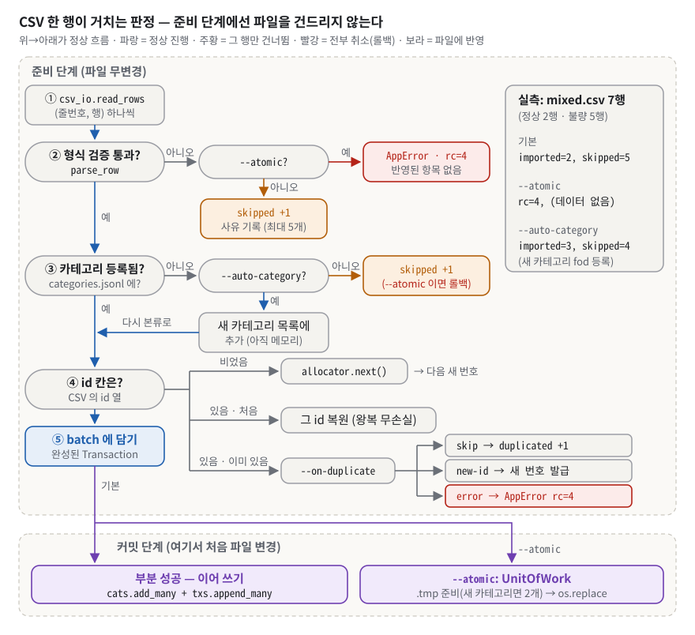
*그림 9. 가져오기는 모든 행을 먼저 판정하고 나서야 파일을 쓴다 — 그래서 --atomic 은 한 줄만 틀려도 아무것도 쓰지 않고, 기본 모드는 틀린 줄만 사유와 함께 건너뛴다.*

그림 9 의 위쪽 큰 영역 "준비 단계" 에는 파일을 쓰는 화살표가 하나도 없다. 행 하나는 세로 본류를 따라 ② 형식 검증 → ③ 카테고리 → ④ id 칸 판정 → ⑤ batch 추가로 내려간다. 오른쪽으로 빠지는 가지는 두 색이다. 빨간 상자(`AppError · rc=4 · 반영된 항목 없음`)는 `--atomic` 일 때 **첫 오류에서 즉시 중단**하는 길이고, 주황 상자(`skipped +1`)는 기본 모드에서 그 행만 건너뛰는 길이다. 아래 "커밋 단계" 에서 처음으로 보라색(파일 반영) 상자가 나온다.

**구체적인 숫자로.** 7행 중 정상 2행인 `mixed.csv`(불량: 날짜 `2024-13-40`, 금액 `-500`, 타입 `refund`, 카테고리 `fod`, 금액 `abc`. 파일 내용과 만드는 명령은 §5.0)로 세 모드를 돌렸다. `demo` 는 §5 시연 폴더이고(§5.5 에서 이 명령을 그대로 한다), `demo3`·`demo4` 는 새 폴더다.

```text
$ python3 -m budget_app import --from mixed.csv --data-dir demo
[완료] mode=부분 성공, imported=2, duplicated=0, skipped=5
[오류 라인 일부]
  - line 3: 날짜 형식이 올바르지 않습니다 (YYYY-MM-DD).
  - line 4: 금액은 양의 정수여야 합니다 (0 또는 음수 불가).
  - line 5: type 은 ('income', 'expense') 중 하나여야 합니다.
  - line 6: 등록되지 않은 카테고리입니다: fod (`category add --name fod` 으로 등록하거나 `--auto-category` 를 쓰세요)
  - line 7: 금액은 정수여야 합니다.
[rc=0]                                                  ← 5행을 버렸어도 0 (§7.4)

$ python3 -m budget_app import --from mixed.csv --atomic --data-dir demo3      (새 폴더)
[오류] 원자적 가져오기 실패 — line 3: 날짜 형식이 올바르지 않습니다 (YYYY-MM-DD). (반영된 항목 없음)
[힌트] CSV 를 고쳐 다시 시도하거나, --atomic 없이 부분 가져오기를 사용하세요.      ← rc=4
$ python3 -m budget_app list --data-dir demo3
(데이터 없음)

$ python3 -m budget_app import --from mixed.csv --auto-category --data-dir demo4
[완료] mode=부분 성공, imported=3, duplicated=0, skipped=4
[안내] 새 카테고리 1개를 등록했습니다: fod
[오류 라인 일부]
  - line 3: 날짜 형식이 올바르지 않습니다 (YYYY-MM-DD).
  - line 4: 금액은 양의 정수여야 합니다 (0 또는 음수 불가).
  - line 5: type 은 ('income', 'expense') 중 하나여야 합니다.
  - line 7: 금액은 정수여야 합니다.                      ← line 6(fod)은 이번엔 받아들여져 빠졌다
```

그리고 방금 내보낸 파일을 그대로 다시 가져오면 `imported=0, duplicated=5` 다(§5.5). 같은 거래가 두 번 들어가지 않는다.

**이 과제에서는.** 큰 흐름은 두 줄이다.

```python
# budget_app/services/importexport.py:106-109
batch = self._prepare(Path(in_path), atomic=atomic, on_duplicate=on_duplicate, auto_category=auto_category)
return self._commit(batch, atomic=atomic)          # 여기서 처음 파일이 바뀐다

# budget_app/services/importexport.py:118-129 (요지)
for lineno, row in csv_io.read_rows(in_path):      # (줄번호, 행) 을 하나씩 — 제너레이터
    try:
        parsed = csv_io.parse_row(row)             # 도메인 검증기를 그대로 재사용
    except (ValidationError, KeyError) as exc:
        if atomic:
            raise AppError(...)                    # 전수 롤백: 준비 중 중단 → 파일 무변경
        batch.note_error(lineno, exc)              # 부분 성공: 세고, 사유는 앞 5개만
        continue
```

커밋 방식도 모드마다 다르다. 부분 성공은 카테고리 추가와 거래 **이어 쓰기**(`budget_app/services/importexport.py:234-241`)라 추가분만큼만 비용이 든다. `--atomic` 은 먼저 워터마크(`id_counter`)를 원자적으로 올리고(`budget_app/services/importexport.py:256`), `UnitOfWork` 가 바뀔 파일의 최종 내용을 `.tmp` 로 준비(fsync 까지)한 뒤 `os.replace` 를 연달아 실행한다(`budget_app/services/importexport.py:243-261`, `budget_app/storage/unit_of_work.py:92-156`). 바뀌는 파일은 보통 거래 파일 하나이고, `--auto-category` 로 새 카테고리가 생길 때만 카테고리 파일까지 두 개다(`budget_app/services/importexport.py:258-260`). 결과 보고는 `skipped`(데이터가 틀림 → CSV 를 고쳐야 함)와 `duplicated`(이미 저장됨 → 할 일 없음)를 **나눠** 센다. 해야 할 일이 정반대라서다(`budget_app/domain/results.py:74-100`). `[완료]` 한 줄은 결과라 stdout, 사유 목록은 진단이라 stderr 로 나간다(`budget_app/cli/handlers.py:203-205`).

**한 칸 아래.** 준비 단계는 id 발급까지 **메모리에서** 끝낸다. `IdAllocator` 가 이미 쓰인 id 집합(`taken`)과 카운터를 들고, CSV 에 id 가 있으면 그것을 예약하고(왕복 무손실), 비었으면 새 번호를 낸다(`budget_app/services/importexport.py:187-218`). 카테고리 판정을 id 발급보다 **먼저** 해서 거부될 행이 번호를 먹지 않게 했다(`budget_app/services/importexport.py:131-141`). 미등록 카테고리는 기본 **거부**이고 `--auto-category` 로만 등록한다 — 예전에는 기본이 자동 등록이라 오타 `fod` 가 경고 없이 카테고리 목록에 영구 등록됐다(`budget_app/services/importexport.py:161-171` docstring). `UnitOfWork.commit` 에서 두 번째 `rename` 이 실패하면, 이미 바뀐 첫 파일은 되돌릴 수 없으므로 (1) 어디까지 반영됐는지 로그를 남기고 (2) 남은 `.tmp` 를 지우고 (3) 예외를 그대로 올려 성공으로 착각하지 않게 한다(`budget_app/storage/unit_of_work.py:125-156`, 테스트 `tests/test_phase2_storage.py:157`).

> [!WARNING]
> **흔한 오해.** "`UnitOfWork` 라는 이름이니 완전한 트랜잭션이다" → 코드가 스스로 "완전한 원자성은 아니다 — rename 두 번 사이에 전원이 끊기면 한쪽만 반영될 수 있다" 고 적었다(`budget_app/storage/unit_of_work.py:38-42`). 창을 "파일 쓰기 2회 사이" 에서 "rename 2회 사이(밀리초)" 로 **줄인** 것이다. / "skipped 와 duplicated 는 같은 실패다" → 하나는 고쳐야 하고 하나는 할 일이 없다. 합치면 정상 왕복이 실패처럼 보인다.

### 3.13 무결성 불변식 — 참조 무결성과 ID 워터마크

**비유로 먼저.** 도서관 두 장면이다. ① 대출 중인 책이 있는 분류("과학")를 분류 목록에서 지우면, 그 책들은 "없는 분류" 에 꽂힌 셈이 된다. 그래서 지우기 전에 막거나, 책들을 다른 분류로 옮기라고 한다(**참조 무결성**). ② 폐기한 책의 **등록번호를 새 책에 다시 붙이지 않는다.** 예전 대출 기록(밖으로 내보낸 CSV)이 엉뚱한 책을 가리키게 되기 때문이다(**워터마크**). 비유의 한계: 도서관은 사서가 기억하지만 이 프로그램에서는 **숫자 한 줄짜리 파일 `id_counter`** 가 기억한다. 그 파일을 지우면 기억도 사라진다(그때는 파일 스캔 값으로 돌아간다).

**정확히 말하면.** **참조 무결성**은 "가리키는 쪽(거래의 category)이 가리키는 대상(카테고리)이 항상 존재해야 한다" 는 규칙이다. 관계형 데이터베이스는 **외래 키**(FK)로 이것을 지키고, `ON DELETE RESTRICT`(참조 중이면 삭제 거부) 같은 옵션을 준다. 이 저장소는 파일 기반이라 그것을 코드로 직접 구현했다(`budget_app/services/categories.py:1-5`). **워터마크**는 "줄어들지 않는 최고 기록선" 이다. 여기서는 "발급한 적 있는 가장 큰 거래 번호" 를 뜻한다.

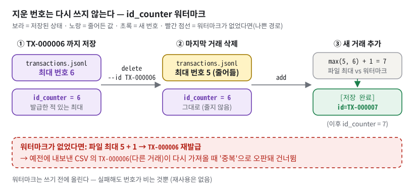
*그림 10. 거래를 지우면 파일 속 최대 번호는 5로 줄지만 id_counter 는 6에 남는다 — 그래서 다음 거래는 지운 번호를 재사용하지 않고 TX-000007 이 된다.*

**구체적인 숫자로.** 그림 10 은 실측 그대로다. `TX-000006` 까지 저장된 폴더에서 `delete --id TX-000006` 을 하면 `[삭제 완료] id=TX-000006` 이 나오고, 이때 `id_counter` 파일의 내용은 `6` 이다. 파일 속 최대 번호는 노란 칸처럼 5로 줄었다. 이어서 `add` 하면 시작점이 `max(5, 6) = 6` 이라 `[저장 완료] id=TX-000007` 이 나온다. 아래 빨간 점선 상자는 워터마크가 없었을 때다. 파일 최대 5 + 1 = `TX-000006` 이 다시 발급되고, 예전에 내보낸 CSV 속 `TX-000006`(다른 거래)을 다시 가져올 때 "이미 있는 id" 로 판정돼 **건너뛰어진다**. 리포트는 `중복은 이미 저장된 거래입니다` 라고 말하므로, 사용자는 다른 거래를 잃은 줄 모른다(회귀 테스트 `tests/test_phase1_data_integrity.py:110`).

카테고리 쪽 실측: `category remove --name food` → `[오류] 카테고리 'food' 는 거래에서 사용 중입니다.` / `` [힌트] `--replace-with <카테고리>` 로 대체 카테고리를 지정하세요. `` rc=4 → `category remove --name food --replace-with etc` → `[완료] 'food' 삭제, 2건을 'etc' 로 재지정했습니다.` rc=0.

**이 과제에서는.**

```python
# budget_app/storage/repositories.py:76-77 — 번호 시작점은 두 값의 최대
max_n, taken = self.id_state()                          # 지금 파일에 있는 것(삭제하면 줄어듦)
return IdAllocator(start=max(max_n, self._watermark.read()), taken=taken)   # 발급한 적 있는 것(안 줄어듦)

# budget_app/storage/repositories.py:135-136 — 쓰기 **전에** 워터마크를 올린다
self._watermark.remember(tx.id.number)
super().append(tx)
```

워터마크를 쓰기 **전에** 올리는 이유: 거래 쓰기가 실패해도 번호 하나가 비는 것뿐이고, 빈 번호는 아무 문제를 일으키지 않는다. 반대 순서면 "쓰였는데 기록선은 낮은" 순간이 생긴다(`budget_app/storage/repositories.py:128-134` docstring). 워터마크 파일 자체도 임시 파일 + `os.replace` 로 쓴다(`budget_app/storage/ids.py:71-78`).

카테고리 삭제는 `CategoryService.remove` 가 맡는다(`budget_app/services/categories.py:38-89`). 사용 중인데 `--replace-with` 가 없으면 차단(rc=4), 있으면 해당 거래를 일괄 재지정한 뒤 삭제한다. 자기 자신으로 대체, 미등록 카테고리로 대체, 없는 카테고리 삭제도 전부 막는다. 순서가 안전하다 — **거래 재지정(거래 파일 원자 교체) → 그다음 카테고리 삭제**. 둘 사이에 죽어도 "쓰는 거래가 없는 카테고리" 가 남을 뿐, "없는 카테고리를 가리키는 거래(고아)" 는 생기지 않는다.

**한 칸 아래.** 워터마크만 믿지 않고 파일도 훑는 이유는, 사용자가 파일을 손으로 편집하거나 다른 폴더에서 복사해 올 수 있어서다(`budget_app/storage/repositories.py:73-74`). 파일을 훑을 때는 **손상된 줄에 든 id 도 "이미 쓴 번호"** 로 센다. JSON 이 깨진 줄이면 정규식 `"id"\s*:\s*"(TX-\d+)"` 로 원문에서 건져낸다(`budget_app/storage/repositories.py:39-51`, `budget_app/domain/tx_id.py:109-117`). 카테고리 삭제에서는 두 이름을 **진입부에서 먼저 정규화**한다(`budget_app/services/categories.py:61-62`). 예전에는 `--replace-with " food "` 처럼 공백을 넣으면 "자기 자신으로 대체" 가드가 문자열 비교에서 달라 보여 통과했고, 결국 고아 거래가 생겼다(회귀 테스트 `tests/test_phase1_data_integrity.py:129`, `tests/test_phase1_data_integrity.py:142`). 백업도 `*.jsonl` 뿐 아니라 `id_counter` 를 함께 복사한다 — 빠뜨리면 복원 후 삭제된 번호 재사용이 되살아난다(`budget_app/storage/backup.py:36-47`).

> [!WARNING]
> **흔한 오해.** "id 가 유일하려면 현재 파일의 최대값 + 1 이면 충분하다" → 파일 안에서는 유일하지만, **밖으로 나간 id**(내보낸 CSV)와 충돌한다. / "카테고리 삭제는 카테고리 파일만 보면 된다" → 거래 파일을 훑어 사용 여부를 봐야 한다(`budget_app/storage/repositories.py:121-124`).

### 3.14 확장성과 복잡도 — 10만 건이면 어디가 먼저 터지나

**비유로 먼저.** 영수증 묶음이 1만 장에서 10만 장이 됐다. 한 장씩 넘기면(스트리밍) 책상이 좁아도 되지만, **넘기는 시간**은 10배가 된다. "1월 것만" 보려면 월별 봉투(샤딩)나 색인 카드(인덱스)가 필요하다. 비유의 한계: 사람은 어제 넘겨 본 것을 기억하지만, 이 프로그램은 명령마다 새 프로세스로 켜지므로 **매번 처음부터** 넘긴다.

**정확히 말하면.** **전체 스캔**(full scan)은 원하는 것을 찾으려고 처음부터 끝까지 읽는 것으로, 시간이 O(N) 이다. **인덱스**는 "값 → 위치" 를 적어 둔 색인표, **샤딩**은 데이터를 기준(예: 월)별로 여러 파일에 나누는 것이다. **tombstone** 은 지운 행을 바로 없애지 않고 "삭제됨" 표시만 이어 쓰는 방식이고, **compaction** 은 그런 표시를 나중에 몰아서 정리하는 작업이다. **SQLite** 는 파일 하나로 동작하는 작은 데이터베이스로, 파이썬에 `sqlite3` 모듈로 들어 있다.

**구체적인 숫자로.** 10만 건 합성 데이터(12.9MB)로 명령마다 별도 프로세스를 띄워 시간과 피크 메모리를 쟀다(Python 3.14.4, 이 환경 기준. 시간은 기계와 그때의 부하에 따라 크게 흔들린다 — 표 아래 참고).

| 명령 | 시간 | 피크 메모리 | 무엇이 비용인가 |
|---|---|---|---|
| `--help`(기준선) | 0.08s | 18.0MB | 파이썬 기동 |
| `list --limit 1` / 기본 20 | 2.9~3.7s | 18.5 / 18.6MB | 전체 스캔(파싱+검증). 메모리는 힙 N 칸 |
| `summary --month 2024-01` | 3.3s | 18.2MB | 한 달만 필요한데도 전체 스캔 |
| `export --month 2024-01` | 3.4s | 18.6MB | 전체 스캔 |
| `search --category food`(22,678건 일치) | 3.9s | 31.9MB | 전체 스캔 + 일치분 정렬 |
| `search`(조건 없음, 10만 건) | 4.6s | 77.8MB | 전부 모아 `sorted` |
| `add`(1건) | 4.2s | 39.8MB | **번호 하나를 위해** 전체 스캔 + id 집합 |
| `update --id` | 4.9s | 55.1MB | 조회 1회 + 재작성 계획(전체 줄 목록) |
| `delete --id`(있는 id) | 3.0s | 55.0MB | 재작성 계획(전체 줄 목록) |
| `import` 2행 `--atomic` | 7.2s | 54.8MB | id 스캔 + 전체 재작성 |

같은 데이터로 다시 재면 메모리는 ±0.5MB 안에서 같게 나온다(재측정: `list` 18.4MB, `search` 77.9MB, 없는 id `delete` 55.1MB). 시간은 그렇지 않다 — 같은 재측정에서 `list --limit 1` 은 2.4초, `search` 는 3.9초로 표와 0.5초 넘게 달랐다. 시간은 기계와 그때의 부하에 따라 흔들리므로, 평가장 기계에서 다른 초가 나와도 당황하지 않는다. 재현되는 것은 **메모리** 숫자이고, 시간은 "수 초" 로 말한다.

**이 과제에서는.** 병목 순서는 이렇다.

1. **매 명령이 파일 전체를 JSON 파싱 + dataclass 검증**한다. 인덱스가 없다.
2. **`add` 가 번호 하나를 위해 전체를 훑는다**(`budget_app/storage/repositories.py:53-81`). `id_state()` 가 10만 개 `TransactionId` 를 set 에 담아서 39.8MB 가 된다. 한 줄 이어 쓰기 자체는 O(1) 이지만 그 앞이 O(N) 이다.
3. **`update/delete` 가 한 건 때문에 전체를 다시 쓴다.** `plan_rewrite` 가 10만 줄 문자열 목록을 메모리에 만든다(`budget_app/storage/jsonl.py:308-329`).
4. **한도 없는 `search` 가 정렬을 위해 일치분을 모은다**(`budget_app/services/transactions.py:108`).

개선 순서(README 9장 `README.md:919-936` 의 B1~B4 와 같은 방향): (a) `add` 는 워터마크만 믿고 번호를 발급해 O(1) 로(중복 검사는 import 에서만). (b) **월별 샤딩** `transactions-2024-01.jsonl` → summary/export 가 한 달 파일만 읽는다. (c) `id → 파일 위치(바이트 오프셋)` 경량 인덱스로 단건 조회(저장·갱신 방법은 Q6.5-17). (d) 삭제는 tombstone 이어 쓰기 + 주기적 compaction. (e) 규모가 더 커지면 **SQLite** — B-tree 인덱스, 페이지 단위 수정, 트랜잭션을 공짜로 얻는다.

**한 칸 아래.** 명령 하나의 비용은 대략 (프로세스 기동 약 0.08초) + (10만 줄 × [JSON 파싱 + `Transaction` 생성 + 7필드 검증])이다. 스트리밍은 두 번째 항의 **메모리**를 N 과 무관하게 만들었을 뿐 **시간**은 그대로다. 시간을 줄이려면 "덜 읽기"(샤딩·인덱스)가 필요하다. 없는 id 를 지우는 경우도 55.1MB 인데, `plan_rewrite` 가 줄 목록을 **다 만든 뒤에야** "바뀐 게 없다" 를 알기 때문이다(파일은 쓰지 않는다).

> [!WARNING]
> **흔한 오해.** "스트리밍이니 10만 건도 빠르다" → 메모리만 일정하고 시간은 O(N) 이다. / "`add` 는 한 줄 append 라 O(1)" → 쓰기만 O(1) 이고 번호 발급이 O(N) 이다(§7.11). / "SQLite 를 말하면 과제 제약 위반" → 과제는 JSONL/CSV 저장을 요구하지만, **개선 방향**으로 말하는 것은 문제없다. `sqlite3` 는 표준 라이브러리이기도 하다.

## 4. 내 코드 투어

### 4.1 폴더·파일 지도

`budget_app/` 아래 파이썬 파일은 43개, 합계 4,604줄이다(`wc -l`). 계층마다 `config.py`(바꾸면 **동작**이 달라지는 값)와 `messages.py`(바꾸면 **글자**만 달라지는 문구)가 따로 있는 것이 이 저장소의 습관이다.

| 파일 | 줄 | 책임 한 줄 | 먼저 볼 곳 |
|---|---|---|---|
| **루트** | | | |
| `budget_app/__main__.py` | 8 | `python -m` 진입점 | `sys.exit(main())` `budget_app/__main__.py:8` |
| `budget_app/context.py` | 80 | 합성 루트 — 저장소 클래스 3개 + 서비스 5개 조립, 첫 실행 준비 | `AppContext` `budget_app/context.py:33`, `prepare` `budget_app/context.py:59` |
| `budget_app/decorators.py` | 66 | 관측 데코레이터 `@log_call`, `@measure_time` | `budget_app/decorators.py:37` |
| `budget_app/errors.py` | 51 | 공용 예외 `ValidationError`, `AppError` | `budget_app/errors.py:33` |
| `budget_app/config.py` | 25 | 로거 이름 `"budget_app"` | `budget_app/config.py:25` |
| **domain/** — 규칙(파일·화면 모름) | | | |
| `budget_app/domain/entities.py` | 190 | 저장 엔티티 `Transaction`·`Budget`·`Category`, 수정 요청 `TransactionPatch` | `budget_app/domain/entities.py:68` |
| `budget_app/domain/validators.py` | 195 | 규칙 하나 = 함수 하나(`parse_amount`, `parse_date` …) | `budget_app/domain/validators.py:63` |
| `budget_app/domain/tx_id.py` | 132 | 거래 ID 값 객체(정규화·번호 비교·손상 줄 발굴) | `budget_app/domain/tx_id.py:53` |
| `budget_app/domain/specs.py` | 244 | 검색 조건 하나 = 객체 하나(Specification 패턴) | `budget_app/domain/specs.py:76` |
| `budget_app/domain/queries.py` | 83 | CLI 옵션 묶음 → 조건 객체 조립(`SearchFilter`) | `budget_app/domain/queries.py:58` |
| `budget_app/domain/results.py` | 100 | 저장하지 않는 계산 결과(`MonthlySummary`, `ImportReport`) | `budget_app/domain/results.py:22` |
| `budget_app/domain/periods.py` | 30 | "이 달" 의 정의(말일 계산) | `budget_app/domain/periods.py:20` |
| **storage/** — 파일(`open()` 은 여기만) | | | |
| `budget_app/storage/jsonl.py` | 351 | JSONL 공통: 두 읽기 경로, 원자적 쓰기, 재작성 계획 | `budget_app/storage/jsonl.py:131` |
| `budget_app/storage/repositories.py` | 308 | 엔티티별 저장소 클래스 3종(ID 발급·재지정 / 이름 중복·시딩 / 같은 달 덮어쓰기) | `budget_app/storage/repositories.py:27` |
| `budget_app/storage/ids.py` | 116 | 워터마크 `IdWatermark`, 발급기 `IdAllocator` | `budget_app/storage/ids.py:26` |
| `budget_app/storage/csv_io.py` | 201 | CSV 읽기·쓰기·행 검증(경계 어댑터) | `budget_app/storage/csv_io.py:73` |
| `budget_app/storage/unit_of_work.py` | 181 | 여러 파일 배치 커밋 | `budget_app/storage/unit_of_work.py:73` |
| `budget_app/storage/backup.py` | 47 | 데이터 폴더 백업 | `budget_app/storage/backup.py:17` |
| `budget_app/storage/config.py` | 45 | 파일명·인코딩·CSV 스키마·기본 카테고리 | `budget_app/storage/config.py:14` |
| **services/** — 판단(파일 여는 법 모름) | | | |
| `budget_app/services/transactions.py` | 112 | 거래 추가·수정·삭제, 정렬 조회 | `budget_app/services/transactions.py:86` |
| `budget_app/services/budgets.py` | 86 | 예산 설정·조회, 월별 요약 | `budget_app/services/budgets.py:51` |
| `budget_app/services/categories.py` | 89 | 카테고리 관리 + 참조 무결성 | `budget_app/services/categories.py:38` |
| `budget_app/services/importexport.py` | 261 | CSV 가져오기/내보내기 정책(실패·중복·카테고리) | `budget_app/services/importexport.py:88` |
| `budget_app/services/maintenance.py` | 37 | 백업 유스케이스(얇은 위임) | `budget_app/services/maintenance.py:29` |
| **cli/** — 사람과 만나는 곳 | | | |
| `budget_app/cli/app.py` | 100 | 레지스트리 `HANDLERS` + `main` + 방패 씌운 `_dispatch` | `budget_app/cli/app.py:63` |
| `budget_app/cli/parser.py` | 261 | argparse 문법 정의만 | `budget_app/cli/parser.py:79` |
| `budget_app/cli/handlers.py` | 212 | `cmd_*` 15개 — 인자를 서비스 호출로 번역 | `budget_app/cli/handlers.py:33` |
| `budget_app/cli/prompts.py` | 134 | 대화형 입력과 재입력 루프 | `budget_app/cli/prompts.py:60` |
| `budget_app/cli/presenter.py` | 220 | 도메인 객체 → 화면 문자열(출력은 안 함) | `budget_app/cli/presenter.py:71` |
| `budget_app/cli/output.py` | 119 | 채널 결정 stdout / stderr / logging | `budget_app/cli/output.py:42` |
| `budget_app/cli/error_handler.py` | 128 | 예외 → 문구 → 종료 코드 | `budget_app/cli/error_handler.py:20` |
| `budget_app/cli/config.py` · `budget_app/cli/messages.py` | 29 · 156 | 한도·종료 코드 / 화면 문구 전부 | `budget_app/cli/config.py:22` |

`__init__.py` 5개는 패키지 설명뿐이고, `cli/__init__.py` 만 `main` 을 다시 내보낸다(`budget_app/cli/__init__.py:14-24`). **프레젠터**(presenter)는 결과를 화면 문자열로 바꾸기만 하고 출력은 하지 않는 부분이다. 반환값이 문자열이라 화면 없이 테스트할 수 있다.

### 4.2 핵심 시나리오 따라가기

가장 자주 쓰는 `add` 한 번을 처음부터 끝까지 따라간다.

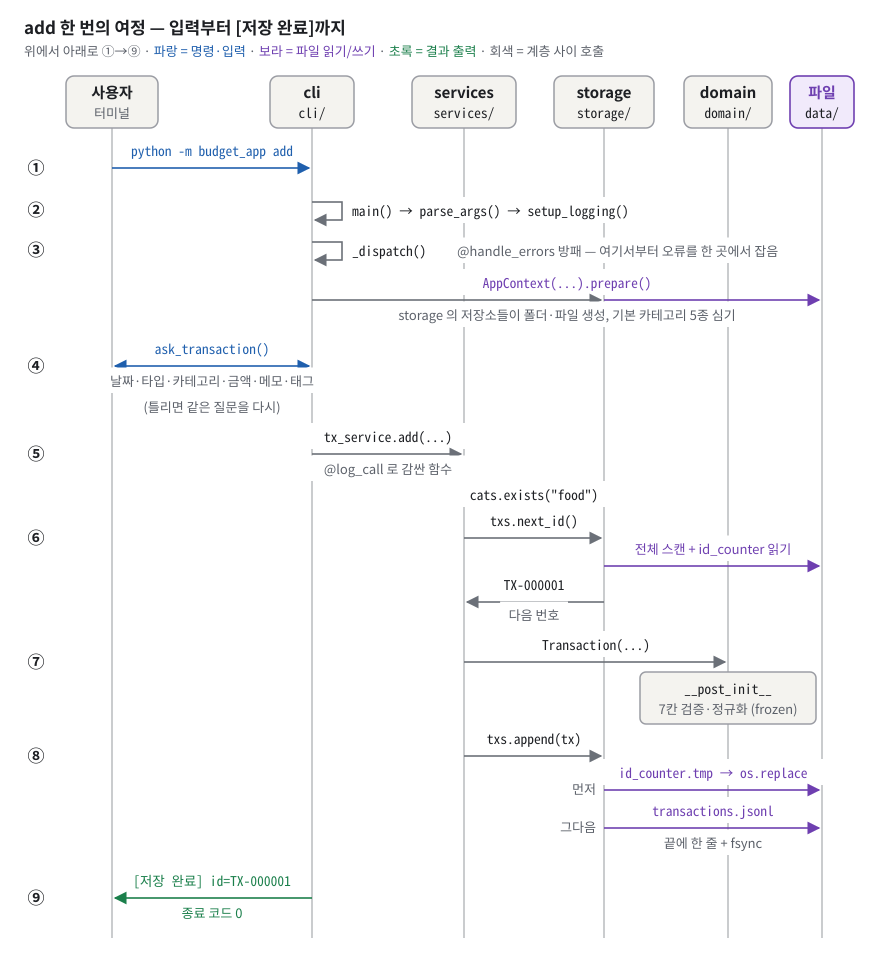
*그림 11. add 한 번은 cli 에서 입력을 받고, services 가 카테고리·번호를 확인하고, domain 이 값을 검증한 뒤, storage 가 워터마크와 거래 한 줄을 디스크에 내리고 끝난다.*

그림 11 의 번호를 그대로 따라 읽는다.

1. **① 명령.** `python -m budget_app add --data-dir D` → `budget_app/__main__.py:8` 의 `sys.exit(main())`.
2. **② 해석.** `main()` 이 `build_parser().parse_args()` 로 인자를 해석하고(`budget_app/cli/app.py:88`), `setup_logging(debug)` 로 로그 레벨을 정한다(`budget_app/cli/app.py:91`). argparse 오류는 여기서 usage + 종료 코드 2 로 끝난다 — 방패 **밖**이다.
3. **③ 방패 안으로.** `_dispatch(args)` 는 `@handle_errors` 가 씌워진 함수다(`budget_app/cli/app.py:63-83`). 여기서 `AppContext(Path(D))` 가 저장소 클래스 3개와 서비스 5개를 조립하고, `ctx.prepare()` 가 storage 의 저장소 클래스들에게 `ensure_ready()`·`seed_defaults()` 를 시켜 폴더·빈 파일을 만들고 카테고리 파일이 비어 있으면 기본 5종을 심는다(`budget_app/context.py:59-65`). 그림에서 이 화살표가 storage 레인을 거쳐 파일로 가는 것은 이 때문이다 — cli 가 파일을 직접 열지 않는다. 이것들이 방패 **안**이어서 `--data-dir` 오타도 `[오류]`/`[힌트]` 로 끝난다.
4. **④ 입력.** `HANDLERS["add"]` = `cmd_add`(`budget_app/cli/handlers.py:33-50`). 카테고리가 0개면 안내 + 종료 코드 5. 아니면 `[안내] 거래 추가 - 대화형 입력입니다.` 를 찍고 `prompts.ask_transaction()` 이 여섯 번 묻는다(`budget_app/cli/prompts.py:112-127`). 날짜 `parse_date`, 타입 `parse_type`, 카테고리 "등록된 것만" 검증기, 금액 `parse_amount`, 메모 `parse_memo`, 태그 `parse_tags`. 틀리면 그 칸만 다시 묻는다.
5. **⑤ 서비스.** `tx_service.add(...)`(`budget_app/services/transactions.py:34-57`). `@log_call` 이 붙어 있어 `--debug` 면 `call add` 가 찍힌다.
6. **⑥ 확인과 번호.** 서비스가 카테고리 등록 여부를 **파일에서 다시** 확인하고(`budget_app/services/transactions.py:44`), `txs.next_id()` 가 파일 전체를 훑어 최대 번호와 `id_counter` 를 비교해 `TX-000001` 을 정한다(`budget_app/storage/repositories.py:65-81`).
7. **⑦ 검증.** `Transaction(...)` 생성 — `__post_init__` 이 7칸을 검증·정규화하고 객체를 굳힌다(`budget_app/domain/entities.py:68-80`).
8. **⑧ 저장.** `txs.append(tx)` 가 **먼저** `id_counter` 를 임시 파일 + `os.replace` 로 올리고, 그다음 `transactions.jsonl` 끝에 한 줄을 쓰고 fsync 한다(`budget_app/storage/repositories.py:128-136`, `budget_app/storage/jsonl.py:242-269`).
9. **⑨ 결과.** `output.out("[저장 완료] id=TX-000001")`(`budget_app/cli/handlers.py:49`) → `EXIT_OK` → 종료 코드 0.

**다른 시나리오 셋(요약).**

- **`list --limit 3`**: `cmd_list` → `stream_sorted(limit=3)` → 필터 제너레이터 식 → `heapq.nlargest(3, …)` → `tx_table()` 이 첫 행을 받은 **뒤에** 머리글·구분선을 내고 행마다 한 줄 → stdout 5줄(그림 4).
- **`import --from mixed.csv --atomic`**: `cmd_import` → `import_csv(atomic=True)` → `_prepare` 가 `read_rows`(BOM 흡수, 헤더 검사, `(줄번호, 행)` yield) → `parse_row` → line 3 에서 `ValidationError` → atomic 이라 `AppError("원자적 가져오기 실패 — line 3: …")` → `_commit` 에 **도달하지 않음**(파일 무변경) → `handle_errors` 의 `except AppError` → stderr 2줄, 종료 코드 4(그림 9).
- **`category remove --name food --replace-with etc`**: `CategoryService.remove` → 두 이름 정규화 → 존재 확인 → `category_in_use`(거래 전체 스트리밍, `any()`) → 대체 검사 3종 → `reassign_category`(거래 파일 원자 재작성, 2건) → `cats.remove`(카테고리 파일 원자 재작성) → `[완료] 'food' 삭제, 2건을 'etc' 로 재지정했습니다.`

### 4.3 설계 결정과 이유

| 결정 | 대안 | 왜 이걸 골랐나 | 대가(트레이드오프) |
|---|---|---|---|
| 저장은 JSONL, 교환은 CSV | 저장도 CSV | 한 줄 = 한 레코드라 이어 쓰기·스트리밍·손상 격리가 자연스럽고, 정수·배열 타입이 보존된다 | 필드 이름이 줄마다 반복돼 파일이 크다(한 줄 약 129바이트), 엑셀로 못 연다 |
| update = 옵션 방식(안 A) | 대화형(안 B) | 바꿀 필드만 주면 되고 스크립트로 쓰기 쉽다. 안 준 필드는 `None` = 변경 없음 | 필드가 많으면 명령이 길어진다 |
| 빈 카테고리 = 기본 5종 자동 생성(안 A) | add 차단(안 B) | 첫 실행에 바로 쓸 수 있다 | 안 쓰는 기본값이 생긴다. 사용자가 다섯 개를 전부 지워도 다음 명령에서 알림 없이 되살아난다(실측). 2차 방어로 0개면 rc=5 |
| 검증을 엔티티 생성자(`__post_init__` + frozen)에 | 서비스·CLI 에서 검증 | 어떤 경로로 만들어도 통과해야 하는 **단일 강제 지점** | 파일을 읽을 때마다 7칸 재검증 → 대용량에서 느림 |
| 수정 = 임시 파일 + fsync + `os.replace` | 제자리 덮어쓰기 | 중간에 죽어도 반쪽 파일이 없다 | 한 건 수정에 전체 재작성 O(N) |
| list 상위 N = `heapq.nlargest` | 전부 `sorted` 후 자르기 | 메모리 O(N_limit) | 시간은 여전히 전체 스캔 |
| search = 일치분 `sorted` | 외부 정렬, 날짜순 저장 불변식 | 단순하고 정확 | 일치 건수만큼 메모리(조건 없으면 전부) |
| ID 시작점 = max(파일 스캔, 워터마크) | 파일 최대+1 / 워터마크만 | 삭제 번호 재사용 방지 + 손으로 고친 파일에도 안전 | `add` 마다 전체 스캔(10만 건 39.8MB) |
| 오류 방패를 `_dispatch` 한 곳에 | 핸들러마다 데코레이터 / `main` 안의 try/except | 빠뜨릴 수 없고, 조립·준비 단계까지 덮는다. 정책(예외 → 문구·코드)을 흐름과 다른 파일로 떼어 따로 읽고 시험한다 | 적용 지점이 하나뿐이라 try/except 로도 같은 동작이 된다(Q6.3-2) |
| 종료 코드 8종 | 0/1 | 셸·CI 가 원인별로 분기 | 표를 외워야 한다. 4 에 성격이 다른 실패가 섞였다(§7.7) |
| import 기본 = 부분 성공, `--atomic` 은 선택 | 기본 롤백 | 1,000행 중 3행 때문에 997행을 버리지 않는다. 원자성 비용은 원할 때만 | `--auto-category` 로 새 카테고리가 생길 때 두 파일 사이에 죽으면 카테고리만 남을 수 있다. 행을 건너뛰어도 종료 코드가 0 이다(§7.4) |
| 미등록 카테고리 기본 거부, `--auto-category` 로 선택 | 자동 등록 | 오타(`fod`)가 카테고리 목록에 영구 등록되는 사고 방지 | 다른 가계부에서 옮겨 올 때 옵션이 필요 |
| 파서는 문자열 키, `HANDLERS` 가 함수로 | `set_defaults(func=…)` | 파서와 핸들러가 서로를 모른다, `if/elif` 사다리 제거 | 등록 누락은 테스트로 잡아야 한다 |
| 계층 규칙을 AST 테스트로 강제 | 문서에만 적기 | 규칙이 검사 속에 산다 | 테스트 유지 비용. 상대 import 만 보고, CI 가 없어 손으로 돌려야 한다(§7.3) |
| 동시 실행 방어 없음(한 번에 한 프로세스 전제) | 잠금 파일 | 잠금은 비정상 종료 후 남은 잠금이라는 새 고장을 들여온다 | 두 프로세스가 동시에 쓰면 나중 것이 이긴다(`README.md:612-618`) |
| Specification 패턴(And/Or/Not) 유지 | 평평한 if 검사 | "A 또는 B", "이 태그 제외" 같은 확장 대비 | 지금 쓰는 것은 AND 뿐 — 코드가 스스로 "선행 투자" 라고 밝힌다(`budget_app/domain/specs.py:43-51`) |

### 4.4 어떻게 검증했나

**테스트.** 저장소 복사본에서 실행했다(저장소의 `.venv/bin/python` 은 다른 컴퓨터 경로를 가리키는 깨진 링크라 따로 설치한 pytest 9.1.1 을 썼다).

```text
$ python -m pytest -p no:cacheprovider
........................................................................ [ 48%]
........................................................................ [ 97%]
...                                                                      [100%]
147 passed in 1.54s
```

| 테스트 파일 | 개수 | 무엇을 지키나 |
|---|---|---|
| `tests/test_architecture.py` | 47 | 계층 규칙(상향 import 금지, cli→storage 금지, 저장소 비공개, 핸들러 등록) |
| `tests/test_phase1_data_integrity.py` | 21 | 고친 데이터 무결성 버그의 회귀(번호 재사용, 비정규 월, 고아 거래 …) |
| `tests/test_phase2_storage.py` | 11 | 저장 계층(찢어진 꼬리, BOM, UoW 커밋 실패 정리) |
| `tests/test_phase3_cli.py` | 14 | CLI(트레이스백 숨김/`--debug` 노출, patch 타입) |
| `tests/test_phase5_patterns.py` | 25 | 패턴(불변 태그, 한 번만 읽는 삭제, 없는 대상이면 파일 무변경) |
| `tests/test_smoke.py` | 29 | 명령 전반 스모크(손상 줄 보존 등) |

테스트는 CLI 를 새 프로세스로 띄우지 않고 `main(argv)` 를 직접 부른다. 빈 임시 폴더를 `--data-dir` 로 자동으로 붙이고, 대화형 입력은 `sys.stdin` 을 `StringIO` 로 바꿔 넣는다(`tests/conftest.py:38-56`, 여섯 칸을 한 번에 넣는 헬퍼 `tests/conftest.py:81-89`). 회귀 테스트는 "고치기 전에는 실패했어야 하는" 버그 재현이다.

**테스트 밖에서 직접 한 검증.**

| 검증 | 방법 | 결과 |
|---|---|---|
| `--help` 18종 | 최상위 + 하위 17종을 반복 실행 | 전부 종료 코드 0 |
| 계층 테스트가 진짜 검사하는가 | 복사본 `domain/periods.py` 에 `from ..storage import config` 삽입 | 2 FAILED(§3.5) |
| 계층 테스트가 못 보는 것 | 같은 자리에 절대 import `from budget_app.storage import config` 삽입 | 47 passed — 못 잡는다(§7.3) |
| 쓰기 순서 | `open`/`os.fsync`/`os.replace` 를 감싸 기록 | tmp → fsync → replace(§3.11) |
| 10만 건 성능 | 합성 100,000행, 명령별 별도 프로세스의 피크 RSS | §3.14 표 |
| 타입 힌트 적용률 | AST 로 함수별 표기 집계 | 242 중 220 |
| 정적 타입 검사 | mypy 2.3.1(기본 설정) | 11 errors in 7 files(§7.16) |
| 린트 | ruff 0.16.8 `ruff check budget_app/ tests/` | **2 errors**(§7.2) |
| 포맷 | ruff 0.16.8 `ruff format --check budget_app tests` | **12 files would be reformatted**(§7.2) |
| 주석 비율 | AST 로 docstring 줄, 토큰으로 주석만 있는 줄을 집계 | 비어 있지 않은 3,605줄 중 1,450줄(40.2%)(§7.9) |

저장소 안의 증거 문서로는 README 0.10 절(`README.md:421`)의 명세 대조표와 실행 검증 기록, `FIX_PLAN.md` 의 수정 계획이 있다. 외부 검수 기록(`/home/coder/volume/review/review_all.md` 의 B2-1 절)은 체크리스트 16문항을 전부 충족으로 판정했다.

### 4.5 주석 없이 읽기 연습 — "주석 빼고 읽어 보세요" 에 대비

평가자는 주석을 가리고 코드를 소리 내어 읽게 할 수 있다(이 학습자가 다른 과제에서 받은 피드백). 아래 세 조각은 이 과제의 핵심 경로를 **주석과 docstring 을 뗀 원문 그대로** 옮긴 것이다. 먼저 코드만 보고 소리 내어 읽은 뒤 모범 낭독과 비교한다. 낭독 순서는 "무엇을 받나 → 한 줄씩 무엇을 하나 → 결과는 무엇인가 → 왜 이렇게 썼나" 다.

**① 최신순 조회** — `budget_app/services/transactions.py:104-108`

```python
filtered = (tx for tx in self.txs.stream() if flt is None or flt.matches(tx))
if limit is not None:
    yield from heapq.nlargest(limit, filtered, key=_sort_key)
    return
yield from sorted(filtered, key=_sort_key, reverse=True)
```

> "첫 줄은 괄호로 감싼 제너레이터 식이라 아직 아무것도 읽지 않습니다. 저장소 클래스의 stream 이 거래를 한 건씩 내주면, 조건이 없거나 조건에 맞는 것만 통과시키겠다는 약속입니다. limit 이 있으면 heapq.nlargest 가 그 흐름을 끝까지 당기면서 크기 limit 인 힙만 유지하고, 가장 최신인 limit 개를 내준 뒤 끝납니다. limit 이 없으면 sorted 가 통과한 것을 전부 모아 최신순으로 정렬합니다. 그래서 list 의 메모리는 limit 에, search 의 메모리는 일치 건수에 비례합니다."

**② 오류 방패의 뼈대** — `budget_app/cli/error_handler.py:47-69`(주석 줄만 뗌)

```python
@functools.wraps(func)
def wrapper(*args, **kwargs) -> int:
    try:
        result = func(*args, **kwargs)
        return config.EXIT_OK if result is None else result
    except BrokenPipeError:
        raise
    except KeyboardInterrupt:
        output.err(messages.MSG_INTERRUPTED)
        return config.EXIT_INTERRUPT
    except ValidationError as exc:
        output.err(messages.MSG_ERROR_LINE.format(msg=exc))
        output.err(messages.HINT_VALIDATION)
        return config.EXIT_VALIDATION
```

> "wrapper 는 원래 함수를 그대로 부르고, 돌려받은 값이 None 이면 0, 아니면 그 숫자를 종료 코드로 돌려줍니다. `or` 로 쓰지 않고 None 만 정확히 검사하는 것은, 빈 문자열 같은 다른 '거짓' 값까지 성공 코드로 바꾸지 않으려는 것입니다. 파이프가 끊기면 여기서는 아무것도 찍지 않고 다시 던져서 main 이 조용히 끝내게 합니다. Ctrl+C 는 안내 한 줄과 130, 값 검증 실패는 오류 줄과 힌트 줄을 stderr 로 내고 2 를 돌려줍니다. 이 아래로 AppError, 파일 오류, 인코딩, 마지막 Exception 이 같은 모양으로 이어집니다."

**③ 재작성 계획** — `budget_app/storage/jsonl.py:311-324`(주석 뗌. 바로 앞 308-310 줄은 `lines`·`changed`·`preserved` 초기화)

```python
for raw in self.iter_raw():
    if not raw.is_valid:
        lines.append(raw.text)
        preserved += 1
        continue
    new_entity = transform(raw.entity)
    if new_entity is None:
        changed = True
        continue
    encoded = self._encode(new_entity)
    if encoded != raw.text:
        changed = True
    lines.append(encoded)
```

> "파일의 모든 줄을 원문과 함께 한 줄씩 읽습니다. 해석할 수 없는 손상 줄은 원문을 그대로 새 목록에 넣고 개수만 셉니다. 해석된 거래는 transform 에 넘기는데, None 이 돌아오면 삭제라서 목록에 넣지 않고 바뀌었다고 표시합니다. 새 객체가 돌아오면 JSON 한 줄로 다시 만들고, 원래 줄과 글자가 다르면 바뀌었다고 표시한 뒤 목록에 넣습니다. 이 함수는 파일을 쓰지 않고 새 줄 목록과 바뀜 여부만 돌려주며, 실제 교체는 호출한 rewrite 가 바뀐 것이 있을 때만 합니다."

연습 방법: 파일을 열어 주석 줄을 손으로 가린 채 같은 순서로 읽는다. 막히는 줄이 있으면 §3 의 해당 칸(① → §3.6 · §3.7, ② → §3.9, ③ → §3.11)으로 돌아간다. 이 코드에 주석이 왜 많은지를 물으면 §7.9 로 답한다.

## 5. 시연 리허설 — 평가장에서 그대로

### 5.0 준비 — 반드시 새 빈 폴더로

아래 출력은 전부 저장소 **밖**의 빈 작업 폴더에서, 없던 폴더 `demo` 를 `--data-dir` 로 주고 §5.1 → §5.8 순서대로 실제로 실행한 결과다(Python 3.14.4). 각 블록 끝의 `[rc=N]` 은 리허설 스크립트가 `echo $?` 로 덧붙인 종료 코드다. **블록 순서를 바꾸면 id 번호와 건수가 달라진다.**

> [!IMPORTANT]
> **평가장에서 지킬 세 가지.**
> 1. 평가 전에 **반드시** 저장소 루트에서 `rm -rf data/` 로 로컬 `data/` 폴더를 지운다(git 이 무시하는 파일이라 저장소 상태는 바뀌지 않는다). 거기에 예전 테스트 때 넣은 부적절한 샘플 메모가 남아 있어서, `--data-dir` 없이 `list` 를 치면 그 메모가 화면에 뜬다(§7.1). 그리고 `--data-dir` 없이는 실행하지 않는다.
> 2. 저장소를 더럽히지 않도록 저장소 **밖**의 작업 폴더에서 한다. 아래 준비 블록이 그 폴더를 만들고 `PYTHONPATH` 로 저장소를 가리키게 한다. 그러면 `demo`, `out.csv`, 백업 폴더가 전부 작업 폴더에 생기고, 출력의 경로 글자도 아래와 똑같다.
> 3. 아래 순서대로 한다. `summary` 를 카테고리 삭제·수정보다 **먼저** 해야 PDF 예시와 숫자가 똑같이 나온다.

**준비 파일 만들기.** 시연에 쓰는 입력 파일 다섯 개와 폴더 하나를 만든다. 저장소 루트에서 시작한다.

```bash
REPO=$(pwd)                                      # 저장소 루트
W=/tmp/b21; rm -rf $W; mkdir -p $W/adir; cd $W   # 작업 폴더 + adir(파일 자리에 폴더 오류용)
export PYTHONPATH=$REPO                          # 저장소 밖에서도 python3 -m budget_app 이 되게

cat > mixed.csv <<'EOF'
date,type,category,amount,memo,tags
2024-03-01,expense,transport,1000,정상,
2024-13-40,expense,transport,2000,날짜오류,
2024-03-02,expense,transport,-500,음수,
2024-03-03,refund,transport,300,타입오류,
2024-03-04,expense,fod,400,오타카테고리,
2024-03-05,expense,rent,abc,숫자아님,
2024-03-06,expense,rent,600,정상2,
EOF
printf '\xef\xbb\xbfdate,type,category,amount,memo,tags\n2024-02-01,expense,transport,1250,버스,commute\n2024-02-03,income,salary,50000,용돈,\n' > ext.csv
printf 'hello,world\n1,2\n' > nohdr.csv
python3 -c "open('u16.csv','w',encoding='utf-16').write('date,type,category,amount\n2024-01-01,expense,food,100\n')"
echo x > notadir.txt
```

| 파일 | 무엇 | 쓰는 곳 |
|---|---|---|
| `mixed.csv` | 헤더 + 7행. 정상 2행(3월 1일 transport 1000, 3월 6일 rent 600)과 깨진 5행(날짜 `2024-13-40`, 금액 `-500`, 타입 `refund`, 카테고리 `fod`, 금액 `abc`) | §3.12, §5.5 |
| `ext.csv` | 엑셀식 BOM(`EF BB BF`)이 붙고 `id` 칸이 없는 외부 CSV 2행(2월) | §5.5 |
| `nohdr.csv` | 필수 컬럼이 없는 헤더(`hello,world`) | §5.6 |
| `u16.csv` | UTF-16 으로 저장한 CSV | §5.6 |
| `notadir.txt` / `adir/` | 폴더 자리에 줄 파일 / 파일 자리에 줄 폴더 | §5.6 |

대화형 입력은 `printf '…' | …` 로 넣었다. 그래서 입력한 값이 화면에 메아리되지 않고 프롬프트 여섯 개가 한 줄에 이어 붙는다. 평가장에서 손으로 치면 프롬프트마다 줄이 바뀐다.

### 5.1 기능 8종 중 add · list · search, 그리고 재실행 후 유지 — C1-1, C1-2

```text
$ python3 -m budget_app category list --data-dir demo          ← 없는 폴더로 첫 실행
- food
- transport
- rent
- salary
- etc
[rc=0]
(생성된 파일: budgets.jsonl 0B, categories.jsonl 91B, transactions.jsonl 0B)

$ printf '2024-01-15\nexpense\nfood\n15000\n점심\nmeal\n' | python3 -m budget_app add --data-dir demo
[안내] 거래 추가 - 대화형 입력입니다.
날짜(YYYY-MM-DD): 타입(income/expense): 카테고리: 금액(양수): 메모(선택): 태그(쉼표로 구분, 없으면 엔터): [저장 완료] id=TX-000001
[rc=0]
(같은 방식으로 4건 더: 2024-01-14 income salary 3000000 월급 / 2024-01-12 expense transport 20000 택시 /
 2024-01-20 expense rent 150000 월세 / 2024-01-22 expense food 30000 회식 태그 company,dinner → TX-000002 ~ TX-000005)
(5건 후: id_counter 2B 내용 5, transactions.jsonl 674B)

$ python3 -m budget_app list --data-dir demo
id        | date       | type    | category     |       amount | memo
----------+------------+---------+--------------+--------------+-----
TX-000005 | 2024-01-22 | expense | food         |        30000 | 회식
TX-000004 | 2024-01-20 | expense | rent         |       150000 | 월세
TX-000001 | 2024-01-15 | expense | food         |        15000 | 점심
TX-000002 | 2024-01-14 | income  | salary       |      3000000 | 월급
TX-000003 | 2024-01-12 | expense | transport    |        20000 | 택시
[rc=0]

$ python3 -m budget_app list --limit 3 --data-dir demo
id        | date       | type    | category     |       amount | memo
----------+------------+---------+--------------+--------------+-----
TX-000005 | 2024-01-22 | expense | food         |        30000 | 회식
TX-000004 | 2024-01-20 | expense | rent         |       150000 | 월세
TX-000001 | 2024-01-15 | expense | food         |        15000 | 점심
[rc=0]

$ python3 -m budget_app search --from 2024-01-01 --to 2024-01-31 --category food --data-dir demo
(머리글·구분선) TX-000005 … food 30000 회식 / TX-000001 … food 15000 점심          [rc=0]
$ python3 -m budget_app search --q 택시 --data-dir demo        → TX-000003 한 행   [rc=0]
$ python3 -m budget_app search --tag dinner --data-dir demo    → TX-000005 한 행   [rc=0]
$ python3 -m budget_app search --type income --data-dir demo   → TX-000002 한 행   [rc=0]

$ cat demo/transactions.jsonl                                  ← 파일 순서 = 입력 순서(날짜순 아님)
{"id": "TX-000001", "type": "expense", "date": "2024-01-15", "amount": 15000, "category": "food", "memo": "점심", "tags": ["meal"]}
{"id": "TX-000002", "type": "income", "date": "2024-01-14", "amount": 3000000, "category": "salary", "memo": "월급", "tags": []}
{"id": "TX-000003", "type": "expense", "date": "2024-01-12", "amount": 20000, "category": "transport", "memo": "택시", "tags": []}
{"id": "TX-000004", "type": "expense", "date": "2024-01-20", "amount": 150000, "category": "rent", "memo": "월세", "tags": []}
{"id": "TX-000005", "type": "expense", "date": "2024-01-22", "amount": 30000, "category": "food", "memo": "회식", "tags": ["company", "dinner"]}
```

**이때 말할 것.** "명령 하나가 프로세스 하나라서, 방금 `add` 가 저장한 것을 다음 `list` 가 **파일에서 다시 읽어** 보여 줍니다. 그래서 모든 명령이 재실행 후 유지의 증거입니다. 파일은 입력 순서라 날짜순이 아니고, 최신순은 매번 힙으로 상위 N 개를 골라 만듭니다."

### 5.2 budget set 과 summary 의 사용률·초과 경고 — C1-4

```text
$ python3 -m budget_app budget set --month 2024-01 --amount 500000 --data-dir demo
[저장 완료] 2024-01 예산 500000원
[rc=0]

$ python3 -m budget_app summary --month 2024-01 --top 3 --data-dir demo
총 수입: 3000000원
총 지출: 215000원
잔액: 2785000원
예산: 500000원 (사용률 43.0%)

지출 TOP 3
1) rent 150000원
2) food 45000원
3) transport 20000원
[rc=0]

$ python3 -m budget_app summary --month 2030-05 --data-dir demo
2030-05: 데이터 없음
[rc=0]
$ python3 -m budget_app budget get --month 2024-01 --data-dir demo
2024-01 예산 500000원
[rc=0]
$ python3 -m budget_app budget list --data-dir demo
month   |       amount
--------+-------------
2024-01 |       500000
[rc=0]
$ cat demo/budgets.jsonl
{"month": "2024-01", "amount": 500000}
```

초과 경고는 §5.4 끝에서 같은 폴더의 예산을 낮춰 보여 준다. 그 시점의 거래(수정·삭제·추가 뒤)여야 숫자가 아래와 같게 나온다.

**이때 말할 것.** "PDF 예시와 숫자까지 같습니다(43.0%). 예산은 `budgets.jsonl` 에 월별 한 줄로 저장되고, 같은 달을 다시 `set` 하면 덮어씁니다. 거래도 예산도 없는 달은 '데이터 없음' 이고, 이것은 실패가 아니라 답이라서 종료 코드는 0 입니다."

### 5.3 category add · list · remove 와 사용 중 처리 — C1-3

```text
$ python3 -m budget_app category add --name groceries --data-dir demo
[저장 완료] category=groceries
[rc=0]
$ python3 -m budget_app category add --name groceries --data-dir demo
[안내] 이미 존재하는 카테고리입니다: groceries
[rc=0]
$ printf 'book\n' | python3 -m budget_app category add --data-dir demo      ← 대화형
카테고리명: [저장 완료] category=book
[rc=0]
$ python3 -m budget_app category remove --name book --data-dir demo
[완료] 'book' 삭제
[rc=0]
$ python3 -m budget_app category remove --name food --data-dir demo
[오류] 카테고리 'food' 는 거래에서 사용 중입니다.
[힌트] `--replace-with <카테고리>` 로 대체 카테고리를 지정하세요.
[rc=4]
$ python3 -m budget_app category remove --name food --replace-with food --data-dir demo
[오류] 대체 카테고리는 자기 자신일 수 없습니다.
[rc=4]
$ python3 -m budget_app category remove --name food --replace-with nope --data-dir demo
[오류] 대체 카테고리가 등록되어 있지 않습니다: nope
[힌트] 먼저 `category add` 로 등록하세요.
[rc=4]
$ python3 -m budget_app category remove --name food --replace-with etc --data-dir demo
[완료] 'food' 삭제, 2건을 'etc' 로 재지정했습니다.
[rc=0]
$ python3 -m budget_app category remove --name nope --data-dir demo
[오류] 존재하지 않는 카테고리입니다: nope
[힌트] `category list` 로 목록을 확인하세요.
[rc=4]
$ python3 -m budget_app category list --data-dir demo
- transport
- rent
- salary
- etc
- groceries
[rc=0]
```

(이후 `list` 에서 `TX-000005`, `TX-000001` 의 category 가 `etc` 로 바뀌어 보인다.) `--replace-with food` 한 줄은 `[힌트]` 없이 끝났다. 힌트가 선택 인자라 빠진 경우인데, 평가자가 짚으면 §7.6 으로 답한다.

**이때 말할 것.** "사용 중인 카테고리는 기본적으로 삭제를 막고, `--replace-with` 를 주면 그 거래들을 먼저 재지정한 뒤 삭제합니다. PDF 의 두 선택지 — 막기, 대체 요구 — 를 둘 다 지원합니다. 거래 재지정을 먼저 하기 때문에 중간에 죽어도 없는 카테고리를 가리키는 거래는 생기지 않습니다."

### 5.4 update · delete, 그리고 지운 번호를 다시 쓰지 않는 것 — C1-1(계속)

```text
$ python3 -m budget_app update --id TX-000005 --amount 35000 --memo 회식 --data-dir demo
[수정 완료] id=TX-000005
TX-000005 | 2024-01-22 | expense | etc          |        35000 | 회식
[rc=0]
$ python3 -m budget_app update --id TX-000005 --category food --data-dir demo    ← food 는 방금 삭제됨
[오류] 등록되지 않은 카테고리입니다: food
[힌트] `category add` 로 먼저 등록하세요.
[rc=4]
$ python3 -m budget_app update --id TX-999999 --amount 1000 --data-dir demo
[오류] 해당 id 의 거래를 찾을 수 없습니다: TX-999999
[힌트] `list` 로 id 를 확인하세요.
[rc=4]
$ python3 -m budget_app update --id TX-000005 --data-dir demo
[오류] 수정할 필드가 없습니다.
[힌트] --date/--type/--category/--amount/--memo/--tags 중 하나 이상 지정하세요.
[rc=4]
$ python3 -m budget_app update --id TX-000005 --amount -5 --data-dir demo
[오류] 금액은 양의 정수여야 합니다 (0 또는 음수 불가).
[힌트] 입력값을 다시 확인해 주세요.
[rc=2]
$ python3 -m budget_app delete --id TX-000003 --data-dir demo
[삭제 완료] id=TX-000003
[rc=0]
$ python3 -m budget_app delete --id TX-000003 --data-dir demo
[오류] 해당 id 의 거래를 찾을 수 없습니다: TX-000003
[힌트] `list` 로 id 를 확인하세요.
[rc=4]
$ python3 -m budget_app delete --id abc --data-dir demo                 ← 형식이 틀린 id 도 "없음"
[오류] 해당 id 의 거래를 찾을 수 없습니다: abc
[힌트] `list` 로 id 를 확인하세요.
[rc=4]
```

워터마크 시연(그림 10). 한 건(`TX-000006`)을 더 추가한 뒤 그것을 지우고 다시 추가한다.

```text
$ printf '2024-01-25\nexpense\netc\n5000\n\n\n' | python3 -m budget_app add --data-dir demo
[안내] 거래 추가 - 대화형 입력입니다.
날짜(YYYY-MM-DD): 타입(income/expense): 카테고리: 금액(양수): 메모(선택): 태그(쉼표로 구분, 없으면 엔터): [저장 완료] id=TX-000006
[rc=0]
$ python3 -m budget_app delete --id TX-000006 --data-dir demo
[삭제 완료] id=TX-000006
[rc=0]
$ cat demo/id_counter
6
$ printf '2024-01-26\nexpense\netc\n7000\n점심, 회식\n\n' | python3 -m budget_app add --data-dir demo
[안내] 거래 추가 - 대화형 입력입니다.
날짜(YYYY-MM-DD): 타입(income/expense): 카테고리: 금액(양수): 메모(선택): 태그(쉼표로 구분, 없으면 엔터): [저장 완료] id=TX-000007
[rc=0]
```

**이때 말할 것.** "update 는 옵션 방식으로 고정했고, 바꿀 필드만 줍니다. 수정·삭제는 임시 파일에 다 쓰고 fsync 한 뒤 `os.replace` 로 바꾸기 때문에 중간에 죽어도 반쪽 파일이 남지 않습니다. 지운 `TX-000006` 은 다시 쓰지 않고 다음 번호가 `TX-000007` 인데, `id_counter` 가 발급한 최대 번호를 기억하기 때문입니다."

**초과 경고(C1-4 계속).** 같은 폴더에서 1월 예산을 낮춘다.

```text
$ python3 -m budget_app budget set --month 2024-01 --amount 100000 --data-dir demo
[저장 완료] 2024-01 예산 100000원
[rc=0]
$ python3 -m budget_app summary --month 2024-01 --data-dir demo
총 수입: 3000000원
총 지출: 207000원
잔액: 2793000원
예산: 100000원 (사용률 207.0%)
[경고] 예산을 초과했습니다!

지출 TOP 2
1) rent 150000원
2) etc 57000원
[rc=0]
$ python3 -m budget_app budget set --month 2025-05 --amount 300000 --data-dir demo
[저장 완료] 2025-05 예산 300000원
[rc=0]
$ python3 -m budget_app summary --month 2025-05 --data-dir demo          ← 예산만 있고 거래 없는 달
총 수입: 0원
총 지출: 0원
잔액: 0원
예산: 300000원 (사용률 0.0%)
[rc=0]
$ python3 -m budget_app budget get --month 2024-1 --data-dir demo         ← 0 없이 쓴 월
2024-01 예산 100000원
[rc=0]
```

`--top` 을 주지 않았으니 기본값은 5 인데 머리글이 `지출 TOP 2` 다. 머리글의 숫자는 요청값이 아니라 **실제로 나열된 개수**이고(`budget_app/cli/presenter.py:118`), 이 달의 지출 카테고리가 이제 rent · etc 둘뿐이기 때문이다(food 거래 둘은 §5.3 에서 etc 로 재지정됐다). 총 지출 207000 은 15000 + 150000 + 35000 + 7000 이다(`TX-000003` 삭제, `TX-000005` 수정 반영).

**이때 말할 것.** "예산을 넘으면 사용률 207.0% 와 경고가 나오지만 종료 코드는 0 입니다 — 경고는 실패가 아니라 계산이 성공한 답이기 때문입니다. 예산만 있고 거래가 없는 달은 '데이터 없음' 대신 사용률 0.0% 를 보여 줍니다."

### 5.5 export · import 와 CSV 스키마 — C1-5

```text
$ python3 -m budget_app export --out out.csv --month 2024-01 --data-dir demo
[완료] out.csv (5 records)
[rc=0]
$ cat out.csv
id,date,type,category,amount,memo,tags
TX-000001,2024-01-15,expense,etc,15000,점심,meal
TX-000002,2024-01-14,income,salary,3000000,월급,
TX-000004,2024-01-20,expense,rent,150000,월세,
TX-000005,2024-01-22,expense,etc,35000,회식,"company,dinner"
TX-000007,2024-01-26,expense,etc,7000,"점심, 회식",
$ head -c 16 out.csv | od -c | head -1                       ← BOM(357 273 277) 없이 바로 i d
0000000   i   d   ,   d   a   t   e   ,   t   y   p   e   ,   c   a   t

$ python3 -m budget_app export --out range.csv --from 2024-01-15 --to 2024-01-31 --data-dir demo
[완료] range.csv (4 records)
$ python3 -m budget_app export --out plain.csv --month 2024-01 --no-id --data-dir demo
[완료] plain.csv (5 records)
$ head -2 plain.csv
date,type,category,amount,memo,tags
2024-01-15,expense,etc,15000,점심,meal
$ python3 -m budget_app export --out x.csv --data-dir demo
[오류] --month 또는 --from/--to 중 하나는 필수입니다.
[힌트] 예: `export --out a.csv --month 2024-01`
[rc=4]
$ python3 -m budget_app export --out x.csv --month 2024-01 --from 2024-01-01 --to 2024-01-05 --data-dir demo
[오류] --month 와 --from/--to 는 함께 쓸 수 없습니다 (기간 정의가 둘이 됩니다).
[힌트] 예: `export --out a.csv --month 2024-01`
[rc=4]

$ python3 -m budget_app import --from out.csv --data-dir demo           ← 왕복: 방금 내보낸 파일
[완료] mode=부분 성공, imported=0, duplicated=5, skipped=0
  - line 2: 중복 id TX-000001 — 건너뜀
  - line 3: 중복 id TX-000002 — 건너뜀
  - line 4: 중복 id TX-000004 — 건너뜀
  - line 5: 중복 id TX-000005 — 건너뜀
  - line 6: 중복 id TX-000007 — 건너뜀
[힌트] 중복은 이미 저장된 거래입니다. 다시 넣으려면 `--on-duplicate new-id` 를 쓰세요.
[rc=0]

$ od -c ext.csv | head -1                                       ← 엑셀식 BOM 이 붙은 외부 CSV(id 없음)
0000000 357 273 277   d   a   t   e   ,   t   y   p   e   ,   c   a   t
$ python3 -m budget_app import --from ext.csv --data-dir demo
[완료] mode=부분 성공, imported=2, duplicated=0, skipped=0
[rc=0]

$ python3 -m budget_app import --from mixed.csv --data-dir demo         ← 깨진 행 5개 + 정상 2행
[완료] mode=부분 성공, imported=2, duplicated=0, skipped=5
[오류 라인 일부]
  - line 3: 날짜 형식이 올바르지 않습니다 (YYYY-MM-DD).
  - line 4: 금액은 양의 정수여야 합니다 (0 또는 음수 불가).
  - line 5: type 은 ('income', 'expense') 중 하나여야 합니다.
  - line 6: 등록되지 않은 카테고리입니다: fod (`category add --name fod` 으로 등록하거나 `--auto-category` 를 쓰세요)
  - line 7: 금액은 정수여야 합니다.
[rc=0]
```

`ext.csv` 두 건이 `TX-000008`·`TX-000009`, `mixed.csv` 의 정상 두 건이 `TX-000010`·`TX-000011` 이 된다. 이어서 `--atomic`(새 폴더 `demo3`, rc=4, 반영 없음)과 `--auto-category`(새 폴더 `demo4`, `imported=3, skipped=4`)는 §3.12 의 실측 블록 그대로 보여 준다.

**이때 말할 것.** "헤더는 `id,date,type,category,amount,memo,tags` 이고, PDF 스키마(필수 date·type·category·amount, 선택 memo·tags)에 왕복 중복을 막는 선택 컬럼 `id` 하나를 더했습니다. UTF-8 로 BOM 없이 쓰고, 읽을 때는 엑셀이 붙인 BOM 을 흡수합니다. 쉼표가 든 칸은 csv 모듈이 따옴표로 감쌉니다. 내보낸 파일을 다시 가져오면 id 가 이미 있어서 5건 모두 중복으로 건너뜁니다."

### 5.6 잘못된 입력·파일 오류에서 원인 + 힌트 — C1-6

```text
$ printf '2024-13-40\n2024-01-15\nexpens\nexpense\nfod\nfood\n-5\n0\nabc\n15000\n점심\na,,b,a\n' | python3 -m budget_app add --data-dir demo5
[안내] 거래 추가 - 대화형 입력입니다.
날짜(YYYY-MM-DD): [오류] 날짜 형식이 올바르지 않습니다 (YYYY-MM-DD).
[힌트] 다시 입력해 주세요.
날짜(YYYY-MM-DD): 타입(income/expense): [오류] type 은 ('income', 'expense') 중 하나여야 합니다.
[힌트] 다시 입력해 주세요.
타입(income/expense): 카테고리: [오류] 등록되지 않은 카테고리입니다: fod (사용 가능: food, transport, rent, salary, etc)
[힌트] 다시 입력해 주세요.
카테고리: 금액(양수): [오류] 금액은 양의 정수여야 합니다 (0 또는 음수 불가).
[힌트] 다시 입력해 주세요.
금액(양수): [오류] 금액은 양의 정수여야 합니다 (0 또는 음수 불가).
[힌트] 다시 입력해 주세요.
금액(양수): [오류] 금액은 정수여야 합니다.
[힌트] 다시 입력해 주세요.
금액(양수): 메모(선택): 태그(쉼표로 구분, 없으면 엔터): [저장 완료] id=TX-000001
[rc=0]

$ printf '2024-01-15\n' | python3 -m budget_app add --data-dir demo5            ← 입력 도중 끝남(EOF)
[안내] 거래 추가 - 대화형 입력입니다.
날짜(YYYY-MM-DD): 타입(income/expense): [오류] 입력이 중단되었습니다 (EOF).
[힌트] 대화형 명령은 필요한 값을 표준입력으로 끝까지 제공해야 합니다.
[rc=4]

$ yes 'bad' | head -20 | python3 -m budget_app add --data-dir demo5 2>&1 | tail -3   ← 10번 틀림
[힌트] 다시 입력해 주세요.
[오류] 재입력 횟수를 초과했습니다.
[힌트] 올바른 형식으로 값을 입력한 뒤 다시 시도해 주세요.

$ python3 -m budget_app list --data-dir notadir.txt                               ← 폴더 자리에 파일
[오류] 디렉터리가 아닙니다: notadir.txt
[힌트] `--data-dir` 에는 데이터를 담을 **폴더** 경로를 지정해 주세요.
[rc=3]
$ python3 -m budget_app import --from nope.csv --data-dir demo
[오류] 파일을 찾을 수 없습니다: nope.csv
[힌트] 경로가 올바른지, 파일이 존재하는지 확인해 주세요.
[rc=3]
$ python3 -m budget_app import --from nohdr.csv --data-dir demo                  (내용 hello,world / 1,2)
[오류] CSV 헤더에 필수 컬럼이 없습니다: ['date', 'type', 'category', 'amount']
[힌트] 필수 컬럼: ['date', 'type', 'category', 'amount']
[rc=4]
$ python3 -m budget_app import --from u16.csv --data-dir demo                    (UTF-16 로 저장한 CSV)
[오류] 파일 인코딩을 읽을 수 없습니다 (UTF-8 이 아닙니다).
[힌트] CSV 를 UTF-8 로 다시 저장하세요 (엑셀: '다른 이름으로 저장 > CSV UTF-8').
[rc=6]
$ python3 -m budget_app export --out adir --month 2024-01 --data-dir demo        (adir 은 폴더)
[오류] 파일이 아니라 디렉터리입니다: adir
[힌트] 파일 경로를 지정했는지 확인해 주세요.
[rc=3]
$ python3 -m budget_app search --from 2024-02-30 --data-dir demo
[오류] 날짜 형식이 올바르지 않습니다 (YYYY-MM-DD).
[힌트] 입력값을 다시 확인해 주세요.
[rc=2]
```

argparse 가 먼저 거절하는 것은 모양이 다르지만(usage + `error:`) 역시 트레이스백이 아니다.

```text
$ python3 -m budget_app list --limit 0 --data-dir demo
usage: budget_app list [-h] [--data-dir DATA_DIR] [--debug] [--limit LIMIT]
budget_app list: error: argument --limit: 1 이상이어야 합니다: 0
[rc=2]
$ python3 -m budget_app frobnicate
usage: budget_app [-h] [--debug] [--data-dir DATA_DIR]
                  {add,list,search,summary,budget,category,update,delete,export,import,backup} ...
budget_app: error: argument command: invalid choice: 'frobnicate' (choose from add, list, search, summary, budget, category, update, delete, export, import, backup)
[rc=2]
```

예상 못 한 버그(최후 방어선)는 일부러 일으킬 수 없으므로 테스트로 보여 준다. `tests/test_phase3_cli.py:160` 은 핸들러 안에서 억지로 예외를 터뜨린 뒤 "`[오류]` 와 `[힌트]` 가 있고 `Traceback` 은 없으며 종료 코드 1" 을, `tests/test_phase3_cli.py:182` 는 "`--debug` 면 `Traceback` 이 stderr 에 있다" 를 확인한다. 복사본에서 `category list` 가 부르는 함수를 억지로 예외를 던지게 바꿔 보면 stderr 는 세 줄이다 — `[오류] 예기치 못한 오류가 발생했습니다: 의도적 폭발`, `` [힌트] `--debug` 를 붙여 다시 실행하면 stderr 로그에 스택트레이스가 남습니다. ``, 그리고 로그 한 줄 `[ERROR] unhandled error`. 종료 코드는 1 이다.

> [!WARNING]
> **평가자가 해 볼 수 있는 것.** 기간을 뒤집은 `search --from 2024-01-20 --to 2024-01-10` 은 오류 없이 `(데이터 없음)` 과 종료 코드 0 이고, `export` 는 헤더만 있는 파일을 만든다. 등록되지 않은 카테고리로 검색해도 `(데이터 없음)` 이다. 이 구현의 약점이므로 숨기지 말고 §7.5 대로 답한다. `search --from 2024-02-30` 의 힌트 `입력값을 다시 확인해 주세요.` 가 해결책을 알려 주지 않는 것도 약점이다(§7.6).

**이때 말할 것.** "PDF 오류 예시와 원인 문구가 글자까지 같습니다. 대화형 입력은 틀린 칸만 다시 묻고, 옵션 방식은 원인과 힌트를 찍고 끝납니다. 어떤 경우에도 트레이스백은 나오지 않고, 개발자용 스택은 `--debug` 일 때만 로그에 남깁니다."

### 5.7 오류 종료 코드가 0 이 아님 — C1-7

```text
$ python3 -m budget_app delete --id TX-999999 --data-dir demo && echo 성공 || echo "실패(rc=$?)"
[오류] 해당 id 의 거래를 찾을 수 없습니다: TX-999999
[힌트] `list` 로 id 를 확인하세요.
실패(rc=4)
$ python3 -m budget_app import --from nope.csv --data-dir demo 2>/dev/null; echo rc=$?
rc=3
$ python3 -m budget_app list --data-dir demo > list.txt; wc -l list.txt
11 list.txt                                     ← 머리글 + 구분선 + 9행
$ python3 -m budget_app list --data-dir demo | head -3; echo ${PIPESTATUS[0]}
id        | date       | type    | category     |       amount | memo
----------+------------+---------+--------------+--------------+-----
TX-000011 | 2024-03-06 | expense | rent         |          600 | 정상2
0
```

**이때 말할 것.** "`&&` 와 `||` 가 종료 코드로 갈라지는 것을 보시면 4 로 실패했습니다. 코드는 0 정상, 2 값 하나의 형식·인자, 3 파일·폴더, 4 없는 id·헤더 없는 CSV 처럼 힌트를 줘야 하는 처리 불가, 5 카테고리 0개에서 add, 6 인코딩, 1 예상 못 한 오류, 130 Ctrl+C 입니다. 오류는 stderr 로 나가서 `2>/dev/null` 로 버리면 화면엔 아무것도 없고 종료 코드만 남습니다. `head` 가 먼저 닫아도 오류가 아니라 0 입니다."

### 5.8 보너스와 관측 — 데코레이터 로그, 백업

```text
$ printf '2024-01-27\nexpense\netc\n100\n\n\n' | python3 -m budget_app --debug add --data-dir demo 2>&1 >/dev/null
[DEBUG] <시각> budget_app:42 call add
[DEBUG] <시각> budget_app:44 done add
$ python3 -m budget_app summary --month 2024-01 --debug --data-dir demo 2>&1 >/dev/null
[DEBUG] 2026-09-23 10:12:55,476 budget_app:64 monthly_summary took 1.65ms
$ python3 -m budget_app backup --data-dir demo
[백업 완료] backup_20260923_101255
[rc=0]
$ ls backup_20260923_101255/
budgets.jsonl  categories.jsonl  id_counter  transactions.jsonl
$ python3 -m budget_app backup --data-dir nosuchdir
[오류] 파일을 찾을 수 없습니다: nosuchdir
[힌트] 경로가 올바른지, 파일이 존재하는지 확인해 주세요.
[rc=3]
```

`backup` 은 데이터 폴더의 **부모** 폴더에 `backup_…/` 를 만든다(`budget_app/storage/backup.py:29`). §5.0 의 작업 폴더에서 하면 작업 폴더에 생긴다(저장소 안에서 하면 저장소 루트에 생기므로 피한다). 없는 폴더를 백업하려 하면 새로 만들지 않고 오류로 알린다(`needs_storage=False`, `budget_app/cli/parser.py:257-261`).

알고 있을 것 두 가지. ① 같은 초에 두 번 실행하면 폴더 이름이 겹쳐 `[오류] 입출력 오류가 발생했습니다: [Errno 17] File exists: …` 와 원인과 무관한 `[힌트] 디스크 여유 공간과 파일 경로/권한을 확인해 주세요.`, 종료 코드 3 이 난다(복사본에서 연달아 실행해 재현, §7.6). ② 백업은 파일을 복사만 하고 fsync 하지 않는다(`budget_app/storage/backup.py:30-32`). 복원 명령은 없고, 백업 폴더를 `--data-dir` 로 주면 그대로 열린다(Q6.5-19).

실행할 수 없는 항목은 없다(외부 서비스 의존 없음). 테스트는 `python -m pytest`(pytest 필요)로 보여 줄 수 있다.

## 6. 구술 문답 — 체크리스트 전 문항 + 꼬리 질문

체크리스트 16문항이 전부 여기 있다(문항 번호는 `<sub>체크리스트 영역-순번</sub>`). 질문만 읽고 먼저 소리 내어 답한 뒤 펼친다. 답은 모두 **결론 → 근거 → 코드 위치** 순서다. **말로 하는 답 (30초)** 은 3~5문장으로 줄였고, 평가자가 더 들으려 할 때 덧붙일 말은 **더 물으면** 아래에 따로 두었다.

### 6.1 기능 동작 검증

<details>
<summary><b>Q6.1-1</b> add/list/search/summary/export/import/update/delete 가 요구사항대로 동작하나요? <sub>체크리스트 1-1</sub></summary>

**핵심 한 줄.** 8개 명령이 전부 `python -m budget_app <명령>` 으로 동작하고, 명령과 함수는 `HANDLERS` 딕셔너리 15개 키로 짝지어져 있습니다.

**말로 하는 답 (30초).**
> "네, 여덟 개 모두 동작하고, 지금 순서대로 보여 드리겠습니다. add 는 PDF 대로 대화형으로 여섯 칸을 묻고 `[저장 완료] id=TX-000001` 처럼 번호를 알려 주고, update 는 옵션 방식으로 고정했습니다. 없는 id 는 update·delete 모두 원인과 힌트를 찍고 종료 코드 4 로 끝납니다. 명령과 함수의 대응은 `cli/app.py` 의 `HANDLERS` 한 곳에 있습니다."

**더 물으면.**
> "list 는 최신순에 `--limit` 기본 20, search 는 `--from`·`--to`·`--category`·`--type`·`--q`·`--tag` 여섯 조건을 AND 로 묶습니다. summary 는 총수입·총지출·잔액·TOP N·예산 사용률을 보여 주고, export 는 기간 조건이 필수이고, import 는 기본 부분 성공에 `--atomic` 을 고를 수 있습니다."

**보여 줄 것.** `budget_app/cli/app.py:28-44` — 명령 15개의 대응표 / 시연 §5.1 · §5.4 · §5.5 순서대로 `add` → `list --limit 3` → `search --tag dinner` → `summary` → `update` → `delete` → `export` → `import`.

**꼬리 질문.**
- **Q.** add 는 대화형인데 update 는 왜 옵션 방식인가요? → **A.** PDF 가 입력 기본은 대화형으로 하되 update 는 "옵션 방식 또는 대화형 중 하나를 선택해도 되나, 문서에 명확히 고정" 하라고 했습니다. 수정은 바꿀 필드만 주는 것이 자연스러워 옵션 방식으로 고정했고(`budget_app/cli/parser.py:190-200`, `README.md:656`), 안 준 필드는 `None` = 변경 없음입니다(`TransactionPatch`, `budget_app/domain/entities.py:127-154`). 아무 필드도 안 주면 `[오류] 수정할 필드가 없습니다.` 로 막습니다(`budget_app/cli/handlers.py:157-158`).
- **Q.** 날짜가 같은 거래 둘은 어떤 순서로 나오나요? → **A.** 정렬 키가 `(date, id)` 라서(`budget_app/services/transactions.py:22-24`) 같은 날이면 번호가 큰, 즉 나중에 발급된 거래가 위입니다. id 비교는 문자열이 아니라 번호로 합니다(`budget_app/domain/tx_id.py:91-95`).
- **Q.** `--limit 0` 을 주면요? → **A.** argparse 단계에서 `argument --limit: 1 이상이어야 합니다: 0` 으로 거절하고 종료 코드 2 입니다(`budget_app/cli/parser.py:38-55`). 0건을 보여 달라는 요청은 의미가 없고, 예전에는 데이터가 있는데도 "(데이터 없음)" 이 나오는 원인이었습니다.
- **Q.** PDF 는 export 기간을 `--month` 또는 `--from/--to` "중 하나 이상" 이라고 했는데, 둘 다 주면 왜 거부하나요? → **A.** 명세의 핵심은 최소 하나를 강제하는 것입니다. 둘을 함께 주면 기간 정의가 두 개가 되는데, 예전 구현은 `--month` 만 쓰고 나머지를 조용히 무시했습니다. 그래서 모호한 입력은 거절하고 다시 묻는 쪽을 택했습니다(`budget_app/cli/handlers.py:179-192`, 실측 rc=4). 두 기간의 교집합으로 해석하는 방법도 있어서, 명세 해석이 갈리는 판단으로 §7.8 에 적어 두었습니다.

</details>

<details>
<summary><b>Q6.1-2</b> 프로그램을 다시 실행해도 거래·카테고리·예산 데이터가 유지되나요? 저장 파일이 3개 이상인가요? <sub>체크리스트 1-2</sub></summary>

**핵심 한 줄.** `transactions.jsonl`·`categories.jsonl`·`budgets.jsonl` 세 파일에 영구 저장하고, 명령 하나가 프로세스 하나라서 모든 명령이 파일에서 다시 읽습니다.

**말로 하는 답 (30초).**
> "유지됩니다. 거래·카테고리·예산을 JSONL 파일 세 개에 저장하고, 발급한 최대 번호를 기억하는 `id_counter` 가 하나 더 있습니다. 명령 하나가 프로세스 하나라서, add 로 저장한 거래를 다음 list 가 새 프로세스에서 파일로부터 다시 읽어 보여 주는 것 자체가 재실행 후 유지의 증거입니다. 파일명은 `storage/config.py` 에 있습니다."

**더 물으면.**
> "거래·카테고리·예산 쓰기는 항상 flush 와 fsync 까지 해서, 명령이 끝나면 운영체제 캐시가 아니라 디스크에 있습니다. 백업 복사만은 예외로 fsync 없이 복사합니다. 첫 실행 때 폴더와 빈 파일, 기본 카테고리 다섯 개는 `AppContext.prepare()` 가 만듭니다."

**보여 줄 것.** `budget_app/storage/config.py:17-21` — 파일 이름 4개 / `budget_app/context.py:59-65` — 첫 실행 준비 / 시연: 없는 폴더에 `category list` → `ls -la demo` 로 `budgets.jsonl 0B, categories.jsonl 91B, transactions.jsonl 0B` → `add` → 새 명령 `list` 에 그대로 나옴 → `cat demo/transactions.jsonl`(§5.1).

**꼬리 질문.**
- **Q.** `id_counter` 는 네 번째 파일인데 "JSONL 또는 CSV 중 1개" 제약 위반 아닌가요? → **A.** 레코드를 쌓는 저장 파일이 아니라 "발급한 적 있는 최대 번호" 숫자 한 줄입니다(`budget_app/storage/ids.py:26-78`). README 3장 표에 위치·형식·역할을 적었고(`README.md:604`), 없어지거나 깨져도 0 으로 읽고 파일 스캔 값으로 동작합니다.
- **Q.** `--data-dir` 에 오타를 내면요? → **A.** 없는 폴더면 새로 만듭니다 — PDF 가 "파일이 없으면 자동 생성" 을 허용하니까요. 폴더 자리에 **파일** 경로를 주면 `[오류] 디렉터리가 아닙니다: notadir.txt` 와 종료 코드 3 입니다(`budget_app/context.py:67-80`).
- **Q.** 쓰는 도중 전원이 나가면요? → **A.** 추가는 한 줄 이어 쓰기 + fsync, 수정·삭제는 임시 파일 + fsync + `os.replace` 라서 원본이 반쯤 쓰인 채 남지 않습니다(Q6.2-3).

</details>

<details>
<summary><b>Q6.1-3</b> category add/list/remove 가 정상 동작하나요? 사용 중인 카테고리를 지울 때는 어떻게 처리하나요? <sub>체크리스트 1-3</sub></summary>

**핵심 한 줄.** 사용 중이면 기본은 삭제를 **막고**, `--replace-with` 를 주면 그 거래들을 **먼저 재지정한 뒤** 삭제합니다 — PDF 의 두 선택지를 모두 지원합니다.

**말로 하는 답 (30초).**
> "add 는 `--name` 으로도, 대화형으로도 되고, 이미 있으면 안내만 하고 0 으로 끝납니다. remove 는 거래 파일을 훑어 그 카테고리를 쓰는 거래가 있으면 `[오류] 카테고리 'food' 는 거래에서 사용 중입니다.` 와 `--replace-with` 힌트를 내고 종료 코드 4 로 막습니다. `--replace-with etc` 를 주면 해당 거래 두 건을 etc 로 바꾼 다음 food 를 지웁니다. 순서가 중요한데, 거래를 먼저 바꾸기 때문에 중간에 죽어도 없는 카테고리를 가리키는 거래는 생기지 않습니다. 코드는 `services/categories.py` 의 `remove` 입니다."

**보여 줄 것.** `budget_app/services/categories.py:38-89` — 차단·대체·자기 자신·미등록 대체 검사 / `budget_app/storage/repositories.py:194-214` — 일괄 재지정 / 시연 §5.3.

**꼬리 질문.**
- **Q.** "사용 중" 은 어떻게 판단하고 비용은요? → **A.** `category_in_use` 가 거래 파일 전체를 스트리밍하며 `any()` 로 찾습니다(`budget_app/storage/repositories.py:121-124`). 최악 O(N) 이라 10만 건이면 매번 전체를 훑습니다. 개선하려면 카테고리별 사용 건수 인덱스를 둡니다.
- **Q.** `--replace-with " food "` 처럼 공백을 넣으면요? → **A.** `remove` 진입부에서 두 이름을 먼저 정규화합니다(`budget_app/services/categories.py:61-62`). 예전에는 정규화 시점이 달라 "자기 자신으로 대체" 가드가 뚫리고 고아 거래가 생겼고, 회귀 테스트가 있습니다(`tests/test_phase1_data_integrity.py:129`, `tests/test_phase1_data_integrity.py:142`).
- **Q.** 기본 카테고리를 다 지우면요? → **A.** 카테고리 파일이 비면 다음 실행의 `prepare()` 가 다시 다섯 개를 심습니다(`seed_defaults` 는 "비어 있을 때만", `budget_app/storage/repositories.py:226-235`). 그래도 0개인 극단 상황의 2차 방어로 `add` 가 `[안내] 등록된 카테고리가 없습니다.` 와 종료 코드 5 를 냅니다(`budget_app/cli/handlers.py:34-37`). 다만 사용자가 일부러 다 지운 것과 첫 실행을 구분하지 못해서, 지운 기본 카테고리가 알림 없이 되살아납니다(실측: 다섯 개를 모두 지워 파일이 0바이트가 된 뒤 `category list` 가 다섯 개를 다시 보여 줌). 구분하려면 "초기화했다" 는 표시 파일을 따로 둬야 합니다.

</details>

<details>
<summary><b>Q6.1-4</b> budget set 이 저장되고, summary 에서 예산 사용률과 초과 여부가 출력되나요? <sub>체크리스트 1-4</sub></summary>

**핵심 한 줄.** `budgets.jsonl` 에 월별로 저장하고(같은 달은 덮어쓰기), summary 가 `사용률 = round(지출/예산×100, 1)` 과 초과 경고를 함께 출력합니다 — PDF 예시와 숫자까지 같습니다.

**말로 하는 답 (30초).**
> "`budget set --month 2024-01 --amount 500000` 을 하면 `budgets.jsonl` 에 한 줄이 저장되고, 같은 달을 다시 설정하면 옛 줄을 지우고 새 값을 원자적으로 다시 씁니다. summary 는 그 달 예산을 함께 읽어 `예산: 500000원 (사용률 43.0%)` 를 찍는데, 이것은 PDF 결과 예시와 똑같습니다. 예산을 100000 으로 낮추면 `사용률 207.0%` 와 `[경고] 예산을 초과했습니다!` 가 나오고, 경고는 실패가 아니라서 종료 코드는 0 입니다. 계산은 `domain/results.py` 의 `MonthlySummary` 속성에 있습니다."

**보여 줄 것.** `budget_app/storage/repositories.py:300-308` — 같은 달 덮어쓰기 / `budget_app/domain/results.py:42-50` — `usage_pct`, `over_budget` / `budget_app/cli/messages.py:78-79` — 문구 / 시연 §5.2.

**꼬리 질문.**
- **Q.** 예산이 0원이면 0 으로 나누기는요? → **A.** 0원 예산은 만들 수 없습니다. `Budget` 생성자가 `parse_amount` 로 양수만 받아서(`budget_app/domain/entities.py:164-166`) `budget set --amount 0` 은 `[오류] 금액은 양의 정수여야 합니다 (0 또는 음수 불가).` 종료 코드 2 입니다. `usage_pct` 안의 "0 이하면 None" 분기는 생성자 규칙이 바뀌어도 0 으로 나누지 않게 한 이중 방어라, 지금은 도달하지 않습니다(§7.18).
- **Q.** 예산만 있고 거래가 없는 달은 "데이터 없음" 인가요? → **A.** 아닙니다. `총 수입: 0원 … 예산: 300000원 (사용률 0.0%)` 를 보여 줍니다. "데이터 없음" 은 거래도 예산도 없을 때만입니다(`budget_app/domain/results.py:52-55`). 예산이 있으면 사용률을 보여 주라는 요구와 충돌하지 않게 한 선택이고, 외부 검수에서도 이 판단이 맞다고 결론 났습니다.
- **Q.** `--month 2024-1` 로 넣으면요? → **A.** `parse_month` 가 `strptime` 으로 확인한 뒤 `strftime` 으로 `2024-01` 로 다시 찍습니다(`budget_app/domain/validators.py:125-136`). 예전에는 `2024-1` 로 저장한 예산을 `summary --month 2024-01` 이 못 찾았습니다(`tests/test_phase1_data_integrity.py:71`).

</details>

<details>
<summary><b>Q6.1-5</b> import/export 가 명시된 CSV 스키마(UTF-8, 헤더, 컬럼)로 동작하나요? <sub>체크리스트 1-5</sub></summary>

**핵심 한 줄.** 헤더 `id,date,type,category,amount,memo,tags`, 필수 컬럼 `date,type,category,amount`, UTF-8(쓰기는 BOM 없음, 읽기는 BOM 흡수)로 동작하고, `id` 는 왕복 중복을 막는 선택 컬럼입니다.

**말로 하는 답 (30초).**
> "네. 헤더는 `id,date,type,category,amount,memo,tags` 이고, PDF 스키마(필수 date·type·category·amount, 선택 memo·tags)에 왕복 중복을 막는 선택 컬럼 `id` 하나를 더했습니다. 쓸 때는 UTF-8 로 BOM 없이 헤더를 먼저 쓰고, 임시 파일에 쓴 뒤 교체합니다. 읽을 때는 엑셀이 붙인 BOM 을 흡수하고, 첫 행에서 필수 컬럼을 검사하고, 행마다 도메인 검증기를 그대로 다시 씁니다. 내보낸 파일을 다시 가져오면 id 가 이미 있어서 `duplicated=5, imported=0` 으로 중복이 생기지 않습니다."

**더 물으면.**
> "스키마는 `storage/config.py` 에 상수로 있습니다. 쓰기는 `csv.DictWriter` 가 하고, 쉼표가 든 칸은 csv 모듈이 따옴표로 감쌉니다. 읽기는 `utf-8-sig` 인코딩으로 BOM 을 뗍니다."

**보여 줄 것.** `budget_app/storage/config.py:39-45` — 스키마 상수 / `budget_app/storage/csv_io.py:145-186` — 쓰기 / `budget_app/storage/csv_io.py:104-118` — 헤더 검사 / 시연 §5.5 의 `cat out.csv`, `od -c` 로 BOM 없음, BOM 붙은 외부 CSV 가져오기.

**꼬리 질문.**
- **Q.** 태그에 쉼표가 들어가면 CSV 에서 어떻게 되나요? → **A.** 태그 **자체**에 쉼표는 금지합니다(`budget_app/domain/validators.py:188-191`). CSV 는 태그 여러 개를 쉼표로 이어 한 칸에 넣고(`budget_app/storage/csv_io.py:196`) 읽을 때 다시 쉼표로 쪼개므로, 태그 안의 쉼표는 왕복하면 태그가 둘로 쪼개지기 때문입니다. 메모의 쉼표는 따옴표 인용으로 안전합니다(`"점심, 회식"`).
- **Q.** 왜 쓰기는 BOM 없음, 읽기는 `utf-8-sig` 인가요? → **A.** 내 파일은 표준대로 깨끗하게, 엑셀이 준 파일은 관대하게 받기 위해서입니다. BOM 이 남으면 첫 컬럼 이름이 깨져 "필수 컬럼 없음" 으로 거절됩니다(`tests/test_phase2_storage.py:98`).
- **Q.** UTF-16 같은 다른 인코딩 CSV 를 주면요? → **A.** `[오류] 파일 인코딩을 읽을 수 없습니다 (UTF-8 이 아닙니다).` 와 엑셀에서 "CSV UTF-8" 로 다시 저장하라는 힌트, 종료 코드 6 입니다(실측).

</details>

<details>
<summary><b>Q6.1-6</b> 잘못된 입력이나 파일 오류에서 스택트레이스 없이 오류 메시지와 해결 힌트를 출력하나요? <sub>체크리스트 1-6</sub></summary>

**핵심 한 줄.** 파일을 만지는 모든 경로가 `_dispatch` 한 함수 안에 있고, 거기 씌운 `@handle_errors` 가 예외를 네 부류로 나눠 `[오류] 원인` + (대부분) `[힌트] 해결책` 을 stderr 로 냅니다.

**말로 하는 답 (30초).**
> "네, 어떤 경우에도 트레이스백은 나오지 않습니다. 대화형 입력에서 틀리면 그 칸만 오류와 힌트를 찍고 다시 묻고, 옵션 방식에서 틀리면 `_dispatch` 한 곳에 씌운 `@handle_errors` 가 예외 종류에 따라 원인과 힌트를 stderr 로 내고 종료 코드를 돌려줍니다. 날짜 오류 문구는 PDF 예시와 글자까지 같습니다. 예상하지 못한 버그도 `[오류] 예기치 못한 오류` 와 `--debug` 힌트, 원인 추적용 로그 한 줄 `[ERROR] unhandled error` 만 나가고, 스택트레이스는 `--debug` 일 때만 붙습니다."

**보여 줄 것.** `budget_app/cli/app.py:63-83` — 방패를 씌운 `_dispatch` / `budget_app/cli/error_handler.py:47-126` — 네 부류 / `budget_app/cli/prompts.py:60-74` — 재입력 루프 / 시연 §5.6(대화형 재입력 6종, 없는 파일, 헤더 없는 CSV, UTF-16, 폴더 자리에 파일).

**꼬리 질문.**
- **Q.** except 순서가 왜 중요한가요? → **A.** 파이썬은 위에서부터 처음 맞는 절을 실행합니다. `FileNotFoundError`·`PermissionError`·`BrokenPipeError` 는 `OSError` 의 자식이라 `OSError` 보다 위에 있어야 각자의 문구가 나갑니다(`budget_app/cli/error_handler.py:37-42`).
- **Q.** 오류는 왜 stdout 이 아니라 stderr 인가요? → **A.** `list > out.txt` 결과 파일에 오류가 섞이지 않게, 그리고 `2>/dev/null` 로 진단만 버릴 수 있게 하려는 것입니다(`budget_app/cli/output.py:11-18`). 실측으로 `import --from nope.csv 2>/dev/null` 은 화면에 아무것도 없고 종료 코드 3 만 남습니다.
- **Q.** 예전엔 트레이스백이 나왔다고 들었는데요? → **A.** 두 번 고쳤습니다. 첫째, `AppContext` 조립이 방패 밖이라 `--data-dir` 에 파일 경로를 주면 트레이스백이 났고, 그래서 `_dispatch` 로 모았습니다. 둘째, 최후 방어선이 `logger.exception` 이라 `--debug` 없이도 트레이스백이 찍혔고, `exc_info=debug_enabled()` 로 바꿨습니다(`budget_app/cli/error_handler.py:117-125`).
- **Q.** 모든 오류에 힌트가 있나요? → **A.** 대부분 있지만 전부는 아닙니다. `AppError` 의 `hint` 가 선택 인자라서(`budget_app/errors.py:48`) `--replace-with food` 는 힌트 없이 한 줄로 끝나고, 옵션 경로의 값 오류는 전부 "입력값을 다시 확인해 주세요." 한 문장이라 해결책을 알려 주지 않습니다. 고칠 방법은 §7.6 에 있습니다.

</details>

<details>
<summary><b>Q6.1-7</b> 오류 상황에서 종료 코드가 0 이 아님을 확인할 수 있나요? <sub>체크리스트 1-7</sub></summary>

**핵심 한 줄.** `sys.exit(main())` 이 `main()` 의 반환값을 프로세스 종료 코드로 넘기고, 코드는 0/1/2/3/4/5/6/130 여덟 가지로 나뉩니다.

**말로 하는 답 (30초).**
> "확인할 수 있습니다. `delete --id TX-999999 && echo 성공 || echo 실패` 를 치면 `실패(rc=4)` 가 나옵니다. `__main__.py` 의 `sys.exit(main())` 이 반환값을 셸로 넘기고, 셸에서 `echo $?` 로 봅니다. 코드는 정상 0, 값 하나의 형식이나 인자 오류 2, 파일·폴더 3, 없는 id·헤더 없는 CSV 처럼 힌트를 줘야 하는 처리 불가 4, 카테고리가 하나도 없을 때 add 5, 인코딩 6, 예상 못 한 오류 1, Ctrl+C 130 입니다. 예산 초과 경고나 '데이터 없음' 은 답이지 실패가 아니라서 0 입니다."

**보여 줄 것.** `budget_app/__main__.py:8` / `budget_app/cli/config.py:22-29` — 종료 코드 표 / 시연 §5.7.

**꼬리 질문.**
- **Q.** 왜 0 과 1 이 아니라 여러 숫자인가요? → **A.** 셸 스크립트나 CI 가 `$?` 로 분기할 수 있게 하려고요. 파일이 없는 것(3)과 값이 틀린 것(2)은 대응이 다릅니다.
- **Q.** 130 은 왜요? → **A.** 시그널로 끝난 프로세스는 "128 + 시그널 번호" 를 쓰는 관례가 있고, Ctrl+C 의 SIGINT 가 2번이라 130 입니다.
- **Q.** argparse 오류는 누가 2 를 주나요? → **A.** `parse_args()` 가 잘못된 인자를 만나면 usage 를 찍고 스스로 `sys.exit(2)` 합니다. `main()` 에서 `parse_args` 는 방패 **밖**에서 불리므로(`budget_app/cli/app.py:88`) argparse 형식(`usage: … error: …`)으로 나옵니다. 트레이스백은 아닙니다.
- **Q.** 헤더 없는 CSV 나 export 기간 누락은 왜 2 가 아니라 4 인가요? → **A.** 제 규칙은 "값 하나의 형식이 틀리면 2(`ValidationError`), 그 밖에 해결 힌트를 줘야 하는 처리 불가는 4(`AppError`)" 입니다. 헤더 없는 CSV 는 파일 내용 문제라 값 하나의 형식이 아니고, export 기간은 옵션 **조합**이라 argparse 가 모르는 규칙입니다. 엄밀히 나누면 옵션 조합 오류는 argparse 와 같은 2 가 더 맞아서 개선 여지로 봅니다(§7.7). 그리고 깨진 행을 건너뛴 import 는 지금 0 이라 이것도 약점입니다(§7.4).

</details>

### 6.2 구현 구조 설명

<details>
<summary><b>Q6.2-1</b> 코드가 3개 이상 모듈로 분리되어 있나요? 각 모듈의 책임을 "어떻게" 나눴는지 설명해 주세요. <sub>체크리스트 2-1</sub></summary>

**핵심 한 줄.** 43개 모듈을 **"무엇을 아는가"** 로 네 계층에 나눴고, 의존은 `cli → services → storage → domain` 아래로만 흐르며 이 규칙을 AST 테스트가 검사합니다(상대 import 한정).

**말로 하는 답 (30초).**
> "43개 모듈을 domain, storage, services, cli 네 폴더로 나눴고, 기준은 '무엇을 아는가' 입니다. domain 은 값 하나로 판단되는 규칙만 알고, storage 만 파일을 열고, services 는 저장된 상태를 봐야 아는 판단을 하고, cli 는 사람과 만나는 인자·화면·종료 코드를 맡습니다. 위는 아래를 써도 아래는 위를 모르고, `tests/test_architecture.py` 가 import 를 AST 로 읽어 이 방향을 검사합니다. 실제로 domain 에 storage import 한 줄을 넣자 테스트 두 개가 실패했습니다."

**더 물으면.**
> "services 에는 `open()` 이 한 번도 없고, cli 는 storage 를 직접 import 하지 않는 것도 따로 검사합니다. 다만 이 검사는 상대 import 만 보고, CI 가 없어서 손으로 돌려야 합니다."

**보여 줄 것.** 그림 1 / §4.1 파일 지도 / `tests/test_architecture.py:66-75` — 상향 import 검사, `tests/test_architecture.py:78-88` — cli 가 storage 를 직접 부르지 않음 / 규칙 위반 실험 결과 `FAILED test_no_upward_imports[domain/periods.py]`(§3.5).

**꼬리 질문.**
- **Q.** 그 AST 테스트가 못 잡는 import 가 있나요? → **A.** 있습니다. 상대 import 만 검사해서(`tests/test_architecture.py:52`), `from budget_app.storage import …` 처럼 절대 경로로 쓰면 통과합니다. 복사본에 실제로 넣어 봤더니 47개가 전부 통과했습니다. 지금 코드에는 절대 import 가 0건이라 위반은 없습니다. 고친다면 `ast.Import` 와 `budget_app.` 으로 시작하는 절대 `ImportFrom` 도 계층 이름으로 풀어 검사하고, pre-commit 이나 CI 에 pytest 를 걸어 규칙이 사람의 기억에 기대지 않게 하겠습니다(§7.3).
- **Q.** 저장 방식을 SQLite 로 바꾸면 몇 파일을 고치나요? → **A.** `storage/` 의 저장소 클래스와 `context.py` 조립, 그리고 `services/importexport.py` 입니다. 이 서비스는 `--atomic` 커밋에서 `UnitOfWork`·`csv_io`·`IdAllocator` 를 직접 가져다 씁니다(`budget_app/services/importexport.py:23-26`). 서비스가 파일 기반 커밋 방식을 알고 있는 것이 계층이 새는 지점이라, 저장소 클래스에 `transaction()` 같은 추상을 두면 SQLite 트랜잭션으로 바꿔 끼울 수 있습니다. 또 서비스가 구체 클래스 `TransactionRepository` 를 타입으로 import 하고 있어서, **인터페이스**(메서드 이름만 정한 약속. 파이썬에서는 `Protocol` 로 적는다)를 먼저 뽑아 두면 더 깔끔합니다.
- **Q.** `@handle_errors` 는 왜 `decorators.py` 가 아니라 `cli/error_handler.py` 에 있나요? → **A.** 예외를 화면 문구와 종료 코드로 바꾸는 것은 CLI 의 표현 정책이라서요. `decorators.py` 에 두면 서비스가 `@log_call` 하나 쓰려다 출력 모듈까지 끌고 오는 역류가 생깁니다(`budget_app/decorators.py:3-15`).
- **Q.** `config.py` 와 `messages.py` 가 계층마다 있는 이유는요? → **A.** 바꾸면 **동작**이 달라지는 값(config)과 바꾸면 **글자**만 달라지는 문구(messages)를 나눴고, 계층별로 둬서 도메인이 CLI 한국어 문구에 묶이지 않게 했습니다(`README.md:1022`).

</details>

<details>
<summary><b>Q6.2-2</b> 최소 2개 이상의 클래스에 부여한 책임 경계를 "어떻게" 정했나요? <sub>체크리스트 2-2</sub></summary>

**핵심 한 줄.** 네 질문으로 갈랐습니다 — 값 하나로 판단되나(엔티티·값 객체), 파일 형식을 아나(저장소 클래스), 저장된 상태를 봐야 판단되나(서비스), 조립인가(`AppContext`).

**말로 하는 답 (30초).**
> "클래스는 42개이고 경계는 질문 네 개로 정했습니다. 값 하나만 보고 판단되는 규칙은 엔티티에 둡니다 — `Transaction` 은 frozen dataclass 라 생성자에서 일곱 칸을 검증하고, 잘못된 거래는 객체로 존재할 수 없습니다. 파일 형식을 아는 일은 저장소 클래스, '카테고리가 등록됐나' 처럼 저장된 상태를 봐야 아는 판단은 서비스, 조립은 `AppContext` 한 곳입니다."

**더 물으면.**
> "저장소 클래스는 공통 `JsonlStore` 아래 `TransactionRepository` 가 번호 발급, `CategoryStore` 가 이름 중복, `BudgetStore` 가 같은 달 덮어쓰기를 맡고, 판단은 하지 않습니다. 예외도 대체로 이 경계를 따라가서, 값 하나의 형식이 틀리면 `ValidationError` 로 종료 코드 2, 그 밖에 힌트를 줘야 하는 처리 불가는 `AppError` 로 4 입니다. 다만 4 에는 옵션 조합 오류와 CSV 헤더 오류도 섞여 있어서, 엄밀히 나누면 옵션 조합 오류는 2 가 맞다고 봅니다(§7.7)."

**보여 줄 것.** `budget_app/domain/entities.py:68-80` — 생성자 검증 / `budget_app/storage/repositories.py:1-11` — 저장소 클래스는 도메인 판단을 하지 않는다는 선언 / `budget_app/services/transactions.py:44` — 카테고리 등록 확인 / `budget_app/context.py:42-57` — 조립(저장소 클래스 객체는 밑줄로 비공개) / `budget_app/errors.py:33-51`.

**꼬리 질문.**
- **Q.** 금액 양수 검사를 서비스가 아니라 엔티티에 둔 이유는요? → **A.** 서비스, CSV 가져오기, JSONL 읽기, `with_patch` 어느 경로로 만들어도 생성자를 지나야 객체가 존재하기 때문입니다. 서비스에 두면 CSV 경로처럼 서비스를 건너뛰는 길에서 구멍이 납니다.
- **Q.** `frozen=True` 는 왜요? → **A.** 만든 뒤 `tx.amount = -1` 을 막아야 "생성자가 유일한 강제 지점" 이 참이 됩니다. 실측으로 `FrozenInstanceError: cannot assign to field 'amount'` 가 납니다. 수정은 `with_patch` 가 새 객체를 만들어 다시 검증합니다(`budget_app/domain/entities.py:113-124`). 태그를 튜플로 둔 것도 같은 이유입니다.
- **Q.** `BackupService` 는 한 줄 위임인데 왜 클래스인가요? → **A.** "CLI 는 서비스와만 말한다" 는 규칙에 예외를 만들지 않으려고, 그리고 보관 개수 제한·복원 같은 기능이 자랄 자리로 두었습니다(`budget_app/services/maintenance.py:7-19`).

</details>

<details>
<summary><b>Q6.2-3</b> 파일 기반 update/delete 를 "어떻게" 안전하게 처리했나요? <sub>체크리스트 2-3</sub></summary>

**핵심 한 줄.** 계획(메모리에서 새 줄 목록) → 준비(`.tmp` 에 쓰고 flush + fsync) → 커밋(`os.replace`) 세 단계라서, 어느 단계에서 죽어도 파일은 옛 내용 아니면 새 내용입니다.

**말로 하는 답 (30초).**
> "계획, 준비, 커밋 세 단계라서 어느 단계에서 죽어도 파일은 옛 내용 아니면 새 내용입니다. 먼저 모든 줄을 읽어 바꾼 결과를 메모리에서만 새 줄 목록으로 만들고, 그 목록을 같은 폴더의 `transactions.jsonl.tmp` 에 다 쓴 뒤 fsync 로 디스크까지 내립니다. 마지막에 `os.replace` 로 이름표를 한 번에 바꿉니다. 호출 순서를 기록해 보니 실제로 tmp 열기, fsync, replace 순서였습니다."

**더 물으면.**
> "준비 중에 죽으면 원본이 그대로이고, 교체는 한 번에 일어나서 반쪽 파일이 없습니다. 해석할 수 없는 손상 줄은 원문 그대로 새 목록에 넣어 무관한 수정에 휩쓸려 사라지지 않게 하고, 바뀐 게 없으면 파일을 아예 건드리지 않습니다."

**보여 줄 것.** 그림 8 / `budget_app/storage/jsonl.py:286-333` — 계획(`plan_rewrite`), 손상 줄 보존 `budget_app/storage/jsonl.py:312-315` / `budget_app/storage/jsonl.py:48-77` — 준비와 커밋 / 호출 순서 기록(§3.11).

**꼬리 질문.**
- **Q.** fsync 는 왜 필요한가요? `os.replace` 만으로는 안 되나요? → **A.** `os.replace` 가 보장하는 것은 "이름이 가리키는 대상이 한순간에 바뀐다" 뿐입니다. 내용은 아직 운영체제 캐시에만 있을 수 있어서, fsync 없이 전원이 끊기면 새 이름이 빈 내용을 가리킬 수 있습니다(`budget_app/storage/jsonl.py:55-57`).
- **Q.** rename 은 왜 원자적인가요? → **A.** 폴더 안의 "이름 → 실체(inode)" 대응 한 줄을 바꾸는 연산이라서, 다른 프로세스는 옛 실체 아니면 새 실체만 봅니다. 다른 파일시스템 사이에서는 안 되기 때문에 임시 파일을 원본과 **같은 폴더**에 만듭니다(`budget_app/storage/jsonl.py:60`).
- **Q.** 이 방식의 한계는요? → **A.** 세 가지입니다. 한 건 수정에 파일 전체를 다시 써서 O(N) 이고, 이름을 바꾼 뒤 폴더 자체를 fsync 하지는 않으며, `.tmp` 이름이 고정이라 두 프로세스가 동시에 쓰면 충돌합니다. 동시 실행은 전제하지 않는다고 README 에 적었습니다(`README.md:612-618`).

</details>

### 6.3 핵심 개념 이해

<details>
<summary><b>Q6.3-1</b> list/search 를 제너레이터로 스트리밍 처리한 방식을 "어떻게" 구현했고, "왜" 유리한가요? <sub>체크리스트 3-1</sub></summary>

**핵심 한 줄.** 파일 → `iter_raw` → `stream` → 필터 제너레이터 식 → (`list` 는) 크기 N 힙 → 표 한 줄씩까지 모두 `yield` 로 한 건씩 흘려서, 메모리가 파일 크기가 아니라 N 에 비례합니다.

**말로 하는 답 (30초).**
> "파일을 한 줄씩 읽는 `iter_raw` 부터 표를 한 줄씩 내는 프레젠터까지, 모든 단계가 `yield` 로 한 건씩 넘깁니다. list 는 그 흐름에서 `heapq.nlargest` 로 크기 N 힙만 유지합니다. 그래서 10만 건, 12.9MB 파일에서 기본 `list`(힙 20칸)의 피크 메모리가 18.6MB 로, 아무 일도 안 하는 `--help` 의 18.0MB 와 거의 같습니다. 정직하게 말씀드리면 한도가 없는 search 는 최신순 정렬 때문에 일치한 것을 모아 77.8MB 까지 오르고, 스트리밍은 메모리를 잡는 것이지 시간은 여전히 전체를 읽습니다."

**보여 줄 것.** 그림 4 / `budget_app/storage/jsonl.py:162-182`, `budget_app/storage/jsonl.py:215-225` / `budget_app/services/transactions.py:104-108` / `budget_app/cli/presenter.py:71-97` / 생성 직후 `GEN_CREATED`, `next()` 후 `GEN_SUSPENDED` 실측(§3.6).

**꼬리 질문.**
- **Q.** 제너레이터를 썼는데 메모리가 안 줄 수도 있나요? → **A.** 있습니다. 예전 구현이 그랬습니다. 필터 통과분을 리스트로 다 모은 뒤 정렬하고 화면에서 `break` 했는데, `break` 는 이미 만들어진 리스트를 자를 뿐이라 20만 건 `list --limit 1` 이 131.4MB 였습니다(외부 검수 측정. 코드 주석과 README 에는 작성자 측정 146MB 로 적혀 있습니다). 중간에 `list()` 나 `sorted()` 로 모으는 순간 스트리밍은 끊깁니다.
- **Q.** `heapq.nlargest` 는 안에서 무엇을 하나요? → **A.** 처음 N 개로 최소 힙을 만들어 루트에 "지금까지 N 개 중 가장 오래된 것" 을 두고, 새 거래가 루트보다 최신이면 루트만 교체합니다. 시간 O(M log N), 메모리 O(N) 입니다. N 이 1 이면 `max()` 로 바로 갑니다(그림 5).
- **Q.** 파일이 날짜순이라면요? → **A.** 뒤에서부터 N 개만 읽으면 됩니다. 하지만 과거 날짜 거래를 나중에 입력할 수 있어서 지금은 "파일 순서 = 날짜순" 이 성립하지 않습니다.
- **Q.** PDF 는 search 도 "스트리밍 처리를 유지" 하라고 했는데, 일치분을 모으는 search 는 요구 위반 아닌가요? → **A.** 읽기와 필터는 스트리밍이고, 최신순 정렬 단계만 일치한 것을 모읍니다. 그래서 메모리는 파일 크기가 아니라 일치 건수에 비례합니다 — `search --category food`(22,678건 일치)는 31.9MB, 조건 없는 search 는 77.8MB 였습니다. 완전히 지키려면 search 에도 `--limit` 기본값을 둬 힙 경로로 보내거나, 월별로 파일을 나눈 뒤 최신 월 파일부터 거꾸로 흘리면 됩니다. 이 한계는 README 10장이 먼저 밝혀 두었습니다(`README.md:1006-1012`).

</details>

<details>
<summary><b>Q6.3-2</b> 데코레이터로 분리한 공통 기능은 무엇이고, "왜" 분리가 필요했나요? <sub>체크리스트 3-2</sub></summary>

**핵심 한 줄.** 호출 로그 `@log_call`, 실행 시간 `@measure_time`, 예외 → 문구·종료 코드 `@handle_errors` 셋이고, "무엇을 계산하는가" 와 무관한 횡단 관심사를 본문에서 떼어 한 곳에서 바꾸기 위해서입니다.

**말로 하는 답 (30초).**
> "세 가지입니다. `@log_call` 은 거래 추가·수정·삭제 전후에 DEBUG 로그를, `@measure_time` 은 월별 요약 시간을 `monthly_summary took 1.65ms` 처럼 남기고, `@handle_errors` 는 예외를 `[오류]`/`[힌트]` 와 종료 코드로 바꿉니다. 분리한 이유는 로그·시간·예외 처리가 '무엇을 계산하는가' 와 상관없는 일이라, 본문에 섞이면 로직을 가리고 정책을 바꿀 때 여러 곳을 고쳐야 하기 때문입니다. `@handle_errors` 는 `_dispatch` 한 곳에만 씌워 15개 명령을 전부 덮고, 예외 처리 정책은 `error_handler.py` 한 파일에 모여 있습니다."

**보여 줄 것.** 그림 6 / `budget_app/decorators.py:37-66` / 붙은 곳 `budget_app/services/transactions.py:34`, `budget_app/services/budgets.py:50`, `budget_app/cli/app.py:63` / 시연 `--debug add`, `--debug summary`(§5.8).

**꼬리 질문.**
- **Q.** `functools.wraps` 를 빼면요? → **A.** 감싼 함수의 이름이 전부 `wrapper` 가 되어 로그가 `call wrapper` 로 찍히고, docstring 과 `__wrapped__` 도 사라집니다.
- **Q.** 예전에는 핸들러마다 `@handle_errors` 를 달았다던데 왜 한 곳으로 옮겼나요? → **A.** 핸들러에만 달면 그 바깥에서 일어나는 `AppContext` 조립과 `prepare()` 가 방패 밖이었습니다. `--data-dir` 오타 하나로 트레이스백이 났고요. 파일을 만지는 모든 경로를 `_dispatch` 로 모아 한 번만 씌우니 빠뜨릴 수 없게 됐습니다(`budget_app/cli/app.py:65-79`).
- **Q.** 한 곳에만 붙인다면 `main` 안에 try/except 를 쓰는 것과 무엇이 다른가요? → **A.** 동작은 같습니다. 데코레이터로 둔 이유는 "예외를 문구·종료 코드로 바꾸는 정책" 과 "조립·디스패치 흐름" 을 다른 모듈로 떼어, 정책을 혼자 읽고 바꾸고 시험하려는 것입니다(`budget_app/cli/error_handler.py:20-128`). 진입점이 하나뿐이면 try/except 도 충분합니다. 기준은 적용 지점이 둘 이상 생길 가능성과, 정책을 흐름과 따로 시험할 필요가 있는지입니다.
- **Q.** `stream_sorted` 에 `@measure_time` 을 붙이면 list 시간이 재지나요? → **A.** 아닙니다. 제너레이터 함수는 호출하면 본문을 실행하지 않고 객체만 돌려주므로, wrapper 가 잰 것은 생성 시간뿐입니다. 복사본에서 0.1초씩 세 번 쉬는 제너레이터에 붙여 보니 로그는 `gen took 0.00ms` 인데 소비에는 0.3초가 걸렸습니다. 순회 시간을 재려면 wrapper 안에서 `yield from` 으로 감싸는 제너레이터용 데코레이터를 따로 만들거나, 소비하는 쪽을 재야 합니다. 지금 `@measure_time` 이 붙은 `monthly_summary` 는 결과를 한 번에 돌려주는 함수라 이 문제가 없습니다.
- **Q.** 로그 템플릿이 왜 `"call %s"` 같은 %-스타일인가요? → **A.** `logging` 에 인자를 따로 넘기면 레벨이 꺼져 있을 때 문자열 조립을 아예 하지 않습니다. f-string 은 호출 전에 이미 조립됩니다(`budget_app/decorators.py:28-32`).

</details>

<details>
<summary><b>Q6.3-3</b> 타입 힌트를 적용해 얻는 이점을 실제 코드 예로 "어떻게" 확인했고, "왜" 도움이 되나요? <sub>체크리스트 3-3</sub></summary>

**핵심 한 줄.** 함수 242개 중 220개에 인자·반환 타입을 적었고, 시그니처만 보고 계약을 알 수 있고(`-> Iterator[Transaction]`), dict 대신 선언된 필드로 오타가 즉시 드러나고(`TransactionPatch`), 선언과 실제 값의 어긋남을 찾아 고쳤습니다.

**말로 하는 답 (30초).**
> "세 가지 예로 확인했습니다. `stream_sorted` 의 반환이 `Iterator[Transaction]` 이라, 리스트가 아니라 스트리밍이고 `len()` 을 못 쓴다는 것을 시그니처만 보고 압니다. 수정 요청을 dict 대신 필드가 선언된 `TransactionPatch` 로 바꿨더니 `amout` 같은 오타가 조용히 무시되지 않고 `TypeError` 로 바로 드러납니다. `tags` 선언은 `list[str]` 인데 argparse 는 문자열을 준다는 어긋남도 찾아서, 핸들러가 경계에서 리스트로 바꿔 넣게 고쳤습니다."

**더 물으면.**
> "`flt: SearchFilter | None` 은 조건이 없을 수 있다는 뜻이고, 그 분기가 코드에 그대로 있습니다. 다만 힌트는 실행 중에 검사되지 않고, 이 프로젝트는 mypy 를 돌리지 않아서 돌려 보면 11건이 나옵니다. 데코레이터를 씌운 메서드는 검사기 눈에 타입이 사라지는 문제도 있습니다."

**보여 줄 것.** `budget_app/services/transactions.py:86-88` — 시그니처 / `budget_app/domain/entities.py:127-154` — `TransactionPatch` / `budget_app/cli/handlers.py:133-151` — 경계에서 타입 맞추기, 회귀 테스트 `tests/test_phase3_cli.py:133` / 실측 `TransactionPatch(amout=5)` → `TypeError … Did you mean 'amount'?`(§3.10).

**꼬리 질문.**
- **Q.** 타입 힌트는 실행 중에 검사되나요? → **A.** 아닙니다. 파이썬은 힌트를 저장만 하고, `from __future__ import annotations` 면 문자열로 저장합니다. 값 검증은 `validators` 가 따로 합니다. 힌트를 검사하는 것은 mypy 같은 정적 검사기와 IDE 입니다.
- **Q.** `amout` 오타의 `TypeError` 는 힌트가 잡은 건가요? → **A.** 엄밀히는 아닙니다. dataclass 가 힌트를 필드 선언으로 읽어 `__init__` 을 만들었고, 그 `__init__` 이 `amout` 인자를 모르기 때문입니다. 힌트가 있어서 dataclass 가 가능했다는 점에서 이점입니다.
- **Q.** `JsonlStore(Generic[T])` 는 무엇인가요? → **A.** 저장소 클래스 공통 코드 하나로 여러 엔티티를 다루되, `TransactionRepository(JsonlStore[Transaction])` 처럼 쓰면 `stream()` 이 `Iterator[Transaction]` 으로 읽히게 하는 제네릭입니다(`budget_app/storage/jsonl.py:131`). `T` 를 `to_dict/from_dict` 를 가진 Protocol 로 제한하면 mypy 지적 일부가 사라집니다.
- **Q.** 데코레이터를 씌우면 타입 힌트는 유지되나요? → **A.** 실행 중에는 `functools.wraps` 가 `__wrapped__` 를 남겨 `inspect.signature` 가 원래 모양을 보여 줍니다. 하지만 제 데코레이터가 `Callable[..., Any] -> Callable[..., Any]` 로 적혀 있어서(`budget_app/decorators.py:37`) mypy 는 `add` 를 `def (*Any, **Any) -> Any` 로 봅니다. `reveal_type` 으로 직접 확인했습니다. Python 3.10 의 `ParamSpec` 으로 `P = ParamSpec("P"); R = TypeVar("R")` 를 두고 `def log_call(func: Callable[P, R]) -> Callable[P, R]` 로 쓰면 인자와 반환 타입이 그대로 보존됩니다.

</details>

### 6.4 확장 사고 · 트러블슈팅

<details>
<summary><b>Q6.4-1</b> JSONL 과 CSV 중 선택한 저장 포맷의 장단점을 비교하고, "왜" 그 포맷을 택했는지 근거를 말해 주세요. <sub>체크리스트 4-1</sub></summary>

**핵심 한 줄.** 영구 저장은 JSONL 하나입니다 — 한 줄 = 한 레코드라 이어 쓰기·스트리밍·손상 격리가 자연스럽고 타입이 보존되기 때문이며, CSV 는 PDF 가 요구한 가져오기/내보내기에만 씁니다.

**말로 하는 답 (30초).**
> "저장은 JSONL 을 택했습니다. 거래는 계속 쌓이는 데이터라 파일 끝에 한 줄 붙이면 끝나는 JSONL 이 맞고, 줄 단위로 읽으니 스트리밍이 자연스럽고, 한 줄이 깨져도 그 줄만 격리됩니다. 금액은 정수, 태그는 배열로 타입도 그대로 남습니다. 단점은 필드 이름이 줄마다 반복돼 크고(한 줄 평균 약 129바이트, 10만 건 12.9MB) 엑셀로 못 연다는 점이라, 엑셀 호환이 필요한 가져오기·내보내기만 CSV 로 합니다."

**더 물으면.**
> "CSV 는 모든 값이 글자라 매번 다시 파싱해야 하고, 쉼표·따옴표 규칙이 있고, 따옴표 안에 줄바꿈이 있으면 한 레코드가 여러 줄이 되어 '한 줄 = 한 레코드' 가 깨집니다. 그래서 CSV 는 교환용으로만 씁니다."

**보여 줄 것.** 그림 3 / `budget_app/storage/config.py:17-19` / `README.md:897-917` — README 8장 포맷 비교 / 같은 거래의 JSONL 줄과 CSV 행(§3.3).

**꼬리 질문.**
- **Q.** CSV 로 저장했다면 tags 는 어떻게 되나요? → **A.** `"company,dinner"` 처럼 따옴표로 감싼 문자열로 넣고 읽을 때마다 쪼개야 합니다. 줄 단위로 읽는 것도 csv 모듈 없이는 안전하지 않습니다.
- **Q.** "JSONL 또는 CSV 중 1개만" 인데 둘 다 쓰는 것 아닌가요? → **A.** 영구 보관 포맷은 JSONL 하나입니다. CSV 는 명세 4-11 이 요구한 가져오기/내보내기 형식이라 저장 포맷 선택과는 별개입니다.
- **Q.** JSONL 한 줄이 깨지면 실제로 어떻게 되나요? → **A.** 조회에서는 `[WARNING] transactions.jsonl:1 손상된 줄을 건너뜁니다: …` 경고를 남기고 건너뛰고, 수정·삭제의 재작성에서는 그 줄을 원문 그대로 다시 씁니다. 무관한 삭제 때문에 손상 줄이 영구히 사라지지 않게 하려는 것입니다(`tests/test_smoke.py:160`).

</details>

<details>
<summary><b>Q6.4-2</b> 거래가 10만 건으로 늘어난다면 현재 구조에서 병목이 어디이고, "어떻게" 개선하겠나요? <sub>체크리스트 4-2</sub></summary>

**핵심 한 줄.** 메모리는 스트리밍으로 잡혀 있지만 **모든 명령이 파일 전체를 파싱·검증**하는 것이 병목이고, 특히 `add` 가 번호 하나를 위해 전체를 훑습니다 — 월별 샤딩, 인덱스, 워터마크만 쓰는 번호 발급, 최종적으로 SQLite 로 개선합니다.

**말로 하는 답 (30초).**
> "10만 건으로 직접 재 봤습니다. 메모리는 스트리밍으로 잡혀서 list 가 18.6MB 로 거의 늘지 않지만, 모든 명령이 파일 전체를 파싱·검증하느라 수 초씩 걸립니다. 가장 아픈 곳은 add 인데, 한 줄 쓰기는 O(1) 이지만 번호를 정하려고 파일 전체를 훑고 모든 id 를 집합에 담아 39.8MB 를 씁니다. 그래서 add 가 워터마크만 믿고 번호를 내게 하는 것을 먼저 고치고, 그다음 월별 샤딩과 인덱스, 더 커지면 SQLite 로 갑니다."

**더 물으면.**
> "summary·export 는 한 달만 필요한데 전체를 읽고, update·delete 는 한 건 때문에 전체 줄 목록을 메모리에 만들어 55MB 를 씁니다. 월별로 파일을 나누면 summary·export 가 한 달 파일만 읽고, id 에서 파일 위치로 가는 인덱스를 두면 단건 조회가 빨라지고, 삭제는 삭제 표시를 이어 쓴 뒤 나중에 몰아서 정리할 수 있습니다. 시간 숫자는 기계와 부하에 따라 흔들려서, 이 환경에서 list 가 2~4초 사이였습니다."

**보여 줄 것.** §3.14 의 10만 건 측정표 / `budget_app/storage/repositories.py:53-81` — `add` 의 전체 스캔 / `budget_app/storage/jsonl.py:308-329` — 재작성 줄 목록 / `README.md:919-936` — README 9장 개선안.

**꼬리 질문.**
- **Q.** 스트리밍인데 왜 몇 초나 걸리나요? → **A.** 스트리밍은 **메모리** 문제를 풉니다. **시간**은 여전히 10만 줄을 JSON 파싱하고 검증해야 합니다. 둘은 별개이고, 시간을 줄이려면 덜 읽어야(샤딩·인덱스) 합니다.
- **Q.** 딱 하나만 먼저 고친다면요? → **A.** `add` 의 번호 발급 전체 스캔입니다. 가장 자주 쓰는 명령이 O(N) 이고, 워터마크 파일이 이미 있어서 변경이 작습니다(§7.11).
- **Q.** SQLite 로 가면 무엇이 달라지나요? → **A.** `WHERE date BETWEEN …` 이 인덱스로 필요한 행만 읽고, `UPDATE` 는 해당 페이지만 바꾸고, 트랜잭션이 여러 파일 원자성과 동시 실행 잠금을 대신합니다.

</details>

<details>
<summary><b>Q6.4-3</b> import CSV 에 일부 깨진 행이 섞이면 "어떻게" 처리해 사용자 신뢰를 지키나요? (부분 성공/롤백/리포트) <sub>체크리스트 4-3</sub></summary>

**핵심 한 줄.** 모든 행을 먼저 판정하고(준비, 파일 무변경) 나서야 쓰는(커밋) 2단계라서, 기본은 **부분 성공 + 줄 번호별 사유 리포트**, `--atomic` 이면 **한 줄만 틀려도 아무것도 쓰지 않는 전수 롤백**입니다.

**말로 하는 답 (30초).**
> "가져오기는 준비와 커밋 두 단계라서, 모든 행을 검증해 메모리에 담는 동안에는 파일을 건드리지 않습니다. 기본 모드는 깨진 행만 건너뛰고 통과한 행을 한 번에 추가하며, `imported=2, skipped=5` 와 줄 번호별 사유를 앞 5개까지 보여 줍니다. `--atomic` 을 주면 첫 오류에서 멈추고 `(반영된 항목 없음)` 과 종료 코드 4 로 끝나서, 그 뒤 list 가 실제로 '데이터 없음' 입니다. 리포트는 고쳐야 하는 `skipped` 와 이미 저장돼 할 일이 없는 `duplicated` 를 나눠 셉니다."

**더 물으면.**
> "미등록 카테고리는 기본 거부이고 `--auto-category` 로만 등록합니다. 약점도 있습니다. 부분 성공은 행을 버려도 종료 코드가 0 이라, 스크립트가 실패를 알 수 없습니다."

**보여 줄 것.** 그림 9 / `budget_app/services/importexport.py:106-149` — 준비 단계 / `budget_app/services/importexport.py:234-261` — 두 커밋 방식 / `budget_app/domain/results.py:74-100` — 리포트 구조 / `mixed.csv` 세 모드 실측(§3.12).

**꼬리 질문.**
- **Q.** 부분 성공과 롤백 중 무엇을 기본으로 했고, 기준은요? → **A.** 기본은 부분 성공입니다. 1,000행 중 3행 때문에 997행을 버리지 않기 위해서입니다. 회계·정산처럼 일부만 들어가면 안 되는 데이터는 `--atomic` 을 쓰라고 README 에 기준을 적었습니다(`README.md:895`).
- **Q.** 깨진 행이 있었는데 종료 코드가 0 이면, 스크립트는 실패를 어떻게 아나요? 나머지 사유는 어떻게 보나요? → **A.** 지금은 알 수 없습니다. 부분 성공도 0 을 돌려주고, 모든 행이 거부돼 `imported=0` 이어도 `[완료]` 로 시작합니다(`budget_app/cli/handlers.py:195-206`, 실측). 사유도 앞 5개까지만 보여 줍니다(`budget_app/services/config.py:16`). 고친다면 skipped 가 있으면 별도 종료 코드(예: 7 = 부분 성공)를, `imported=0` 이면서 skipped 가 있으면 실패 코드를 돌려주고, 거부된 행 전체를 사유와 함께 `<입력>.rejected.csv` 로 남기겠습니다(§7.4).
- **Q.** 부분 성공 모드도 커밋 도중에 죽으면요? → **A.** `--auto-category` 로 새 카테고리가 생긴 경우에만 카테고리 추가와 거래 이어 쓰기가 두 파일이 되어, 그 사이에 죽으면 카테고리만 남을 수 있습니다. 코드가 인정하고 감수한 위험입니다(`budget_app/services/importexport.py:235-239`). 원자성을 약속한 `--atomic` 에만 `UnitOfWork` 의 전체 재작성 비용을 냅니다.
- **Q.** 보고된 줄 번호가 편집기의 줄 번호와 같나요? → **A.** 대부분 같지만, 메모에 따옴표 안 줄바꿈이 있으면 어긋납니다. `enumerate(reader, start=2)` 가 물리 줄이 아니라 레코드를 세기 때문이고(`budget_app/storage/csv_io.py:96`), 실측으로 편집기 4번째 줄 오류를 `line 3` 으로 보고했습니다. `reader.line_num` 을 쓰면 고칠 수 있습니다(§7.13).

</details>

### 6.5 한 칸 더 — 평가자가 파고드는 원리 질문

<details>
<summary><b>Q6.5-1</b> `yield` 를 만나면 함수 안에서 정확히 무슨 일이 일어나나요? <sub>심화</sub></summary>

**핵심 한 줄.** 값을 호출자에게 넘기고 **프레임(지역 변수·실행 위치)을 보존한 채 멈춥니다.**

**말로 하는 답.**
> "`yield` 가 있는 함수를 부르면 본문은 실행되지 않고 제너레이터 객체만 생깁니다. `next()` 가 불리면 다음 `yield` 까지 실행해 값을 넘기고, 지역 변수와 현재 위치를 그대로 보관한 채 멈춥니다. 다음 `next()` 에서 그 줄 바로 다음부터 이어 가고, 본문이 끝나면 `StopIteration` 이 납니다. 실측으로 `repo.stream()` 직후 상태가 `GEN_CREATED`, `next()` 한 번 뒤 `GEN_SUSPENDED` 였습니다."

**꼬리 질문.**
- **Q.** 제너레이터를 두 번 돌 수 있나요? → **A.** 없습니다. 한 번 소진되면 빕니다. 그래서 `stream()` 은 필요할 때마다 새로 불러 새 제너레이터를 만듭니다.

</details>

<details>
<summary><b>Q6.5-2</b> `flush()` 와 `fsync()` 는 무엇이 다른가요? <sub>심화</sub></summary>

**핵심 한 줄.** `flush` 는 파이썬 버퍼 → 운영체제(페이지 캐시), `fsync` 는 운영체제 → 디스크 장치입니다.

**말로 하는 답.**
> "파이썬 파일 객체는 자체 버퍼가 있어서 `write` 한 내용이 아직 파이썬 안에 있을 수 있습니다. `flush` 는 그것을 운영체제에 넘기고, 운영체제는 다시 페이지 캐시에 잠시 모아 둡니다. 전원이 끊겨도 살아남으려면 `fsync` 로 디스크까지 내려야 합니다. 그래서 두 개를 연달아 부릅니다(`budget_app/storage/jsonl.py:70-71`)."

**꼬리 질문.**
- **Q.** 그럼 매번 fsync 하면 느리지 않나요? → **A.** 느려집니다. 다만 이 CLI 는 명령 하나에 한 번 쓰고 끝나서 비용이 작고, 이어 쓰기와 재작성이 같은 내구성을 약속하게 하려고 둘 다 fsync 합니다(`budget_app/storage/jsonl.py:250-252`).

</details>

<details>
<summary><b>Q6.5-3</b> `os.replace` 와 `os.rename` 은 무엇이 다른가요? <sub>심화</sub></summary>

**핵심 한 줄.** 리눅스에서는 둘 다 `rename` 이지만, Windows 의 `os.rename` 은 대상이 있으면 실패하고 `os.replace` 는 덮어씁니다.

**말로 하는 답.**
> "POSIX(리눅스·macOS 같은 유닉스 계열 운영체제의 표준)에서는 둘이 같습니다. 차이는 Windows 인데, `os.rename` 은 대상 파일이 이미 있으면 `FileExistsError` 를 내고 `os.replace` 는 덮어씁니다. 원자적 교체는 대상이 이미 있는 상황이 기본이라 어디서나 같은 동작을 하는 `os.replace` 를 썼습니다(`budget_app/storage/jsonl.py:77`). Windows 에서는 다른 프로그램이 대상 파일을 열고 있으면 `PermissionError` 로 실패할 수 있어서, `UnitOfWork` 가 그 경우를 정리하도록 했습니다(`budget_app/storage/unit_of_work.py:128-143`)."

</details>

<details>
<summary><b>Q6.5-4</b> 날짜를 문자열로 비교해도 되나요? <sub>심화</sub></summary>

**핵심 한 줄.** `YYYY-MM-DD`(0 채움) 형식이면 사전순이 곧 시간순이라 됩니다 — 그래서 입력을 반드시 그 형식으로 다시 찍습니다.

**말로 하는 답.**
> "ISO 8601 처럼 자릿수가 고정되면 글자 비교와 날짜 비교가 같습니다. 문제는 0 채움이 깨질 때인데, `'2024-1-5' <= '2024-01-31'` 이 False 라서 1월 5일 거래가 1월 요약에서 빠집니다. `strptime` 은 `2024-1-5` 도 통과시키므로, `parse_date` 가 `strftime` 으로 다시 찍어 표기를 하나로 강제합니다(`budget_app/domain/validators.py:103-122`). 기존 파일의 비정규 표기도 읽는 순간 생성자를 지나 고쳐집니다."

**꼬리 질문.**
- **Q.** 월말은 어떻게 정하나요? → **A.** `calendar.monthrange` 로 그 달의 실제 말일을 구합니다(`budget_app/domain/periods.py:29`). 실측으로 `SearchFilter.for_month("2024-02").spec` 은 `(DateFrom('2024-02-01') & DateTo('2024-02-29'))` 로 윤년을 반영했습니다. 객체 자체를 찍으면 `SearchFilter(date_from='2024-02-01', date_to='2024-02-29', …)` 로 나오고, 조건 조합은 `.spec` 속성에 들어 있습니다.

</details>

<details>
<summary><b>Q6.5-5</b> `TX-1000000` 과 `TX-999999` 는 어떻게 정렬되나요? <sub>심화</sub></summary>

**핵심 한 줄.** 문자열로는 `TX-1000000` 이 더 작다고 나오지만, `TransactionId` 가 **번호**로 비교해 올바르게 정렬합니다.

**말로 하는 답.**
> "문자열 비교는 첫 번째로 다른 글자에서 갈리니까 '1' 과 '9' 를 비교해 `'TX-1000000' < 'TX-999999'` 가 참이 됩니다. 그래서 `dataclass(order=True)` 대신 `__lt__` 를 직접 써서 번호로 비교하고, `@functools.total_ordering` 이 나머지 `<=, >, >=` 를 채워 줍니다(`budget_app/domain/tx_id.py:51-95`). 실측으로 `TransactionId('TX-1000000') < TransactionId('TX-999999')` 는 False 입니다."

</details>

<details>
<summary><b>Q6.5-6</b> 손상된 줄이 있는 파일에서 다른 거래를 지우면, 그 손상 줄도 사라지나요? <sub>심화</sub></summary>

**핵심 한 줄.** 사라지지 않습니다 — 읽기 경로를 둘로 나눠, 재작성은 해석 못 한 줄을 **원문 그대로** 다시 씁니다.

**말로 하는 답.**
> "읽기 입구가 두 개입니다. 조회용 `stream()` 은 검증을 통과한 객체만 주고, 재작성과 번호 스캔용 `iter_raw()` 는 모든 줄을 원문과 함께 줍니다. 재작성은 해석 못 한 줄을 그대로 다시 쓰므로 무관한 삭제가 손상 줄을 지우지 않습니다(`budget_app/storage/jsonl.py:9-17`, `budget_app/storage/jsonl.py:311-315`). 예전에는 입구가 하나라 삭제 한 번에 손상 줄이 영구 삭제됐고, 지금은 회귀 테스트가 있습니다(`tests/test_smoke.py:160`)."

**꼬리 질문.**
- **Q.** 손상 줄의 id 는 번호 발급 때 어떻게 되나요? → **A.** "이미 쓴 번호" 로 셉니다. JSON 이 깨졌으면 원문에서 정규식으로 id 를 건져냅니다(`budget_app/storage/repositories.py:39-51`). 놓치면 같은 번호가 재발급됩니다.

</details>

<details>
<summary><b>Q6.5-7</b> 마지막 줄에 줄바꿈이 없는 파일에 거래를 추가하면 어떻게 되나요? <sub>심화</sub></summary>

**핵심 한 줄.** 그냥 이어 쓰면 두 레코드가 한 줄로 붙어 둘 다 망가지므로, 마지막 1바이트를 확인해 필요하면 줄바꿈을 먼저 씁니다.

**말로 하는 답.**
> "손으로 편집했거나 쓰다 만 파일은 마지막 줄에 줄바꿈이 없을 수 있습니다. 거기에 새 JSON 을 붙이면 한 줄에 두 객체가 되어 둘 다 손상 줄이 되고, 방금 '저장 완료' 라고 알린 거래까지 사라집니다. 그래서 파일을 `rb` 로 열어 끝에서 1바이트만 읽고(`seek(-1, SEEK_END)`), 줄바꿈이 아니면 먼저 `\n` 을 씁니다(`budget_app/storage/jsonl.py:271-284`, 테스트 `tests/test_phase2_storage.py:27`)."

</details>

<details>
<summary><b>Q6.5-8</b> Specification 패턴이 여기서 실제로 이득인가요? <sub>심화</sub></summary>

**핵심 한 줄.** 조건 하나가 객체 하나라 따로 읽고 시험할 수 있고 정규화가 각 생성자에 모였지만, `Or`/`Not` 은 지금 쓰는 곳이 없는 **선행 투자**입니다.

**말로 하는 답.**
> "검색 조건 하나를 `DateFrom`, `InCategory`, `HasTag` 같은 객체 하나로 만들고 `&` 로 잇습니다. 실측으로 `SearchFilter(category=' food ', tag='meal').spec` 은 `(InCategory('food') & HasTag('meal'))` 이 되는데, 공백 정규화를 `InCategory` 생성자가 맡습니다(객체 자체를 찍으면 입력값 `category=' food '` 가 그대로 보이고, 조합은 `.spec` 에 있습니다). 조건이 하나도 없으면 None 대신 항상 참인 `Always()` 를 씁니다 — 이런 것을 Null Object 라고 합니다. 다만 `Or`, `Not` 은 지금 소비자가 없고, 코드에도 '지금 이득을 보고 있다고 말하면 거짓말' 이라고 적어 두었습니다(`budget_app/domain/specs.py:43-51`)."

**꼬리 질문.**
- **Q.** `and`/`or` 대신 `&`/`|` 를 쓰는 이유는요? → **A.** 파이썬은 `and/or/not` 키워드를 재정의할 수 없습니다. `__and__`, `__or__`, `__invert__` 는 재정의할 수 있어서 `&`, `|`, `~` 로 조합합니다(`budget_app/domain/specs.py:84-91`).

</details>

<details>
<summary><b>Q6.5-9</b> `surrogateescape` 는 무엇이고 왜 썼나요? <sub>심화</sub></summary>

**핵심 한 줄.** UTF-8 로 해석 안 되는 바이트를 예외 대신 임시 글자(U+DC80~U+DCFF)로 받아 두었다가, 쓸 때 원래 바이트로 되돌리는 **무손실 왕복** 방식입니다.

**말로 하는 답.**
> "저장 파일에 깨진 바이트가 한 줄만 섞여도 엄격하게 읽으면 `UnicodeDecodeError` 로 파일 전체 읽기가 죽습니다. `surrogateescape` 로 읽으면 그 바이트를 임시 글자로 보관해 계속 읽을 수 있고, 같은 방식으로 쓰면 원래 바이트가 그대로 복원됩니다(`budget_app/storage/config.py:23-25`). 그런 줄은 조회 경로에서는 손상 줄로 격리해 내보내지 않고(`budget_app/storage/jsonl.py:184-203`), 재작성 때는 원문 그대로 보존합니다. 새로 입력되는 값은 `_require_utf8` 가 입구에서 막습니다(`budget_app/domain/validators.py:40-60`)."

</details>

<details>
<summary><b>Q6.5-10</b> `list | head -3` 에서 BrokenPipe 는 왜 오류로 처리하지 않나요? <sub>심화</sub></summary>

**핵심 한 줄.** 받는 쪽이 "이만하면 됐다" 고 먼저 닫은 것이라 실패가 아니기 때문에, 조용히 종료 코드 0 으로 끝냅니다.

**말로 하는 답.**
> "`head` 가 세 줄을 받고 파이프를 닫으면 이쪽의 다음 쓰기가 `BrokenPipeError` 가 됩니다. 사용자가 원한 만큼 받은 것이니 오류가 아닙니다. `handle_errors` 는 이 예외를 다시 던지고, `main` 이 잡아서 stdout 을 `/dev/null` 로 돌린 뒤 0 을 돌려줍니다(`budget_app/cli/app.py:52-60`, `budget_app/cli/app.py:93-96`). 돌려 놓지 않으면 인터프리터가 끝날 때 'Exception ignored' 가 찍힙니다. 실측 `${PIPESTATUS[0]}` 은 0 이었습니다."

</details>

<details>
<summary><b>Q6.5-11</b> `AppContext` 의 생성자와 `prepare()` 를 왜 나눴나요? <sub>심화</sub></summary>

**핵심 한 줄.** "객체를 만드는 일" 과 "디스크를 바꾸는 일" 은 다른 일이라서입니다.

**말로 하는 답.**
> "예전에는 저장소 생성자가 폴더 만들기, 빈 파일 만들기, 기본 카테고리 심기까지 해서, 객체를 만드는 것만으로 디스크가 바뀌었습니다(`budget_app/context.py:12-17`). 지금은 생성자는 경로 계산만 하고, 진입점이 `prepare()` 를 한 번만 부릅니다. 덕분에 `backup` 처럼 디스크를 바꾸면 안 되는 명령은 `needs_storage=False` 로 준비를 건너뜁니다. 없는 폴더를 백업하려 할 때 빈 폴더를 만들어 '빈 백업' 을 내는 대신 '파일을 찾을 수 없습니다' 로 알리기 위해서입니다(`budget_app/cli/parser.py:89-91`, `budget_app/cli/parser.py:257-261`)."

</details>

<details>
<summary><b>Q6.5-12</b> 로그 설정에 `basicConfig(force=True)` 를 쓴 이유는요? <sub>심화</sub></summary>

**핵심 한 줄.** 이미 로그 핸들러가 붙어 있어도(테스트, 재호출) 이 설정으로 덮어쓰기 위해서입니다.

**말로 하는 답.**
> "`logging.basicConfig` 는 기본적으로 이미 설정이 있으면 아무것도 하지 않습니다. `force=True` 면 기존 핸들러를 떼고 다시 붙입니다. 로그는 결과가 아니라서 stderr 로 보내고, 기본 레벨은 WARNING, `--debug` 나 `BUDGET_APP_DEBUG` 면 DEBUG 입니다(`budget_app/cli/output.py:94-119`). 이 때문에 pytest 의 `caplog` 핸들러도 떼어져서, 테스트는 로그 대신 실제 사용자가 보는 stderr 를 직접 확인합니다(`tests/test_phase3_cli.py:168-170`)."

</details>

<details>
<summary><b>Q6.5-13</b> 사용률 계산에 `round(x, 1)` 을 썼는데, 반올림이 정확한가요? <sub>심화</sub></summary>

**핵심 한 줄.** 파이썬 `round` 는 사사오입이 아니라 가운데 값을 짝수 쪽으로 보내고(`round(2.5) == 2`) float(소수점 있는 숫자 타입. 2진수로 저장해 오차가 생길 수 있다) 오차도 있지만, 여기서는 **표시용 비율**에만 쓰고 돈 계산은 전부 정수입니다.

**말로 하는 답.**
> "금액은 전부 `int` 로 원 단위이고, 합계와 잔액도 정수 연산입니다. float 이 등장하는 곳은 사용률 표시 `round((지출 / 예산) * 100, 1)` 하나뿐입니다(`budget_app/domain/results.py:46`). 소수 첫째 자리 표시라 경계값에서 한 끗 차이가 날 수는 있어도 돈이 틀리지는 않습니다. 정확한 반올림 규칙이 필요하면 `decimal.Decimal` 과 `ROUND_HALF_UP` 을 씁니다."

</details>

<details>
<summary><b>Q6.5-14</b> 두 프로세스가 동시에 같은 폴더에 쓰면 어떻게 되나요? <sub>심화</sub></summary>

**핵심 한 줄.** 방어하지 않습니다 — 한 번에 한 프로세스를 전제했고, 동시에 재작성하면 나중에 `os.replace` 한 쪽이 이깁니다.

**말로 하는 답.**
> "파일 교체는 한 프로세스 안에서는 원자적이지만, 두 프로세스가 같은 파일을 동시에 재작성하면 둘 다 옛 내용을 읽고 각자 새 내용을 만들어서 나중에 교체한 쪽의 변경만 남습니다. `.tmp` 이름도 고정이라 부딪칩니다. 잠금 파일을 두는 방법이 있지만, 비정상 종료 후 남은 잠금이라는 새 고장을 들여오기 때문에 이번 범위에서는 README 에 '동시 실행은 전제하지 않습니다' 로 경계를 적었습니다(`README.md:612-618`). 필요해지면 `fcntl.flock` 같은 OS 잠금이나 SQLite 로 갑니다."

</details>

<details>
<summary><b>Q6.5-15</b> 힙은 트리라면서 어떻게 리스트 하나에 저장되고, 어떻게 탐색하나요? <sub>심화</sub></summary>

**핵심 한 줄.** 인덱스 계산으로 부모·자식을 찾습니다 — i 칸의 자식은 2i+1 과 2i+2, 부모는 (i−1)//2 입니다.

**말로 하는 답.**
> "포인터 없이 리스트 칸 번호로 트리를 표현합니다. 0번이 루트이고, i 번 칸의 자식은 2i+1 번과 2i+2 번입니다. 제 예시의 마지막 힙 `[01, 04, 05]` 에서 0번 `TX-000001` 의 자식이 1번 `TX-000004` 와 2번 `TX-000005` 입니다. `heapreplace` 는 루트를 새 값으로 바꾼 뒤 더 작은 자식과 자리를 바꾸며 내려가서, 트리 높이인 log n 단계면 끝납니다(§3.7, 그림 5)."

**꼬리 질문.**
- **Q.** 그럼 힙에서 특정 거래를 찾을 때도 빠른가요? → **A.** 아닙니다. 힙이 빠르게 보장하는 것은 "가장 작은 것 꺼내기·바꾸기" 뿐이고, 임의 값을 찾으려면 전부 봐야 합니다. 형제끼리는 순서가 없기 때문입니다.

</details>

<details>
<summary><b>Q6.5-16</b> 번호 발급 때 "이미 쓴 id 인가" 는 어떻게 빨리 확인하나요? <sub>심화</sub></summary>

**핵심 한 줄.** 쓴 id 를 `set` 에 담아 두고, 해시로 칸을 바로 찾아 평균 O(1) 에 확인합니다 — 대신 10만 개를 담는 메모리를 냅니다.

**말로 하는 답.**
> "`id_state()` 가 파일을 한 번 훑으며 쓴 id 를 `set[TransactionId]` 에 담고(`budget_app/storage/repositories.py:53-63`), 확인은 `tx_id in self._taken` 한 줄입니다(`budget_app/storage/ids.py:97-98`). set 은 값의 해시로 들어갈 칸을 바로 계산하므로 10만 개가 있어도 평균 한 번에 찾습니다. `TransactionId` 는 frozen dataclass 라 값으로 해시와 비교가 정해져서, 같은 번호면 같은 칸으로 갑니다. 대가는 메모리로, 10만 건에서 `add` 가 39.8MB 를 씁니다."

**꼬리 질문.**
- **Q.** 리스트에 담아 `in` 으로 찾으면요? → **A.** 리스트의 `in` 은 앞에서부터 하나씩 비교해 O(N) 입니다. 10만 개면 한 번 확인에 최악 10만 번 비교라, 가져오기처럼 여러 번 확인하는 곳에서 크게 느려집니다.

</details>

<details>
<summary><b>Q6.5-17</b> 개선안의 "id → 바이트 오프셋 인덱스" 는 어떻게 저장하고, 어떻게 찾고, 어떻게 갱신하나요? <sub>심화</sub></summary>

**핵심 한 줄.** 줄을 쓰기 직전의 파일 위치를 id 옆에 적어 두고, 찾을 때는 그 위치로 바로 건너뛰어 한 줄만 읽습니다 — 지금 코드에는 없는 **설계안**입니다.

**말로 하는 답.**
> "이어 쓰기 직전에 `f.tell()` 로 지금 파일 끝 위치를 얻어 `TX-000123 → 1583204` 처럼 id 와 바이트 위치를 인덱스 파일에 적습니다. 조회는 인덱스에서 위치를 찾아 `seek(위치)` 한 뒤 `readline()` 한 번이면 되니 파일 전체를 읽지 않습니다. 약점은 갱신입니다. 수정·삭제가 파일을 다시 쓰면 뒤쪽 줄의 위치가 전부 밀리므로, 재작성할 때 새 파일을 쓰면서 인덱스도 같이 새로 만들어 두 파일을 함께 교체해야 합니다. 인덱스와 데이터가 어긋나면 엉뚱한 줄을 읽으니, 이 둘을 한 단위로 바꾸는 부담이 SQLite 로 넘어갈 이유가 됩니다."

</details>

<details>
<summary><b>Q6.5-18</b> 데이터 모델을 dict·NamedTuple·TypedDict 대신 dataclass 로 고른 기준은요? <sub>심화</sub></summary>

**핵심 한 줄.** "잘못된 거래는 존재할 수 없다" 를 만들려면 불변 + 생성 직후 검증 자리 + 값 기반 비교·해시가 한꺼번에 필요했고, `dataclass(frozen=True)` 가 셋을 다 줍니다.

**말로 하는 답.**
> "PDF 는 'dataclass 또는 그에 준하는 구조' 라고 열어 두었습니다. dict 는 키 오타가 조용히 통과합니다 — 수정 요청을 dict 로 받던 시절 `amout` 이 무시됐던 게 그 예입니다. TypedDict 는 정적 검사기만 보는 표기라 실행 중에는 그냥 dict 이고, 검증을 넣을 자리가 없습니다. NamedTuple 은 불변이지만 생성 직후 정규화할 `__post_init__` 같은 자리가 없고, 튜플이라 인덱스로도 꺼내지고 비교됩니다. dataclass(frozen=True) 는 불변, `__post_init__` 검증, 값 기반 `__eq__`·`__hash__` 를 한 번에 줘서 골랐습니다."

</details>

<details>
<summary><b>Q6.5-19</b> 백업은 어떻게 복구하나요? <sub>심화</sub></summary>

**핵심 한 줄.** 복구 명령은 없습니다 — 백업 폴더에 같은 파일 네 개가 있으니 `--data-dir` 로 바로 열어 확인하고, 되돌릴 때는 그 파일들을 데이터 폴더로 복사합니다.

**말로 하는 답.**
> "`backup` 은 `*.jsonl` 세 개와 `id_counter` 를 `backup_날짜_시각/` 폴더로 복사합니다(`budget_app/storage/backup.py:17-47`). 형식이 데이터 폴더와 똑같아서 `list --data-dir backup_…` 로 그대로 열리는 것을 복사본에서 확인했습니다. 되돌릴 때는 네 파일을 데이터 폴더로 복사하는데, `id_counter` 까지 함께 가져와야 지운 번호 재사용이 되살아나지 않습니다. 다만 백업은 복사만 하고 fsync 하지 않고, 같은 초에 두 번 하면 폴더 이름이 겹쳐 실패합니다(§7.6, §7.18)."

</details>

## 7. 약점과 방어 — 지적받기 전에 먼저 알기

필수 요구와 체크리스트 16문항은 전부 충족한다. 그래도 평가자가 파고들 수 있는 틈이 있다. 출처는 외부 검수 기록(`/home/coder/volume/review/` 의 B2-1 절), 저장소 README 와 코드의 자기 고백, 그리고 이 문서를 쓰며 복사본에서 **직접 재현한 것**이다. 각 항목은 **무엇이 문제인가 → 물으면 이렇게 답한다 → 고친다면** 순서다. 고치는 일은 학습자의 몫이고, 이 문서 작업에서는 코드를 바꾸지 않았다.

### 7.1 [중요] 작업 폴더의 부적절한 샘플 데이터 — 부분 해결

**무엇이 문제인가.** 예전 커밋에 `data/transactions.jsonl` 이 추적되고 있었고, 그 안에 테스트 중 넣은 **욕설이 섞인 메모**와 `0101-01-01` 같은 엉터리 날짜의 샘플 거래가 있었다. 외부 코드 품질 가이드가 B2-1 에서 "오늘 할 하나" 로 꼽은 것이 바로 이것이다(`/home/coder/volume/review/코드_품질_가이드_2026-09-21.md`). 현재 상태를 직접 확인한 결과는 이렇다.

- ✅ HEAD `3b27383`(2026-09-21)에서 `.gitignore` 18행에 `data/` 를 넣고 추적을 해제했다. `git ls-files data/` 결과가 비어 있다.
- ⚠️ 그러나 **과거 커밋 이력**에는 그 파일이 남아 있고, 원격 브랜치 `origin/fix/assignment-requirements` 와 로컬 브랜치 `fix/assignment-requirements` 의 트리에도 그대로 있다(`git show fix/assignment-requirements:data/transactions.jsonl` 같은 읽기 전용 명령으로 확인).
- ⚠️ **작업 폴더의 `data/`** 에도 세 파일이 git 무시 상태로 남아 있다. `--data-dir` 없이 `list` 를 치면 그 메모가 화면에 뜬다. 그 폴더의 카테고리에는 `food` 도 없다.

**물으면.**
> "과거 테스트 중 넣은 부적절한 샘플이 커밋에 들어갔던 것을 알고 있습니다. 개인 기록 데이터는 코드가 아니므로 9월 21일 커밋에서 `data/` 를 git 추적에서 빼고 `.gitignore` 에 넣었습니다. 첫 실행 때 폴더와 파일, 기본 카테고리가 자동으로 만들어지기 때문에 사용에는 지장이 없습니다. 다만 과거 이력과 예전 브랜치에는 남아 있어서, 이력 정리가 남은 과제입니다."

**고친다면.** ① 로컬 `data/` 폴더 삭제(무시된 파일이라 git 상태에 영향 없음). ② 원격과 로컬의 `fix/assignment-requirements` 브랜치 삭제(`git push origin --delete fix/assignment-requirements`, `git branch -D fix/assignment-requirements`). ③ 필요하면 `git filter-repo --path data/ --invert-paths` 로 이력에서 제거한 뒤 강제 push(공유 저장소면 협업자에게 먼저 알린다). **평가 전에 ①은 꼭 한다.**

### 7.2 README 의 "ruff 통과" 주장이 사실과 다르다

**무엇이 문제인가.** README 는 "현재 두 명령 모두 통과 상태를 유지합니다" 라고 적었다(`README.md:577`). 실제로 ruff 0.16.8 을 돌리면 2건이 나온다.

```text
budget_app/cli/messages.py:148:73: E501 Line too long (103 > 100)
budget_app/storage/csv_io.py:96:13: UP028 Replace `yield` over `for` loop with `yield from`
Found 2 errors.
```

외부 검수도 ruff 0.1.15 · 0.6.9 · 0.16.4 세 버전에서 같은 결과를 재현해 "문서의 거짓 서술" 로 분류했다(`/home/coder/volume/review/review_all.md`). 그러니 "작성 시점에는 통과했다" 는 변명은 통하지 않는다. 포맷 검사도 어긋난다. `pyproject.toml` 에 `[tool.ruff.format]` 을 설정해 두었는데 `ruff format --check budget_app tests` 는 `12 files would be reformatted, 38 files already formatted` 다. 린트 설정을 선언만 하고 자동 실행이 없으면 설정이 문서가 된다 — §7.3 의 "CI 없음" 과 같은 뿌리다.

**물으면.**
> "ruff 를 실제로 돌려 확인하지 않고 '통과' 라고 적은 것은 제 실수입니다. 지금 돌리면 두 건이 나옵니다. 하나는 한 줄이 100자를 넘는 것이고, 하나는 `for … yield` 를 `yield from` 으로 쓰라는 제안입니다. 동작 문제는 아니고, 고친 뒤 ruff 버전을 고정하고 자동으로 돌리게 하겠습니다."

**고친다면.** 긴 문자열을 두 줄로 나누고 `yield from enumerate(reader, start=…)` 로 바꾼다. `ruff format` 을 한 번 적용한다. `pyproject.toml` 에 ruff 버전을 개발 의존성으로 고정하고, pre-commit 이나 CI 에서 `ruff check` 와 `ruff format --check` 를 돌린다.

### 7.3 계층 검사의 구멍 — 절대 import 는 못 잡고, CI 가 없다

**무엇이 문제인가.** 이 코드가 가장 내세우는 설계는 "계층 규칙을 문서가 아니라 테스트가 강제한다" 인데, 그 테스트는 상대 import(`from ..storage import …`)만 본다(`tests/test_architecture.py:52`). 복사본에서 한 줄씩 넣어 본 결과다.

| 넣은 한 줄 | 위치 | `tests/test_architecture.py` 결과 |
|---|---|---|
| `from ..storage import config as _st` | `domain/periods.py` | 2 failed, 45 passed — 잡는다 |
| `from budget_app.storage import config as _st` | `domain/periods.py` | 47 passed — 못 잡는다 |
| `import budget_app.storage.repositories` | `cli/handlers.py` | 47 passed — 못 잡는다 |

지금 패키지 안에 절대 import 는 0건이라 실제 위반은 없다. 그리고 README 가 "CI 가 없으므로 **손으로 돌립니다**" 라고 적은 대로(`README.md:567`), 이 테스트는 누군가 pytest 를 돌릴 때만 동작한다.

**물으면.**
> "상대 import 만 검사해서 `from budget_app.storage import …` 처럼 절대 경로로 쓰면 통과합니다. 실제로 넣어 봤더니 47개가 전부 통과했습니다. 지금 코드는 전부 상대 import 라 위반은 없지만, 검사기가 그 관례에 기대고 있다는 점은 구멍입니다. CI 도 없어서 테스트를 돌리는 것이 사람의 기억에 달려 있습니다."

**고친다면.** `_imported_layers` 가 `ast.Import` 와 `level == 0` 인 `ImportFrom` 도 보게 해서, 이름이 `budget_app.` 으로 시작하면 두 번째 조각(`storage` 등)을 계층 이름으로 풀어 검사한다. 그리고 pre-commit 훅이나 CI(예: GitHub Actions)에 `python -m pytest` 와 `ruff check` 를 건다.

### 7.4 import 가 실패를 성공처럼 보고한다 — 종료 코드 0, `[완료]`

**무엇이 문제인가.** 부분 성공 모드는 행을 몇 개 건너뛰든 종료 코드 0 을 돌려준다(`budget_app/cli/handlers.py:195-206` 이 결과와 상관없이 `EXIT_OK`). 모든 행이 거부돼도 첫 줄은 `[완료]` 다. 세 행이 전부 틀린 CSV(날짜 `2024-13-01`, 금액 `-1`, 타입 `refund`)로 재현했다.

```text
$ python3 -m budget_app import --from allbad.csv --data-dir e1
[완료] mode=부분 성공, imported=0, duplicated=0, skipped=3
[오류 라인 일부]
  - line 2: 날짜 형식이 올바르지 않습니다 (YYYY-MM-DD).
  - line 3: 금액은 양의 정수여야 합니다 (0 또는 음수 불가).
  - line 4: type 은 ('income', 'expense') 중 하나여야 합니다.
[rc=0]
```

사유도 앞 5개까지만 모으고(`budget_app/services/config.py:16`, `budget_app/services/importexport.py:52`) 나머지를 받아 볼 방법이 없다. C1-7(오류면 0 이 아닌 종료 코드)과 C4-3(사용자 신뢰)에 바로 걸리는 "조용한 실패" 모양이다.

**물으면.**
> "맞습니다. 부분 성공은 '가능한 만큼 넣는다' 는 정책이라 0 으로 끝내게 했는데, 그러면 셸 스크립트는 행을 버린 것을 알 수 없고, 하나도 안 들어가도 [완료] 로 보입니다. 성공과 부분 성공과 실패를 종료 코드로 구분해야 한다고 봅니다."

**고친다면.** skipped 가 있으면 별도 종료 코드(예: 7 = 부분 성공)를 돌려주고, `imported=0` 이면서 skipped 가 있으면 첫 줄을 `[실패]` 로 바꾸고 0 이 아닌 코드로 끝낸다. 거부된 행 전체를 사유 칸과 함께 `<입력>.rejected.csv` 로 남겨 5개 제한을 없앤다.

### 7.5 뒤집힌 기간·없는 카테고리 검색이 조용히 빈 결과가 된다

**무엇이 문제인가.** 기간 순서를 검사하지 않는다(`budget_app/domain/queries.py:58-73` 에 `date_from <= date_to` 확인이 없다). 복사본 재현이다.

```text
$ python3 -m budget_app search --from 2024-01-20 --to 2024-01-10 --data-dir e1
(데이터 없음)
[rc=0]
$ python3 -m budget_app export --out rev.csv --from 2024-01-31 --to 2024-01-01 --data-dir e1
[완료] rev.csv (0 records)                      ← 파일에는 헤더 한 줄만
[rc=0]
$ python3 -m budget_app search --category nope --data-dir e1
(데이터 없음)
[rc=0]
```

사용자는 "그 기간에 거래가 없다" 와 "내가 날짜를 거꾸로 넣었다" 를 구별할 수 없다. 등록되지 않은 카테고리로 검색해도 같다.

**물으면.**
> "기간 순서를 검사하지 않아서 from 과 to 를 바꿔 쓰면 오류 없이 빈 결과가 나오고, export 는 빈 파일까지 만듭니다. 입력 실수를 '데이터 없음' 이라는 답으로 바꿔 버리는 조용한 실패라서 막아야 합니다."

**고친다면.** `SearchFilter.__post_init__` 에서 `date_from > date_to` 면 `ValidationError("시작일이 종료일보다 늦습니다")` 를 던진다. search 와 export 가 같은 `SearchFilter` 를 쓰므로 한 곳에서 막힌다. 미등록 카테고리 검색에는 "등록되지 않은 카테고리입니다" 안내를 stderr 로 한 줄 덧붙인다.

### 7.6 힌트가 없거나 해결책을 말하지 않는 오류

**무엇이 문제인가.** "모든 오류는 `[오류]` + `[힌트]` 두 줄" 이라고 말하기 쉽지만 실제로는 예외가 세 종류 있다(모두 재현).

| 사례 | 실제 출력 | 무엇이 부족한가 |
|---|---|---|
| `category remove --name food --replace-with food` | `[오류] 대체 카테고리는 자기 자신일 수 없습니다.` 한 줄, rc=4 | 힌트 없음. `AppError` 의 `hint` 가 선택 인자라 빠져도 모른다(`budget_app/errors.py:48`, `budget_app/services/categories.py:83`) |
| `summary --month 2024-13`, `search --from 2024-02-30` | `[힌트] 입력값을 다시 확인해 주세요.` | 옵션 경로의 값 오류는 전부 이 한 문장이다(`budget_app/cli/messages.py:137`). PDF 예시 `[힌트] 예: 2024-01-15` 처럼 올바른 모양을 알려 주지 않는다 |
| 같은 초에 `backup` 두 번 | `[오류] 입출력 오류가 발생했습니다: [Errno 17] File exists: 'backup_…'` / `[힌트] 디스크 여유 공간과 파일 경로/권한을 확인해 주세요.` rc=3 | 원인(폴더 이름 충돌)과 무관한 힌트(`budget_app/cli/messages.py:154`) |

**물으면.**
> "hint 가 선택 인자라서 빠뜨려도 아무도 모릅니다. 규칙이 코드가 아니라 제 기억에 있었던 셈입니다. hint 를 필수 인자로 바꾸거나, `AppError(` 호출 중 hint 가 없는 것을 찾는 테스트를 넣겠습니다. 값 오류도 규칙마다 '예: 2024-01-15' 같은 예시를 힌트로 싣게 하겠습니다."

**고친다면.** `AppError.__init__` 의 `hint` 기본값을 없앤다. `ValidationError` 에도 힌트 자리를 두어 `parse_date` 는 `예: 2024-01-15`, `parse_month` 는 `예: 2024-01` 을 싣는다. 백업 폴더 이름에 초 아래 단위나 순번을 붙이고, `FileExistsError` 를 따로 잡아 "같은 이름의 백업이 이미 있습니다" 로 알린다.

### 7.7 종료 코드 4 에 성격이 다른 실패가 섞여 있다

**무엇이 문제인가.** 종료 코드 4(`EXIT_APP`)는 이름만 보면 "앱 규칙 위반" 이지만, 실제로는 `AppError` 로 던진 것이 전부 4 다. 저장 상태 위반(없는 id, 사용 중 카테고리)과 함께 다음이 4 로 끝난다 — update 필드 없음(`budget_app/cli/handlers.py:158`), export 기간 누락·충돌(`budget_app/cli/handlers.py:187`, `budget_app/cli/handlers.py:192`), CSV 헤더 없음·필수 컬럼 누락(`budget_app/storage/csv_io.py:107`, `budget_app/storage/csv_io.py:115`), CSV 파싱 오류(`budget_app/storage/csv_io.py:99`), 대화형 입력 중단(`budget_app/cli/prompts.py:28-37`), 재입력 10회 초과(`budget_app/cli/prompts.py:74`). "값이 틀리면 2, 상황이 틀리면 4" 로만 외우면 "헤더 없는 CSV 가 왜 4 인가요? export 에 기간을 안 준 건 인자 오류(2) 아닌가요?" 에 막힌다.

**물으면.**
> "값 하나의 형식이 틀리면 2, 그 밖에 사용자에게 힌트를 줘야 하는 실패는 4 로 모았습니다. 그래서 4 는 '처리할 수 없는 요청' 전반입니다. 엄밀히 나누면 update 필드 없음이나 export 기간 같은 옵션 조합 오류는 argparse 오류와 같은 2 가 맞고, 파일 내용 문제는 따로 두는 편이 셸에서 분기하기 좋아서, 개선 여지로 봅니다."

**고친다면.** 옵션 조합 오류는 `parser.error()` 로 보내 argparse 와 같은 2 로 맞추고, CSV 내용 오류(헤더·파싱)는 새 코드로 분리한다. README 11장 「종료 코드」 표와 §3.2 표의 설명도 그에 맞춘다.

### 7.8 export 의 두 기간 동시 지정 거부 — 명세 "하나 이상" 과의 해석 차이

**무엇이 문제인가.** PDF 원문은 "export는 --month YYYY-MM 또는 --from YYYY-MM-DD --to YYYY-MM-DD 중 하나 이상 조건을 필수로 받는다" 이다. 구현은 둘을 함께 주면 `[오류] --month 와 --from/--to 는 함께 쓸 수 없습니다 (기간 정의가 둘이 됩니다).` 와 rc=4 로 거부한다(`budget_app/cli/handlers.py:186-187`, §5.5 실측). "하나 이상이면 둘 다 줘도 되는 것 아니냐" 는 해석이 가능하다.

**물으면.**
> "명세의 핵심은 기간 조건을 최소 하나 강제하는 것이라고 읽었습니다. 둘을 같이 주면 기간 정의가 두 개가 되는데, 예전 구현은 --month 만 쓰고 나머지를 조용히 무시했습니다. 모호한 입력을 조용히 한쪽으로 해석하기보다 거절하고 다시 묻는 쪽을 택했고, 그 이유를 코드에 적어 두었습니다. 두 기간의 교집합으로 해석하는 방법도 있습니다."

**고친다면.** 명세를 문자 그대로 따르려면 둘을 함께 받을 때 두 기간의 교집합으로 내보내고, 교집합이 비면 오류로 알린다. 어느 쪽이든 README 의 export 절에 규칙을 한 줄로 고정한다(판단 근거는 `budget_app/cli/handlers.py:179-185` docstring).

### 7.9 주석이 채점자와 과거 이력에게 말한다 — 산문 40%

**무엇이 문제인가.** `budget_app/` 의 비어 있지 않은 3,605줄 중 1,450줄(40.2%)이 docstring 이거나 주석만 있는 줄이다(AST·토큰으로 직접 집계). 양보다 **독자**가 문제다. `요구사항 G2`, `Phase`, `이전에는`, `예전` 처럼 채점자나 과거 이력에게 하는 말이 46줄이다(`grep -rn "요구사항\|이전에는\|이전 코드\|예전\|수정의 전부\|Phase\|FIX_PLAN" budget_app`). 예를 들어 `budget_app/services/transactions.py:91-96` 은 "이전 구현은 … 요구사항 G2 의 … 가 여기서 깨졌다" 이고, `budget_app/cli/app.py:65-79` 는 본문 네 줄(`budget_app/cli/app.py:80-83`)짜리 함수에 붙은 15줄 docstring 이다. 외부 코드 품질 가이드는 같은 모양(B3-1 의 40.9%)을 "학생 티" 로 짚었다(`/home/coder/volume/review/코드_품질_가이드_2026-09-21.md` 축 6). 이 학습자가 받은 피드백 "주석을 지웠으면 한다" 와 같은 방향이다.

**물으면.**
> "주석이 '왜 이렇게 했는지' 와 지켜야 할 규칙을 설명하는 것은 남겨야 한다고 생각합니다. 다만 요구사항 번호와 '이전에는 이랬다' 같은 이력은 채점자나 과거의 저에게 하는 말이라, 커밋 메시지와 FIX_PLAN 으로 옮기는 것이 맞습니다. 주석이 떠맡은 규칙 중 검사할 수 있는 것은 테스트로 옮기겠습니다."

**고친다면.** 코드 품질 가이드의 처방("주석을 줄여라" 가 아니라 "주석이 하는 일 중 코드·테스트가 해야 할 몫을 돌려줘라")대로, 요구사항 번호·이전 구현 이야기는 커밋 메시지와 `FIX_PLAN.md` 로 옮기고, 검사 가능한 규칙은 테스트로 옮긴다. 남는 주석은 "왜" 와 "뒤집으면 무엇이 깨지는가" 만 둔다. 평가장 대비로는 §4.5 의 주석 뗀 읽기 연습을 한다.

### 7.10 git 이력 — 의미 없는 커밋 메시지와 AI 공동 작성 표시

**무엇이 문제인가.** 과제 구분이 "Python과 Git 심화" 인데, `git log` 를 열면 초기 커밋 메시지가 `ㄱㄱ`(3774696), `할일 ㄱㄱ`(8da69cd), `임시커밋 ㅅㄱㅇ`(0c1a9c2), `trash commit message`(9069806)다. 첫 커밋은 `init: 초기화 및 완성본 추가`(47099d8, 2026-05-11)로, 메시지대로라면 완성본이 한 번에 들어갔다. 커밋 29개 중 12개의 본문에 `Co-Authored-By: Claude` 가 있다(`git log --format=%b | grep -c "Co-Authored-By: Claude"`). `docs/00-INDEX.md` 도 AI 가 생성한 코드라고 적고 있다(§7.19). 2026-08-06 이후 커밋은 `fix:`·`refactor:`·`test:`·`docs:` 접두어와 Phase 단위로 한 커밋에 한 목적을 담았다.

**물으면.**
> "초기에는 커밋을 저장 버튼처럼 써서 의미 없는 메시지가 남았습니다. 8월부터는 fix, refactor, test 같은 접두어와 Phase 단위로 한 커밋에 한 가지 목적을 담았습니다. AI 도움을 받은 커밋은 숨기지 않고 Co-Authored-By 로 표시했고, 그 코드를 제가 설명할 수 있는지가 이 평가라고 생각합니다."

**고친다면.** 이미 공개된 브랜치의 이력은 다시 쓰지 않는다(다른 사람의 이력이 깨진다). 앞으로의 규칙(Conventional Commits 형식, 한 커밋 한 목적)을 README 에 적고, 커밋 메시지 검사 훅을 둔다.

### 7.11 `add` 가 O(N) — 번호 하나를 위해 파일 전체를 훑는다

**무엇이 문제인가.** `next_id()` → `id_allocator()` → `id_state()` 가 파일 전체를 파싱하고 모든 id 를 집합에 담는다(`budget_app/storage/repositories.py:53-81`). 10만 건에서 4.2초, 39.8MB(list 는 18.6MB). README 8장의 "append 가 O(1)"(`README.md:912`)은 **쓰기 한 줄**에 대해서만 맞다.

**물으면.**
> "파일에 쓰는 것은 한 줄 이어 쓰기라 O(1) 이지만, 그 전에 번호를 정하려고 파일을 한 번 훑습니다. 지운 번호를 다시 쓰지 않으려고 워터마크와 파일 스캔을 둘 다 보기 때문인데, 단건 추가에서는 워터마크를 믿으면 O(1) 로 줄일 수 있습니다."

**고친다면.** 단건 `add` 는 `max(워터마크, 마지막 발급 번호) + 1` 만 쓰고, 손편집 대비 전체 스캔은 import·백업 복원 때만 한다. 또는 id 인덱스 파일을 둔다.

### 7.12 `export --out` 이 자기 데이터 파일을 덮어쓸 수 있다

**무엇이 문제인가.** 출력 경로를 데이터 파일과 비교하지 않는다. 복사본에서 재현했다.

```text
$ python3 -m budget_app export --out v1/transactions.jsonl --month 2024-01 --data-dir v1
[완료] v1/transactions.jsonl (7 records)                ← rc=0
$ python3 -m budget_app list --limit 2 --data-dir v1
[WARNING] transactions.jsonl:1 손상된 줄을 건너뜁니다: Expecting value: line 1 column 1 (char 0)
[WARNING] transactions.jsonl:2 손상된 줄을 건너뜁니다: Expecting value: line 1 column 1 (char 0)
…
```

거래 파일이 CSV 로 바뀌어 전부 손상 줄로 보인다. 원자적 교체라서 오히려 "완전하게" 덮어쓴다.

**물으면.**
> "출력 경로가 데이터 폴더의 저장 파일과 같은지 검사하지 않는 구멍입니다. 사용자 실수 한 번에 거래 파일이 CSV 로 바뀔 수 있어서, 경로를 정규화해 비교하는 검사를 넣어야 합니다."

**고친다면.** `_export_filter` 옆에서 `Path(out).resolve()` 가 데이터 폴더의 `*.jsonl` 이나 `id_counter` 와 같으면 `AppError` 로 막는다.

### 7.13 import 오류 줄 번호가 편집기 줄 번호와 어긋날 수 있다

**무엇이 문제인가.** 메모에 따옴표 안 줄바꿈이 있으면, 편집기에서 4번째 줄에 있는 음수 금액을 `line 3` 으로 보고한다(복사본에서 재현). `enumerate(reader, start=2)`(`budget_app/storage/csv_io.py:96`)가 물리 줄이 아니라 **레코드**를 세기 때문이다.

**물으면.** "레코드 번호를 줄 번호로 쓰고 있어서, 여러 줄짜리 칸이 있으면 어긋납니다. csv 모듈이 주는 `reader.line_num` 을 쓰면 편집기 줄 번호와 맞습니다."

**고친다면.** `reader.line_num` 사용.

### 7.14 금액 표기 허용 범위가 경로마다 다르다

**무엇이 문제인가.** `budget set --month 2024-06 --amount 1_000` 은 `[저장 완료] 2024-06 예산 1000원` 으로 통과한다. argparse 의 `type=int`(`budget_app/cli/parser.py:154`, `update` 는 `budget_app/cli/parser.py:197`)가 먼저 `int('1_000')` = 1000 으로 바꿔 버리기 때문이다. 같은 `1_000` 이 CSV 에서는 `금액은 정수여야 합니다.` 로 거부된다(둘 다 재현). `parse_amount` 가 정규식으로 `1_000` 을 막으려던 의도(`budget_app/domain/validators.py:70-85`)가 옵션 경로에서 우회된다.

**물으면.** "금액 검증 규칙은 하나인데, 옵션 경로에서는 argparse 가 먼저 정수로 바꿔 버려서 규칙을 우회합니다. `--amount` 를 문자열로 받고 `parse_amount` 를 argparse 의 type 으로 쓰면 규칙이 하나로 맞춰집니다."

**고친다면.** `p.add_argument("--amount", type=validators.parse_amount …)` 처럼 도메인 검증기를 argparse `type` 으로 쓴다(`ValidationError` 를 `ArgumentTypeError` 로 감싸는 얇은 어댑터 필요).

### 7.15 CSV 중복 헤더를 경고 없이 받는다

**무엇이 문제인가.** 헤더 `date,date,type,category,amount` 에 값 `2024-01-01,2024-02-02,…` 를 주면 `imported=1` 이고 저장된 날짜는 `2024-02-02`(뒤 칸이 이김)다(재현). `_check_header` 는 필수 컬럼이 있는지만 본다(`budget_app/storage/csv_io.py:104-118`).

**고친다면.** `len(set(names)) != len(names)` 이면 `AppError` 로 거부한다.

### 7.16 타입 힌트를 기계가 검사하지 않는다

**무엇이 문제인가.** 프로젝트에 mypy/pyright 설정이 없다. 따로 설치한 mypy 2.3.1 로 돌리면 `Found 11 errors in 7 files` 다. 예를 들어 `budget_app/cli/presenter.py:128` 에서 `summary.budget` 이 `Budget | None` 인데 `.amount` 를 읽는다(실제로는 호출 전에 `None` 이 아님을 확인하지만 검사기는 모른다). 나머지는 "엔티티가 받는 값이 선언보다 넓다"(생성자가 정규화하므로)와 "제네릭 `T` 에 제약이 없다" 는 종류다. 또 데코레이터가 `Callable[..., Any]` 로 적혀 있어, 데코레이터를 씌운 `add`·`update`·`delete`·`monthly_summary` 는 검사기 눈에 `def (*Any, **Any) -> Any` 가 된다(§3.10, 실측 `reveal_type`).

**물으면.**
> "타입 힌트는 계약을 적는 용도로 달았고, 값 검증은 생성자가 따로 합니다. 정적 검사기는 돌리지 않았고 돌려 보면 11건이 나옵니다. 대부분 실제 버그는 아니고 선언이 실제로 받는 값보다 좁게 적힌 것이라, 받는 모양과 저장하는 모양의 타입을 나누고 CI 에 mypy 를 넣는 것이 다음 단계입니다."

**고친다면.** `JsonlStore` 의 `T` 를 `to_dict/from_dict` 를 가진 Protocol 로 제한(bound), 엔티티 입력 타입을 `Iterable[str] | str | None` 처럼 "받는 모양" 으로 넓히고 필드 타입과 분리, 데코레이터를 `ParamSpec`·`TypeVar` 로 다시 적어 시그니처 보존, 개발 검사에 mypy 추가.

### 7.17 원자성의 남은 틈 — 코드가 스스로 인정한 것

**무엇이 문제인가.** 네 가지다. ① 디렉터리 fsync 를 하지 않아, 전원 차단 직후 rename 의 영속성은 파일시스템에 맡긴다(`budget_app/storage/jsonl.py:48-77`). ② `UnitOfWork` 의 rename 두 번 사이 창(`budget_app/storage/unit_of_work.py:38-42`). ③ `.tmp` 이름 고정 + 잠금 없음 → 동시 실행 비안전(`README.md:612-618`). ④ 부분 성공 import 의 두 파일 사이 창(`budget_app/services/importexport.py:235-239`). 덧붙여 `atomic_write_lines` 는 쓰기 실패 시 `.tmp` 를 지우지 않지만 CSV 쓰기는 지운다(`budget_app/storage/csv_io.py:179-185`) — 두 경로의 뒷정리 규칙이 다르다.

**물으면.**
> "한 프로세스 안에서 파일 하나의 교체는 원자적입니다. 파일 두 개 이상, 프로세스 여러 개까지 완전히 보장하려면 저널이나 SQLite 가 필요하고, 그 경계를 코드 주석과 README 에 적어 두었습니다."

**고친다면.** `os.replace` 뒤에 폴더를 `os.open(dir, O_RDONLY)` 로 열어 `os.fsync`, 임시 파일 이름에 프로세스 번호를 붙이거나 `tempfile.NamedTemporaryFile(dir=같은 폴더)` 사용, `stage_lines` 실패 시 `.tmp` 정리.

### 7.18 작은 것들 (재현 확인)

평가에서 드물게 나오는 일곱 가지다. 처음 읽을 때는 건너뛰고, 두 번째 읽을 때 펼친다.

<details>
<summary>작은 것들 7가지 펼치기 — 표준입력 인코딩 힌트, `/dev/zero`, 없는 id 삭제의 메모리, N/A 분기, TOP N 동점, 메모 속 줄바꿈, 백업</summary>

| 항목 | 무엇 | 물으면 한 줄 | 고친다면 |
|---|---|---|---|
| 표준입력 인코딩 힌트 | UTF-8 이 아닌 바이트를 대화형으로 넣으면 `[오류] 파일 인코딩을 읽을 수 없습니다` + **CSV·엑셀** 힌트, rc=6 | "대화형 입력인데 CSV 기준 힌트가 나갑니다" | 예외가 난 곳(표준입력/파일)에 따라 힌트 분리 |
| `/dev/zero` 가져오기 | `timeout 5 … import --from /dev/zero` → 타임아웃(rc=124) | "일반 파일이 아닌 경로를 막지 않습니다" | `path.is_file()` 확인, 최대 크기 제한 |
| 없는 id 삭제의 메모리 | 10만 건에서 `delete --id TX-999999` 가 rc=4 인데 55.1MB | "재작성 계획을 다 만든 뒤에야 바뀐 게 없다는 걸 압니다" | 임시 파일에 스트리밍으로 쓰고 `changed` 일 때만 교체 |
| `usage_pct` 의 N/A | "예산 0원 → N/A" 분기(`budget_app/domain/results.py:44-45`)는 0원 예산이 생성 단계에서 거부되므로 **도달하지 않는다**. README 0.10 R9-2 행(`README.md:465`)의 설명도 마찬가지 | "0원 예산은 입력에서 막고, 그 분기는 이중 방어입니다" — 0원으로 N/A 를 시연하려 하면 rc=2 가 난다 | 문서 문구 정정 |
| TOP N 동점 | 1000원씩 세 카테고리 → `--top 2` 가 `1) transport 1000원`, `2) food 1000원`(먼저 나온 순) | "금액만으로 정렬해 동점은 파일 순서입니다" | `key=lambda kv: (-kv[1], kv[0])` 로 금액 내림차순·이름 오름차순 |
| 메모 속 줄바꿈 | CSV 칸 `"two\nlines"` 를 가져오면 `imported=1` 이고, `list` 표의 `two` 다음 줄에 `lines` 가 홀로 찍혀 표와 `wc -l` 이 깨진다 | "메모의 제어 문자를 검증하지 않습니다" | `parse_memo` 에서 `\n`·`\r` 거부, 또는 표시할 때 공백으로 바꿈 |
| 백업의 내구성·이름 충돌 | 백업은 `write_bytes` 로 복사만 하고 fsync 하지 않는다(`budget_app/storage/backup.py:30-32`). 같은 초에 두 번 하면 rc=3 + 디스크 힌트(§7.6) | "백업은 저장 파일과 같은 내구성 약속을 하지 않습니다" | 복사 후 fsync, 폴더 이름에 순번 |

</details>

### 7.19 문서·도구 정합성

코드 동작이 아니라 README·도면집·도움말·docstring·개발 환경의 어긋남 일곱 가지다. 처음 읽을 때는 건너뛰어도 된다.

<details>
<summary>문서·도구 어긋남 7가지 펼치기</summary>

- README 0.10 의 R14-1 행(`README.md:476`)은 "cli/(11) + 루트 5" 로 적었지만 실측은 cli 10 + 루트 6 이다(합 43 은 같다).
- 도면집 `docs/budget-app-atlas.html` 은 2026-08-26 판이라 `budget get/list` 가 빠져 있고(`README.md:1082` 가 인정), Mermaid 를 인터넷에서 받아 오므로 오프라인에서는 그림이 안 나온다.
- `--help` 에 내부 변수명이 보인다 — `search … [--from FROM_]`(argparse `dest="from_"` 의 기본 표시). `metavar="YYYY-MM-DD"` 로 고칠 수 있다.
- `list`/`search` 표에는 tags 칸이 없다(PDF 예시에도 없다). 태그는 `search --tag` 와 export 로만 보인다.
- `err()` 의 docstring 은 "stderr 는 버퍼링 없음" 이라고 적었지만(`budget_app/cli/output.py:56-58`), 파이썬 3.9 부터 stderr 는 줄 버퍼링이다(§3.2). 결론(먼저 stdout 을 비운다)은 맞다.
- 저장소의 `.venv/bin/python` 은 다른 컴퓨터의 경로를 가리키는 깨진 링크다. 평가장에서 테스트를 보여 주려면 pytest 가 설치된 파이썬으로 `python -m pytest` 를 친다.
- `docs/00-INDEX.md` 는 첫머리에 "과제 명세에 따라 AI 가 생성한 코드" 라고 적고 있다. 평가자가 읽으면 "직접 설명할 수 있나" 를 더 깊이 물을 수 있다. 과제 목표가 "스스로 설명할 수 있어야 한다" 이므로, 이 문서의 §3 과 §6 을 소리 내어 설명할 수 있는 상태로 가는 것이 대응이다.

</details>

### 7.20 보너스 2(반복 내역) 미구현

**무엇이 문제인가.** `recurring`, `반복 내역` 같은 코드가 없다(❌). 선택 과제라 감점 요소는 아니지만 물을 수 있다.

**물으면.**
> "반복 내역은 구현하지 않았습니다. 한다면 `recurrings.jsonl` 에 규칙을 저장하고 `recurring apply --month 2024-02` 가 그 달의 거래를 만들되, 적용 이력을 남겨 같은 달에 두 번 적용해도 중복이 생기지 않게 하겠습니다. 여러 건을 한 번에 넣는 것이니 이미 있는 `UnitOfWork` 를 재사용해 전부 들어가거나 전혀 안 들어가게 합니다."

README 0.10 에도 같은 보완안이 있다(`README.md:496`).

### 7.21 예전 체크리스트 답변 문서를 읽었다면 교정할 것

`/home/coder/volume/docs/b2-1-python-cli-budget-app.md`(2026-08-27 작성)는 그 뒤 코드가 바뀌어 틀린 곳이 있다. 평가장에서 그 문서의 표현을 쓰지 않는다.

| 예전 서술 | 지금의 사실 |
|---|---|
| 테스트 137개 | **147개**(2026-09-23 실행) |
| "`add` (append) O(1) — 문제 없음" | 쓰기는 O(1) 이지만 번호 발급 전체 스캔으로 O(N)(§7.11) |
| "파일 → 화면까지 어느 지점에서도 리스트로 모이지 않는다" | `search` 는 `sorted()` 로 모은다. 상수 메모리는 `list`(힙)·`summary`·`export` |
| `rejected` 필드, "csv_io.py 74행의 `iter_rows`" | 필드는 `errors`/`skipped`(`budget_app/domain/results.py:93-97`), 함수는 `read_rows`(`budget_app/storage/csv_io.py:73`) |
| "값 객체 — Transaction, Budget, Category" | 이들은 **엔티티**, 값 객체는 `TransactionId` |
| "예산 0원과 예산 미설정은 다른 상태" | 0원 예산은 존재할 수 없다(§7.18) |
| "`EXIT_NO_CATEGORY` 5 = 미등록 카테고리" | 5 는 카테고리가 **하나도 없는** 상태의 add. 미등록 카테고리는 대화형이면 재입력, update 면 4 |
| "`\| None` 을 받으면 타입 검사기가 묻는다" | 이 프로젝트는 타입 검사기를 돌리지 않는다(§7.16) |
| "cli/error_handler.py 22~70행" 같은 줄 번호 | 지금은 `handle_errors` 가 `budget_app/cli/error_handler.py:20-128`, `tx_table` 이 `budget_app/cli/presenter.py:71` |

## 8. 평가 직전 1페이지 치트시트

**3문장 요약.**
1. 표준 라이브러리만으로 만든 `python -m budget_app` 가계부이고, 43개 모듈을 cli → services → storage → domain 네 계층으로 나눴으며 의존 방향을 AST 테스트가 검사한다(상대 import 한정).
2. 저장은 JSONL 3개(+`id_counter`), 교환은 CSV. 목록 조회(list)는 `yield` 파이프라인 + `heapq` 로 10만 건에서도 18.6MB(한도 없는 search 는 정렬 때문에 77.8MB), 수정·삭제는 `.tmp` + fsync + `os.replace` 로 반쪽 파일이 없다.
3. 오류는 `_dispatch` 한 곳의 `@handle_errors` 가 `[오류]`/`[힌트]` + 종료 코드로 바꾸고, 트레이스백은 `--debug` 일 때만 로그에 남는다.

**꼭 외울 숫자·명령·형식.**

| 무엇 | 값 |
|---|---|
| 테스트 | **147 passed**(architecture 47 · phase1 21 · phase2 11 · phase3 14 · phase5 25 · smoke 29) |
| 모듈 · 클래스 · 명령 | 43 모듈(domain 10 · storage 9 · services 8 · cli 10 · 루트 6) · 42 클래스 · `HANDLERS` 15키 · `--help` 18개 |
| 저장 파일 | `transactions.jsonl` · `categories.jsonl` · `budgets.jsonl` · `id_counter`, 기본 폴더 `./data`, 기본 카테고리 `food, transport, rent, salary, etc` |
| 종료 코드 | 0 정상 · 1 예상 못 한 오류 · 2 값 하나의 형식/인자 · 3 파일/폴더 · 4 힌트를 줘야 하는 처리 불가(없는 id, 헤더 없는 CSV, 옵션 조합) · 5 카테고리 0개 add · 6 인코딩 · 130 Ctrl+C |
| 기본값 | `list --limit` 20 · `summary --top` 5 · 재입력 최대 10회 · import 오류 표본 5개 |
| id 형식 | `TX-{:06d}` → `TX-000001`, 비교는 번호로 |
| CSV | 헤더 `id,date,type,category,amount,memo,tags`, 필수 `date,type,category,amount`, UTF-8 BOM 없음(읽기는 `utf-8-sig`), 줄 끝 `\r\n` |
| 10만 건 | 파일 12.9MB · `--help` 18.0MB · 기본 `list` 18.6MB · `search` 77.8MB · `add` 39.8MB · `update/delete` 약 55MB · 시간은 "수 초"(기계마다 다름) |
| PDF 재현 | 총 수입 3000000 · 총 지출 215000 · 잔액 2785000 · 예산 500000원 (사용률 43.0%) · TOP3 rent 150000 / food 45000 / transport 20000 |
| 시연 첫 줄 | §5.0 준비 블록(작업 폴더 + `PYTHONPATH` + 입력 파일 5개) → `python3 -m budget_app category list --data-dir demo` |

**핵심 키워드 10개.**

| 키워드 | 한 줄 뜻 |
|---|---|
| 제너레이터(`yield`) | 값을 하나 내주고 멈췄다가 다음 요청에 이어서 도는 함수 — 메모리를 N 에 묶는다 |
| `heapq.nlargest` | 크기 N 최소 힙으로 상위 N 개만 쥔다. 시간 O(M log N), 메모리 O(N) |
| 데코레이터 | `@deco def f` = `f = deco(f)`. 앞뒤에 로그·시간·오류 처리를 덧붙이는 포장지 |
| `functools.wraps` | 포장된 함수에 원래 이름표(`__name__` 등)를 옮겨 붙인다 |
| 원자적 교체 | `.tmp` 에 쓰고 fsync → `os.replace` 로 이름표만 한 번에 교체 |
| fsync | 운영체제 캐시의 내용을 디스크까지 내리라는 요청 |
| 생성자 검증(frozen dataclass) | 잘못된 거래는 객체로 존재할 수 없다. 수정은 새 객체 |
| 계층 의존 방향 | cli → services → storage → domain. 아래는 위를 모른다(AST 테스트, 상대 import 한정) |
| 워터마크(`id_counter`) | 발급한 최대 번호. 삭제해도 줄지 않아 번호 재사용을 막는다 |
| 준비 → 커밋 | import 는 모든 행을 판정한 뒤에야 파일을 쓴다. 기본 부분 성공, `--atomic` 은 전수 롤백 |

**자주 틀리는 것 3개.**
1. "`add` 는 O(1)" → 쓰기만 O(1), 번호 발급이 전체 스캔이라 O(N).
2. "제너레이터라 search 도 메모리가 일정" → 한도 없는 search 는 정렬 때문에 일치분을 모은다(77.8MB).
3. "예산 0원이면 N/A" → 0원 예산은 만들 수 없다(rc=2).

**평가장 금지 사항.** 평가 전에 로컬 `data/` 를 지우고, `--data-dir` 없이 실행하지 않는다(§7.1). `summary` 는 카테고리 삭제·수정보다 먼저 보여 준다(§5.0). §5 의 블록 순서를 바꾸지 않는다(id 번호가 달라진다).

**먼저 인정할 약점 다섯.** 계층 검사는 절대 import 를 못 본다(§7.3) · import 는 행을 버려도 rc=0(§7.4) · 뒤집힌 기간은 조용히 빈 결과(§7.5) · 힌트가 빠지거나 일반적인 오류(§7.6) · README 의 "ruff 통과" 는 사실이 아니다(§7.2).

## 부록 A. 용어집

| 용어 | 한 줄 풀이(비전공자용) | 풀이한 절 |
|---|---|---|
| argparse | 명령줄 글자를 해석해 주는 파이썬 표준 도구 | §3.1 |
| AST(추상 구문 트리) | 코드를 문법 구조로 분해한 것. import 문만 정확히 뽑을 때 쓴다 | §3.5 |
| BOM | 파일 맨 앞 3바이트 `EF BB BF` 표식. 엑셀이 UTF-8 CSV 에 붙인다 | §3.3 |
| BrokenPipe | 받는 쪽이 먼저 닫아서 더 쓸 수 없는 상황(`list \| head`) | §3.2 |
| CI | Continuous Integration. 코드를 올릴 때마다 테스트를 자동으로 돌리는 서버 | §2.1 |
| CLI | 마우스 대신 글자로 명령을 입력해 쓰는 프로그램 방식 | §3.1 |
| compaction | 삭제 표시(tombstone)를 나중에 몰아서 정리하는 작업 | §3.14 |
| CPython | 우리가 쓰는 표준 파이썬 실행기 | §3.7 |
| CSV | 쉼표로 칸을 나눈 표 파일(엑셀로 열림) | §3.3 |
| dataclass | 필드만 적으면 생성자 등 기본 기능을 자동으로 만들어 주는 클래스 | §3.4 |
| docstring | 함수·클래스·파일 맨 위에 적는 설명 문자열 | §3.3 |
| EOF | End Of File. 더 읽을 입력이 없다는 신호 | §3.9 |
| float | 소수점 있는 숫자 타입. 2진수로 저장해 오차가 생길 수 있다 | §6.5 |
| fsync | 운영체제 메모리에만 있는 내용을 디스크에 확실히 쓰라는 요청 | §3.11 |
| `functools.wraps` | 포장된 함수에 원래 이름표를 옮겨 붙이는 도구 | §3.8 |
| inode | 파일의 실체를 가리키는 번호. 파일 이름은 "이름 → inode" 대응 한 줄 | §3.11 |
| JSON / JSONL | `{"키": 값}` 데이터 표기 / 그것을 한 줄에 한 건씩 쌓은 파일 | §3.3 |
| log₂ n | n 을 몇 번 반으로 나누면 1 이 되나(3 이면 약 1.6, 10만이면 약 17) | §3.7 |
| mypy | 실행하지 않고 코드만 읽어 타입 모순을 찾는 도구 | §3.10 |
| Null Object | "조건 없음" 을 None 대신 항상 참인 객체(`Always()`)로 표현하는 방법 | §6.5 |
| O(…) 표기 · 복잡도 | 데이터 수 N 이 커질 때 시간(시간 복잡도)이나 메모리(공간 복잡도)가 늘어나는 정도. O(N) 은 N 에 비례, O(1) 은 일정 | §3.7 |
| ParamSpec | 데코레이터가 감싼 함수의 인자 타입을 그대로 옮겨 적는 타입 표기(Python 3.10+) | §6.3 |
| PEP | 파이썬 개선 제안 문서(484번이 타입 힌트) | §3.10 |
| POSIX | 리눅스·macOS 같은 유닉스 계열 운영체제의 표준 | §6.5 |
| Protocol / 인터페이스 | 파이썬에서 "이런 메서드가 있다" 는 약속을 적는 타입 / 메서드 이름만 정한 약속 | §6.2 |
| `python -m` | 폴더(패키지)를 프로그램처럼 실행하는 방법 | §3.1 |
| RSS · 피크 메모리 | 프로그램이 실제로 쓰는 물리 메모리 / 그중 가장 많이 쓴 순간 | §3.6 |
| sift-down | 힙의 루트를 바꾼 뒤 더 작은 자식과 자리를 바꾸며 내려가는 동작(O(log n)) | §3.7 |
| SIGINT | Ctrl+C 가 보내는 중단 신호(2번 → 종료 코드 130) | §3.2 |
| Specification 패턴 | 검색 조건 하나를 객체 하나로 만들어 `&`·`\|`·`~` 로 조합하는 방법 | §4.1 |
| SQLite | 파일 하나로 동작하는 작은 데이터베이스(파이썬 `sqlite3` 내장) | §3.14 |
| stdout / stderr | 결과를 내보내는 통로 / 안내·오류를 내보내는 통로 | §3.2 |
| surrogateescape | 읽을 수 없는 바이트를 잃지 않고 임시 글자로 보관하는 파이썬 방식 | §3.3 |
| tombstone | 지운 행을 바로 없애지 않고 "삭제됨" 표시만 남기는 방식 | §3.14 |
| Unit of Work(staged commit) | 여러 파일의 변경을 준비해 두었다가 한꺼번에 반영하는 방법 | §3.12 |
| UTF-8 | 전 세계 글자를 바이트로 저장하는 방식(한글 1자 = 3바이트) | §3.3 |
| 값 객체 | 값과 그 규칙을 한 타입으로 묶은 것(`TransactionId`) | §3.4 |
| 검증 / 정규화 | 규칙에 맞는지 확인 / 같은 뜻을 한 표기로 통일(`2024-1-5` → `2024-01-05`) | §3.4 |
| 계층 | 역할별로 나눈 코드 층(domain/storage/services/cli) | §3.5 |
| 고차 함수 / 클로저 | 함수를 받거나 돌려주는 함수 / 바깥 변수를 기억하는 안쪽 함수 | §3.8 |
| 대화형 입력 | 프로그램이 묻고 사람이 한 줄씩 답하는 방식(`input()`) | §2.1 |
| 데코레이터 | 함수 위에 `@이름` 으로 붙여 앞뒤 동작을 덧씌우는 포장지 | §3.8 |
| 레지스트리 | 이름 → 함수 대응표(`HANDLERS`) | §3.1 |
| 레코드 | 데이터 한 건(거래 하나, 카테고리 하나) | §3.3 |
| 로그 레벨 | 기록의 중요도(DEBUG < INFO < WARNING < ERROR) | §3.8 |
| 루트 | 맨 위·출발점. 패키지 바로 아래 파일(§1.1) / 조립의 출발점인 합성 루트(§3.5) / 트리의 맨 위 칸(§3.7) | §1.1 |
| 리다이렉트 / 파이프 | 출력을 파일로 돌리기(`>`, `2>`) / 한 프로그램 출력을 다음 입력으로 잇기(`\|`) | §3.2 |
| 모듈 / 패키지 | `.py` 파일 하나 / 모듈을 담은 폴더 | §3.5 |
| 부분 성공 / 전수 롤백 | 되는 것만 반영 / 하나라도 틀리면 전부 취소 | §3.12 |
| 불변(frozen) | 만든 뒤 값을 바꿀 수 없음 | §3.4 |
| 불변식 | 언제나 참이어야 하는 규칙(예: 금액은 양수) | §3.4 |
| 샤딩 | 데이터를 기준(월)별로 여러 파일에 나누는 것 | §3.14 |
| 서브커맨드 / 옵션 | `add`, `list` 같은 세부 명령 이름 / `--limit 3` 같은 선택 설정 | §3.1 |
| 스키마 | 칸 이름과 규칙의 목록. 여기서는 CSV 헤더와 필수 컬럼 | §1.2 |
| 스택트레이스 | 오류가 난 함수 호출 경로를 줄줄이 찍은 개발자용 기록 | §2.2 |
| 스트리밍 | 전체를 모으지 않고 한 건씩 흘려 처리하는 것 | §3.6 |
| 시그니처 | 함수 이름·인자·반환 타입을 적은 첫 줄 | §3.10 |
| 엔티티 | 저장되는 도메인 객체(거래·예산·카테고리) | §3.4 |
| 영구 저장 | 프로그램이 꺼져도 남도록 파일에 저장하는 것 | §3.3 |
| 예외 / 예외 상속 계층 | 실행 중 생긴 오류 신호 객체 / 예외 종류의 부모-자식 관계 | §3.9 |
| 오프셋 | 파일 맨 앞에서 몇 바이트 떨어졌는지를 나타내는 위치 | §6.5 |
| 워터마크 | 줄어들지 않는 최고 기록선(`id_counter`) | §3.13 |
| 원자성 | 전부 되거나 전혀 안 되거나 — 중간 상태가 없음 | §3.11 |
| 이터레이터 / 제너레이터 | `next()` 로 하나씩 꺼내는 것 / `yield` 로 하나씩 내주고 멈추는 함수 | §3.6 |
| 인덱스 | 값 → 위치를 적어 둔 색인표 | §3.14 |
| 인코딩 | 글자를 바이트로 바꾸는 규칙 | §3.3 |
| 저장소(두 뜻) | 이 과제의 git 저장소 / 파일을 읽고 쓰는 저장소 클래스(Repository) | §1.1 |
| 전체 스캔 | 원하는 것을 찾으려고 처음부터 끝까지 읽는 것 | §3.14 |
| 정규식 | 글자 모양 규칙. `^[+-]?[0-9]+$` = 부호 한 개까지, 그 뒤 숫자만 | §3.4 |
| 제네릭(`Generic[T]`) | 여러 타입에 재사용하되 타입을 매개변수로 받는 클래스 | §3.10 |
| 종료 코드 | 프로그램이 끝나며 남기는 숫자. 0 = 성공 | §3.2 |
| 지연 평가 | 필요해질 때까지 계산을 미루는 것 | §3.6 |
| 참조 무결성 / 외래 키 | 가리키는 대상(카테고리)이 항상 있어야 한다는 규칙 / DB 가 그 규칙을 지키는 장치 | §3.13 |
| 커밋(두 뜻) | git 에 변경을 기록하기 / 준비해 둔 변경을 파일에 실제로 반영하는 단계 | §1.1 |
| 타입 힌트 | 함수가 받고 돌려주는 값의 종류를 적은 표기 | §3.10 |
| 트랜잭션 | DB 에서 여러 변경을 "전부 되거나 전혀 안 되거나" 로 묶는 기능. 거래 클래스 `Transaction` 과 이름만 같다 | §3.12 |
| 트리 / 이진 트리 | 맨 위(루트)에서 가지가 뻗는 계층 그림 / 가지가 둘까지인 트리 | §3.7 |
| 파서 / 파싱 | 글자를 문법에 맞춰 뜯어 읽는 부품 / 그 일 | §3.1 |
| 페이지 캐시 | 운영체제가 디스크 쓰기를 잠시 모아 두는 메모리 | §3.11 |
| 프레젠터 | 결과를 화면 문자열로 바꾸기만 하고 출력은 하지 않는 부분 | §4.1 |
| 프로세스 | 실행 중인 프로그램 하나. 이 가계부는 명령마다 새로 켜졌다 꺼진다 | §3.2 |
| 합성 루트 | 부품(저장소·서비스)을 조립하는 단 한 곳(`AppContext`) | §3.5 |
| 해시 | 값으로 저장 칸 번호를 바로 계산하는 것. set·dict 가 평균 O(1) 로 찾는 이유 | §6.5 |
| 핸들러 | 명령 하나를 맡아 처리하는 함수(예: `cmd_add`) | §3.1 |
| 회귀 테스트 | 한 번 고친 버그가 다시 생기지 않는지 지키는 테스트 | §3.3 |
| 횡단 관심사 | 로그·시간·예외처럼 여러 기능에 공통으로 걸치는 일 | §3.8 |
| 힙 | "부모 ≤ 자식" 규칙만 지키는 완전 이진 트리. 맨 위(루트)가 최솟값이고, 리스트 하나에 담는다(i 의 자식은 2i+1, 2i+2) | §3.7 |

## 부록 B. 더 깊이 보려면

**저장소 안 문서.** 이 문서만으로 평가를 통과할 수 있게 썼지만, 한 주제를 더 파고들고 싶으면 아래를 본다.

| 주제 | 저장소 문서 |
|---|---|
| 전체 읽기 순서 | [docs/00-INDEX.md](docs/00-INDEX.md) |
| 개요와 사용법 | [docs/01-overview.md](docs/01-overview.md) |
| 이 코드에 쓰인 파이썬 기초 · 중고급 기법 | [docs/02-python-basics.md](docs/02-python-basics.md), [docs/03-python-advanced.md](docs/03-python-advanced.md) |
| 계층 구조와 설계 원칙(§3.5) | [docs/04-architecture.md](docs/04-architecture.md) |
| 설정·검증·모델(§3.4) | [docs/05-config-and-models.md](docs/05-config-and-models.md) |
| 데코레이터와 예외 처리(§3.8, §3.9) | [docs/06-decorators.md](docs/06-decorators.md) |
| 저장소 계층 — jsonl · ids · csv_io · unit_of_work(§3.11 ~ §3.13) | [docs/07-repository.md](docs/07-repository.md) |
| 서비스 계층 | [docs/08-services.md](docs/08-services.md) |
| CLI 계층 | [docs/09-cli.md](docs/09-cli.md) |
| 원자성·불변식·성능·트레이드오프(§3.14) | [docs/10-advanced-design.md](docs/10-advanced-design.md) |
| 설계 FAQ · 용어집 | [docs/11-faq-and-glossary.md](docs/11-faq-and-glossary.md) |
| 문법의 출처와 표준 라이브러리 내부 동작 | [docs/12-syntax-and-stdlib.md](docs/12-syntax-and-stdlib.md) |
| 코드 리뷰 후속 수정 계획(무엇을 왜 고쳤나) | [FIX_PLAN.md](FIX_PLAN.md) |
| 과제 명세 · 명세 대조(0.10) · 실행 방법 · CSV 스키마 · 성능 · 종료 코드 | [README.md](README.md) — 0장 명세, 0.10 점검, 3장 저장 파일, 6장 CSV 스키마, 7장 가져오기 정책, 8장 포맷 선택, 9장 대용량, 11장 종료 코드 |

`docs/` 의 12편은 이 문서보다 먼저(2026-08~09월) 쓰였으므로 줄 번호가 다를 수 있다. 줄 번호는 이 문서의 것을 믿는다.

**공식 문서(외부).**

- argparse — https://docs.python.org/3/library/argparse.html
- 제너레이터와 `yield` — https://docs.python.org/3/reference/expressions.html#yield-expressions
- heapq — https://docs.python.org/3/library/heapq.html
- functools.wraps — https://docs.python.org/3/library/functools.html#functools.wraps
- dataclasses — https://docs.python.org/3/library/dataclasses.html
- csv — https://docs.python.org/3/library/csv.html
- os.replace / os.fsync — https://docs.python.org/3/library/os.html#os.replace
- typing — https://docs.python.org/3/library/typing.html
